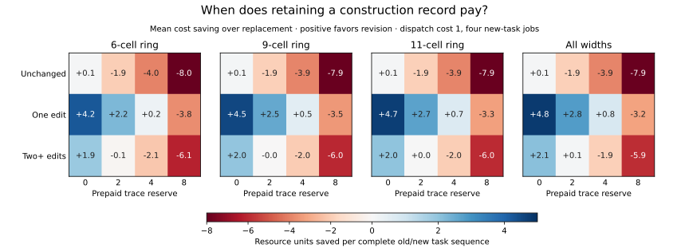

# When does keeping a construction revisable pay?

Keeping an editable construction record can make a later change cheaper.
It also consumes resources before we know whether it will be useful. In this
explicit cost model, revision often beats rebuilding for nearby changes and
usually loses for more distant changes. The advantage is small at the primary
prices, and its ceiling follows from the accounting itself.

**Status: exact bounded cost comparison.** This is an oracle planning model
of one library transition. It does not model learning, discovery of useful
primitives, or an organization regulating itself. The original
[proposal](2026-09-07-revisable-primitives.md) remains broader than this test.
The [causal-window follow-up](2026-09-07-macro-local-equivalence.md) removes a
finite-size limitation in the first results.

## What the shortcut saves

A four-operation construction W becomes a callable macro. Calling it still
executes four physical CA ticks, but requires one instruction dispatch. The
primitive operations A and B remain available. We price a job as

\[
 c=\text{physical ticks}+d\,\text{dispatches}.
\]

All jobs have an eight-physical-tick cap. A target job asks for transformation
VV, meaning execute the four-letter word V twice. An implementation must work
on **every** initial state using the same open-loop program. We enumerate every
primitive word of length zero through eight, allowing shorter equivalent
programs, and find its cheapest encoding with a given macro.

This separates two resources: executing a construction and directing its
execution. A macro can reduce dispatch work without adding a new physical
operation. Indeed, expanding every macro call gives the same primitive
computation at the same physical cost. With d=0, all libraries have identical
minimum execution costs. That is a structural control, not a numerical
surprise. With d>0, the same transformation can fit a smaller combined budget.

## What keeping it revisable costs

Eight old-task jobs request WW. Then K changed-task jobs request VV. We compare
all 16 inherited words W and all 16 target words V, including inherited
constructions that were never useful. The main table selects the declared
stratum where compilation paid for itself during the old jobs.

| Policy | Initial construction cost | Management after the task changes |
| --- | ---: | --- |
| Uncompiled | 0 | Continue using A and B |
| Frozen | 8 | Keep W |
| Replace | 8 | Keep W, or write and construct another word for 8 |
| Revisable | 8 plus trace reserve t | Keep W, patch it, or replace it |

One slot holds a four-letter macro. The reserve pays for preserving an editable
construction record and is charged before the task changes, even if unused.
A patch costs one access plus two units per changed letter, capped at the
full replacement cost. The two units represent writing and constructing a
changed instruction. These are prices of a specified toy machine; they are
not measured cognitive, biological, or hardware costs.

The primary prices are d=1 and t=4, with K=4 changed-task jobs. Sensitivities
use d={0,1,2,4}, t={0,2,4,8}, and K={1,4,16}. Replacement may always keep the
old macro, so its weak dominance over freezing is built into oracle planning.
Likewise, revision with a free trace may always choose a replacement; its
weak dominance in that control is built in. The substantive comparison charges
for the trace and includes the uncompiled baseline.

## A bound before interpreting any win rate

The cheapest nontrivial patch costs three units, versus eight for replacement.
It can save at most five management units. Whatever macro the revision planner
chooses, the replacement planner could choose the same macro and pay at most
five extra units. Therefore

\[
 C_{\rm replace}-C_{\rm revisable}\leq 5-t.
\]

At the primary trace reserve t=4, **every revision win over replacement is at
most one unit**. At t≥5, a single transition cannot repay the trace relative
to replacement in this model. High win rates do not mean large gains, and
the threshold is a consequence of the declared prices. Multiple transitions
could amortize the reserve differently; that is a separate experiment.

## Exact results

The panel contains eight pairs: 0/51, 4/30, 30/110, 51/170, 54/110, 90/150,
110/184, and 184/250. The original comparison enumerated widths 6, 9, and 11,
yielding 294,912 policy configurations and 4,608 aggregate rows. These share
rules, tasks, and prices; they are not independent statistical samples.

The following primary-price counts condition on useful inherited compilation.
“Nearby” means one literal letter changes between W and V; it is not a
behavioral distance. The final two rows use the subsequent local-rule audit,
whose program equivalences apply at every ring width.

| Domain | Task change | Cases | Revision cheaper than replacement | Mean saving over replacement |
| --- | --- | ---: | ---: | ---: |
| 6 cells | One edit | 240 | 201 | +0.250 |
| 6 cells | Two or more edits | 660 | 25 | −2.139 |
| 9 cells | One edit | 344 | 304 | +0.541 |
| 9 cells | Two or more edits | 946 | 63 | −2.022 |
| 11 cells | One edit | 364 | 336 | +0.692 |
| 11 cells | Two or more edits | 1,001 | 83 | −1.971 |
| All widths | One edit | 384 | 364 | +0.802 |
| All widths | Two or more edits | 1,056 | 91 | −1.902 |

For unchanged literal tasks, revision loses to replacement in every case of
this stratum at the primary prices. Even an unused trace has a cost. For
changed tasks, gains over freezing can be larger, but replacement is the
stronger comparison: it also allows adaptation.



The [complete generated table](../../results/macro_program_20260907_table.md)
and [summary](../../results/macro_program_20260907_summary.json) include unchanged
tasks and all declared price settings. Source constructions need only have
been useful, not globally optimal; an unchanged task can still admit a better
macro. The oracle is allowed to find it.

## A surviving example, and a failed generalization

For A=4, B=30, W=AABB, and V=ABBB, the all-width calculation gives total costs
160 uncompiled, 152 frozen, 136 with replacement, and 135 with revision. Both
replacement and revision choose ABBB. Repeating the macro performs eight
physical ticks through two dispatches. The difference is management: a
one-letter patch costs three, and its prepaid trace costs four, versus eight
to replace. The one-unit gain is exactly the accounting bound.

The first finite-ring win was more exotic: with target V=ABBA, a shorter
program using macro ABBB sufficed on the six-cell ring. The local audit found
that this shortening fails on other configurations. It remains an exact
six-cell result, but it cannot serve as an all-width example. See the
[counterexample and audit](2026-09-07-macro-local-equivalence.md).

## Reproduction and provenance

The [protocol](protocols/revisable-primitives-20260907.md) was committed in
[7c6757f](https://github.com/bombadil-labs/groovy-commutator/commit/7c6757f808d0749e5594a553b70ae238150722cc),
and the implementation in
[029eb98](https://github.com/bombadil-labs/groovy-commutator/commit/029eb98fe4e01f0cdb51b80c88ecd100277034bc),
before evaluation. Run:

```bash
python scripts/experiment_revisable_primitives.py
python scripts/experiment_macro_local_equivalence.py
python scripts/report_macro_program.py
```

The first experiment checks 8,176 encodings against independent token
enumeration, 1,024 engine transitions, 12,240 prefix/suffix map constructions,
and 6,528 physical-only library costs. Four selected witnesses independently
replay through the vectorized CA engine. All checks passed.

Sources: [experiment](../../scripts/experiment_revisable_primitives.py),
[CSV](../../results/revisable_primitives_20260907.csv),
[execution-cost kernels](../../results/revisable_primitives_20260907_kernels.json),
[witnesses](../../results/revisable_primitives_20260907_witnesses.json),
[metadata and hashes](../../results/revisable_primitives_20260907_metadata.json),
and [report generator](../../scripts/report_macro_program.py).

## What remains open

The planner knows the dynamics and current target, and pays no search cost.
This is a cost frontier under those assumptions, not a measured learning
algorithm. The library contains one inherited construction and undergoes one
transition. A natural next test lets tasks leave and return, so that a useful
current revision can change the cost of recovering an earlier capability.

The wider question concerns historical structure that can support and revise
future activity. These calculations provide an inspectable resource model;
they do not settle viability, self-direction, or the ethics of a relationship.
