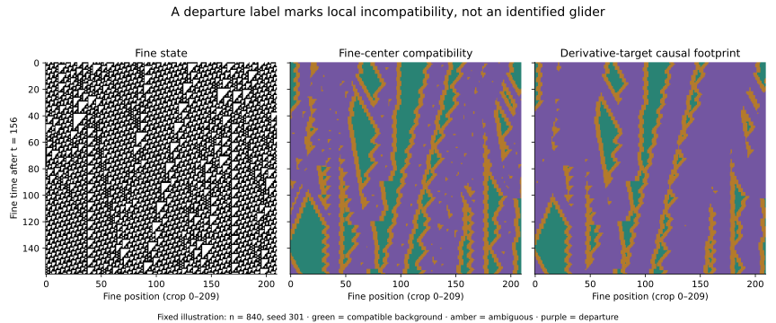
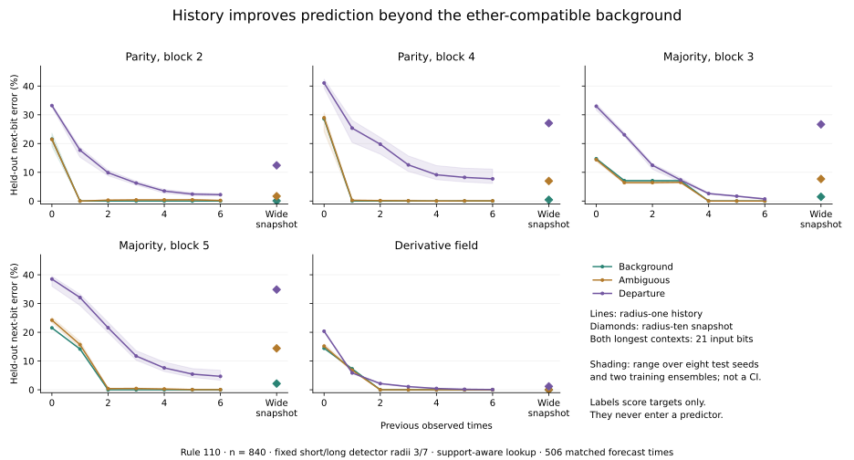

# History helps around disturbances, too

## The answer

Rule 110 becomes easier to predict with a short history **both on its repeating
background and around local departures from that background**. The benefit is
not confined to recognizing undisturbed ether. But this experiment does not
identify gliders or establish that the predictor models their interactions.

Across both ring widths, both fixed detector scales, all five observations,
both training ensembles, and all eight held-out seeds, departure-region error
falls between the current-only predictor and six previous observations.
Those are 320 paired comparisons with shared trajectories, not 320 independent
replicates. Background and ambiguous regions improve in all the same comparisons.

The remaining errors are much more concentrated: departure neighborhoods
contain **97.2–100% of residual errors** in the primary detector's pooled
results. History helps substantially there without finishing the job.

## What was fixed before the test

The [frozen protocol](protocols/ether-regions-20260907.md) and
[parameters](protocols/ether-regions-20260907.json) were committed in
[3374637](https://github.com/bombadil-labs/groovy-commutator/commit/3374637d7a025f10bdb10b82faed2311ce0434f2)
before held-out evaluation. The implementation and detector checks were also
committed before running the forecasts, in
[24297ae](https://github.com/bombadil-labs/groovy-commutator/commit/24297ae8ca2d1bcc443cde80f742d8e5455983c2).
After evaluation, the summary JSON was compacted into columns and rows; no
counts, estimates, detector settings, or prediction parameters were changed.

This executes the [background-versus-disturbances plan](2026-09-07-ether-or-defects.md)
and extends the [earlier independent-seed validation](2026-09-07-history-repairability.md).

| Component | Fixed setup |
| --- | --- |
| Dynamics | Rule 110, periodic rings of 420 and 840 cells |
| Reference ether | Repeated `00010011011111`; its exact temporal period of seven is checked |
| Training | Two disjoint ensembles: seeds 101–108 and 111–118 |
| Held-out random states | Seeds 301–308; the same test trajectories score both models |
| Times | 150 fine steps of burn-in; 512 observed transitions; 506 identical forecast anchors at every history depth |
| Observations | Parity blocks 2 and 4 with strides 2 and 4; majority blocks 3 and 5 with stride 1; derivative field with stride 1 |
| History | Radius-one observed neighborhoods at the present and 0–6 previous observed times |
| Estimation | Training-majority lookup; support below five backs off to a shorter history, ultimately a training-only marginal; ties predict zero |
| Spatial controls | Current-only radii 3 and 10; back off through smaller radii when support is below five |
| Detector sensitivity | Past three fine rows; short/long radii 3/7 and 7/14 |
| Additional controls | Pure ether and two initially perturbed ether trajectories, seeds 401 and 402, at each width |

Radius-ten snapshots and the longest histories both contain 21 input bits.
Equal bit counts do not imply equal information or equally well sampled
contexts. The same initial fine trajectory is reused across observers, whose
fine-time horizons differ with stride. Increasing ring width also increases
the training sample count; this is a robustness check, not an isolated
finite-size scaling experiment.

Perturbed controls flip exactly `round(0.02*n)` initial sites without replacement:
8 of 420 or 17 of 840. They receive the same burn-in. They and the single
pure-ether forecast phase are controls, not additional random-soup replicates.
The detector itself is checked on all spatial and temporal phases.

## What the region labels mean

At forecast anchor $t$, a fine center is **background-compatible** if its
long window over fine times $t-2,t-1,t$ matches one coherent ether phase.
It is a **departure** if no phase matches the short window. The remainder
is **ambiguous**. Matching unrelated phases in each row is not allowed.
Exact evolution yields 14 distinct coherent three-row phase patterns.

A coarse target receives the maximum-severity label in its full fine causal
footprint at the anchor: any departure center makes it a departure-neighborhood
target; all background centers make it background; otherwise it is ambiguous.
The target block is expanded by the forecast stride on either side, or by
stride plus one for the derivative observation. The extra derivative radius
accounts for its definition $D(S)=S\oplus\phi(S)$.

Labels never enter a predictor and never inspect the future target. Tests
check translation covariance, an introduced single-bit departure, exact ether
phases, long-match inclusion in short matches, periodic causal-footprint
aggregation, and independence from changes to future rows. Literal patch
comparisons cross-check the encoded detector.



This illustration uses the declared seed 301, width 840, fine times 156–315,
and positions 0–209. The detector inspects the full periodic ring before the
image is cropped. Purple marks local incompatibility and its causal neighborhood;
it does not label a particle species, a collision, or computational activity.

## Regional errors and the spatial control

The table below uses width 840 and primary detector radii 3/7. It pools
integer counts across the eight test seeds and two training ensembles;
the ensembles score the same targets. "History" is depth six (seven observed
times), and "wide" is a radius-ten current-only snapshot. Supported means at
least five training examples of that exact context. Predictions at all
targets are scored, including those requiring backoff.

| Observation | Departure frequency | Departure error: snapshot → history | Gain from departures | All-target error: history / wide snapshot | History / wide supported |
| --- | ---: | ---: | ---: | ---: | ---: |
| Parity 2 | 37.8% | 33.21% → 2.21% | 46.7% | 0.86% / 4.92% | 98.8% / 84.5% |
| Parity 4 | 36.8% | 41.06% → 7.74% | 40.4% | 2.85% / 10.78% | 93.2% / 71.7% |
| Majority 3 | 44.7% | 32.97% → 0.71% | 64.0% | 0.32% / 13.55% | 98.8% / 66.3% |
| Majority 5 | 48.4% | 38.52% → 4.67% | 58.9% | 2.27% / 19.46% | 92.1% / 43.8% |
| Derivative | 44.7% | 20.37% → 0.08% | 52.9% | 0.04% / 0.53% | 100.0% / 95.3% |



The shaded envelope spans test trajectories under either training ensemble;
it is **not a confidence interval**. Intermediate history depths are reported
without selecting a preferred depth on test performance. The machine-readable
counts retain both gains and new mistakes for each comparison.

At width 420 the conclusion repeats. Departure error falls from 32.77% to
2.39% for parity 2, 42.07% to 8.53% for parity 4, 32.71% to 0.88% for majority
3, 38.86% to 5.58% for majority 5, and 20.34% to 0.08% for the derivative.
Across all 320 departure comparisons, individual trajectory error reductions
range from 18.77 to 37.65 percentage points, conditional on their training
ensemble, observation, width, and detector. This range describes observed
variation, not population uncertainty.

The 21-bit history has lower all-target error than the 21-bit wide snapshot
in all 160 seed/ensemble/width/observation comparisons. However, history's
supported-context fraction is larger, often substantially. **This is an
advantage for the tested estimator and training budget**, not proof that no
spatial predictor could recover the same information. Spatial radius-three
results, coverage, supported-subset errors, and per-seed counts are retained
alongside radius ten in the data.

## Where the total gain comes from

For region $r$, let $f_r$ be its target frequency and $e_{r,h}$ its error at
history depth $h$. The signed contribution to total error reduction is

$$\Delta_r=f_r(e_{r,0}-e_{r,6}).$$

All regions use identical forecast targets. Their contributions sum exactly
to the total reduction; the saved integer counts verify this identity.
Negative contributions would be retained. A region's share of the total gain
is $\Delta_r/\sum_s\Delta_s$, when the total is nonzero.

With the primary detector, departures account for **40.4–65.7%** of total
improvement across the two widths and five observations, despite occupying
36.8–50.9% of targets. The larger detector gives **48.3–74.8%**, while labeling
45.1–63.9% of targets as departure neighborhoods. The more stringent detector
changes the group membership; it does not change any prediction or total error.

Background and ambiguous regions make substantial contributions too. In
particular, the primary parity-4 result assigns less than half of total gain
to departures. The data support improvement in both settings, not a universal
claim that disturbances dominate every aggregate.

## Controls and limitations

Pure ether's radius-one snapshot error is 14.29–28.57%, depending on observation;
depth-six error is **zero for every tested width, observer, and training
ensemble**. Models trained only on random trajectories can predict this held-out
reference. All pure-ether targets are background-compatible under both detectors.

For the perturbed-ether controls, the errors pooled over the two seeds within
each width and training ensemble fall to 0.18–0.39% (parity 2), 0.45–0.81%
(parity 4), 0.05–0.10% (majority 3), 0.20–0.72% (majority 5), and 0.005–0.008%
(derivative). Full regional results are saved, including empty groups with
zero sample counts and null rates.

The detector is an operational partition. It may absorb nearby background
into departure neighborhoods, and it does not establish why any individual
forecast improved. Its stricter version changes attribution considerably.
Finite rings, finite horizons, two training ensembles, and eight random test
trajectories limit generalization. Repeated cells and times are correlated;
the two training ensembles share test states and are not independent test
replicates. No cell-level confidence interval or significance claim is made.

These results do not prove finite-memory closure, identify glider computation,
or restore a projection-independent Class IV classifier. The earlier
[observation-dependence finding](../knowledge/projection-dependence.md)
continues to apply.

## What to test next

Two distinctions now deserve separate experiments:

1. **Residual structure:** locate the errors that remain after history backoff.
   Are they associated with specific recurring departure patterns, boundaries,
   or collisions? That requires independently validated structure labels;
   today's detector is not a glider classifier.
2. **Training coverage versus context information:** fix width and test states,
   vary only the training budget, and compare spatial and temporal contexts
   with supported-subset diagnostics and an estimator that shares information
   across contexts. Freeze that protocol before inspecting new test outcomes.

The accessible insight is ready for editorial consideration: a path can
restore predictive context around a disturbance as well as a repeating
background. Its formal explanation and limits remain in Research.

## Reproduce and inspect

From the repository root, with NumPy and Matplotlib available:

```bash
python scripts/experiment_ether_regions.py --check-only
python scripts/experiment_ether_regions.py
python scripts/report_ether_regions.py
```

- [Experiment and detector](../../scripts/experiment_ether_regions.py)
- [Table, figures, and result checks](../../scripts/report_ether_regions.py)
- [15,840 per-trajectory count records](../../results/ether_regions_20260907.csv)
- [Aggregate data in a columns/rows JSON layout](../../results/ether_regions_20260907.json)
- [Protocol, runtime, source hashes, and detector checks](../../results/ether_regions_20260907_metadata.json)
- [Result accounting checks](../../results/ether_regions_20260907_checks.json)
- [Generated table](../../results/ether_regions_20260907_table.md)

The 15,840 count records cover 2 widths × 5 observations × 2 training ensembles
× 11 test/control trajectories × 2 detector scales × 4 region records (three
regions plus aggregate) × 9 model settings (seven history depths and two
spatial controls). They are bookkeeping rows, not independent measurements.
