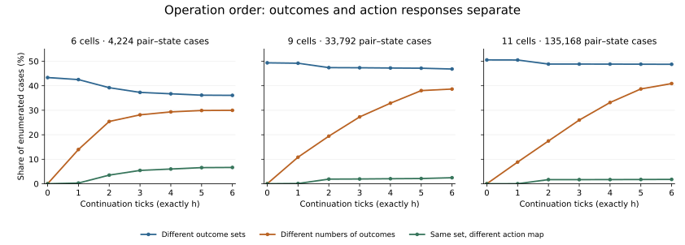

# Operation order changes outcomes and how to reach them

Two histories can leave a system with the same number of available outcomes
but different outcomes. Even when the outcome sets agree, the same action
sequence can work differently after each history.

**Status: exact finite enumeration, with elementary counterexamples.** This
is a first instrument for the [history-and-possibility program](2026-09-07-history-and-possibility.md).
It establishes distinctions we need to measure; it does not establish a new
law of complexity or a test for life.

## What we measured

Start with a binary cellular automaton on a periodic ring. Apply rule A then
B to prepare X, or B then A to prepare Y. Here **AB is chronological order**:
X = B(A(S)), while Y = A(B(S)). We then allow an external controller to choose
either A or B at every continuation tick, synchronously over the whole ring.

For an observation O and exactly h continuation ticks, the repertoire is

\[
\mathcal R_h^O(X)=\{O(F_w(X)): w\in\{A,B\}^h\}.
\]

We compare three objects: the prepared states X and Y; their sets of reachable
outcomes; and the maps from each action word w to its outcome. Counting a set
discards its members' identities. Keeping the set still discards which word
reaches which member.

The [protocol](protocols/future-repertoire-20260907.md) and
[configuration](protocols/future-repertoire-20260907.json) were committed in
[bc23733](https://github.com/bombadil-labs/groovy-commutator/commit/bc23733f01a511182ec3719366d2074ea01162b4)
before running the experiment. The implementation was committed in
[2662151](https://github.com/bombadil-labs/groovy-commutator/commit/2662151d109e143e7507fcd9f10afb5474fbbb77)
before evaluation.

The panel is {0, 4, 30, 51, 54, 90, 110, 150, 170, 184, 204, 250}: all 66
distinct unordered pairs, every initial state at widths 6, 9, and 11, and
horizons 0 through 6. Full-state identity is the primary observation; population
count is a declared coarse control. The primary comparison is h=6.

This yields 2,772 aggregate rows and 1,212,288 pair–state–horizon cases per
observation. They share rules and states and are not independent replicates.
There is no fitted predictor, random seed, or train/test split in this exact
enumeration. The panel was selected for controls and familiar examples, not
to represent all rule pairs statistically.

## Results at six continuation ticks

These are exact counts across the 66 pairs at each width, using the full state
as the outcome. Every initial state receives equal weight within each pair.

| Ring width | Pair–state cases | Different outcome sets | Different numbers of outcomes | Equal size, different sets | Equal sets, different action maps |
| --- | ---: | ---: | ---: | ---: | ---: |
| 6 | 4,224 | 1,524 | 1,266 | 258 | 281 |
| 9 | 33,792 | 15,825 | 13,062 | 2,763 | 831 |
| 11 | 135,168 | 65,901 | 55,286 | 10,615 | 2,399 |

“Different numbers” and “equal size, different sets” partition the
different-set cases. The final column is separate: the set agrees, but at
least one action word has different outcomes. Differing prepared states can
also have identical entire response maps at a given horizon: there are 26,
21, and 22 such cases at h=6, respectively.



The figure keeps widths separate and divides by all configured pair–state
cases at each width. These are panel summaries, not estimates of a universal
frequency. The [generated table](../../results/future_repertoire_20260907_table.md)
also includes population count. At width 11, that coarser view reports 51,381
different-set cases, compared with 65,901 using full states: observation can
hide outcome differences here, just as it changes the earlier prediction task.

## An option can return with more time

The first selected containment witness uses only rule 0 (reset every cell to
zero) and rule 51 (complement every cell). Let A be reset, B be complement,
and start at the all-zero state. After AB the ring is all ones; after BA it
is all zeros.

With one further action, the all-ones preparation can reach only all zeros:
either reset or complement does that. The all-zeros preparation can reach
either all zeros or all ones. One repertoire strictly contains the other.

With two further actions, both preparations can reach both uniform states.
But the response maps still differ:

| Continuation word | After preparation AB | After preparation BA |
| --- | --- | --- |
| AA | All zeros | All zeros |
| AB | All ones | All ones |
| BA | All zeros | All zeros |
| BB | All ones | All zeros |

The enumeration selected this example at width 6. The reset/complement
argument proves the same statement for any positive ring width. It is an
elementary counterexample, not a newly discovered cellular-automaton regime.

The loss of an option at one step is therefore not permanent loss. Conversely,
agreement of the later option sets does not mean that actions have become
interchangeable across the two prepared states.

## Equal numbers can hide entirely different options

The first equal-size/different-set witness uses A=4, B=30, width 6, and
initial state 13. States are encoded as integers with cell i stored in bit i.
Preparation AB gives state 35; BA gives state 4. After one more action:

| Continuation | From 35 | From 4 |
| --- | ---: | ---: |
| A | 0 | 4 |
| B | 52 | 14 |

Both repertoires have size two, but {0,52} and {4,14} are disjoint. Population
count merges part of this distinction: the sets become {0,3} and {1,3}. A
single repertoire-size score cannot describe which capabilities have changed.

All six witnesses, including the coarse-view cases, are in the
[witness record](../../results/future_repertoire_20260907_witnesses.json).
They were selected by the frozen lexicographic rule, not by visual appeal.

## Checks and reproduction

Run from the repository root:

```bash
python scripts/experiment_future_repertoire.py
python scripts/report_future_repertoire.py
```

The [experiment script](../../scripts/experiment_future_repertoire.py) checks
all 768 width-six rule/state transitions against the separate vectorized CA
engine. A word-table construction agrees with the set recurrence for all
59,136 width-six state/pair/horizon/observation repertoires. It also checks
173,184 zero-horizon cases, 333,248 identity/reset word endpoints, and the
requirement that identical prepared states give identical future responses.
Every saved witness independently replays through the vectorized engine.
All checks passed.

The [CSV](../../results/future_repertoire_20260907.csv),
[metadata and hashes](../../results/future_repertoire_20260907_metadata.json),
[summary](../../results/future_repertoire_20260907_summary.json), and
[report script](../../scripts/report_future_repertoire.py) preserve the full
bounded result. The additional direct-word/set cross-check was an implementation
check; it did not change the frozen experimental panel or readouts.

## What this changes in the program

Possibility needs a declared action vocabulary, observation, and budget. We
will track outcome identity and response to action alongside repertoire size.
A commutator measures prepared-state discrepancy; it does not by itself say
whether a later capability is lost, regained, or reachable through a different
sequence.

The alternative futures here come from external intervention. Historical
effects are carried by the complete present state; equal complete states
cannot remember different pasts under these fixed continuation rules. Exactly
h ticks also differs from allowing any number up to h: reachable endpoint
sets need not grow monotonically with h. Different pairs have different action
alphabets, so their repertoire sizes cannot rank intrinsic freedom.

No viability criterion, self-maintaining organization, learned controller, or
new action invention was tested. The [revisable-primitives proposal](2026-09-07-revisable-primitives.md)
takes up that next difficulty: a history may change the effective operations
available to a system, and reopening a useful construction may carry real costs.
