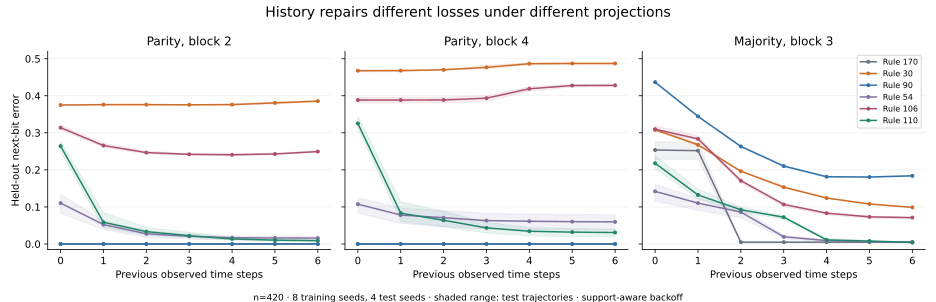

# When does the path restore what an observation loses?

**Research checkpoint, 2026-09-07.** Continuation of **Analysis of Collusion
Wiki**, recovered through targeted conversation retrieval and the original
research artifacts. The full conversation transcript was not available. This
record preserves the mathematical work, its conceptual motivation, and the
corrections that change what we can claim.

## Re-entry: the path to this question

The Rule-90 discussion asked what survives when change is treated as a state
and when a trajectory is viewed at a coarser scale. Rule 90 gives unusually
clean answers: its linear algebra transports differences exactly and supports
exact dyadic parity coarse-graining. That makes it a useful reference case,
but an unrepresentative stand-in for all Class-III behavior.

The next agreed comparison was Rule 110, with nonlinear Rule 30 as an
additional control. In the recovered comparison, Rule 110 has a structured
commutator and fails small-block, radius-one macro closure. Yet short observed
histories restore much of its predictive power. This suggested **history-
repairable nonclosure**: information absent from an observed present can
remain available in its path.

The subsequent broad sweep falsified the simple identification with Class IV:
Class-II observations can also need history to reveal periodic phase. The
surviving research question concerns a joint profile of nonclosure, repair,
and nontrivial structure, conditional on an observation and an ensemble.

The wider conversation connected this to knowing as transformation, wet
alignment, Buber, and resistance to final closure. Those links motivate the
questions; they are not mathematical consequences of a CA experiment. The
interpretive continuation belongs in [NOTES.md §11](../../NOTES.md#11-from-the-collusion-wiki-conversation-to-observed-history-experiments).

## What was recovered, and what was checked

| Material or claim | Status at this checkpoint |
| --- | --- |
| [Original Rule 90/110 comparison](archive/rule90_rule110_wet_math_comparison.md) | Preserved unchanged; 16 sections covering derivatives, coarse-graining, memory, information, reversibility, and perturbations |
| [Later broad-sweep note](archive/history_repairable_nonclosure.md) | Preserved unchanged, including the failed simple Class-IV proposal |
| Broad parity and majority CSVs and summary | Reproduced numerically; see method and label qualifications below |
| D90=150, D110=162, G110 formula and density over local windows | Exhaustively reproduced |
| Dyadic derivative ANF degrees/counts through horizon 8 | Exhaustively reproduced |
| Rule 90 dyadic parity closure | Algebraic identity, with exhaustive local checks at b=2,4 |
| Rule 110 no radius-one binary block closure at b=2,3 and stride ≤ b | Exhaustively reproduced within those bounds |
| Original trajectory MI, commutator compression, reversible-damage, and perturbation tables | Recovered pilot observations; original generating code/settings not recovered, so not independently reproduced here |
| New history curves | 12 rules, five observations, two ring widths, eight training seeds, four independent test seeds, depths 0–6 |
| A general Class-IV diagnostic or finite-memory closure theorem | **Not established** |

The [archive README](archive/README.md) records limitations and corrections;
the [source manifest](archive/source_manifest.json) records recovered-file hashes.

## Definitions: separate the dynamical system from its observation

For the elementary rule's global evolution map E on a binary periodic ring,

\[
D(S)=S\oplus E(S),\qquad
G(S)=D(E(S))\oplus E(D(S)).
\]

D is the outgoing change mask; its rule number is the base rule XOR 204.
G asks whether that mask evolves under the **original** rule. It is not the
error of the best possible predictor of D. Nor is the G field observed along
one trajectory the two-engine disagreement U; see the existing run calculus.

For a block observation P and stride q, the observed trajectory is

\[
Y_k=P(E^{qk}(S_{\mathrm{burn}})).
\]

Parity XORs b nonoverlapping microcells; majority uses an odd block b and
outputs 1 when more than half are on. Derivative observation uses P=D at
the full spatial resolution, q=1. All projections have a fixed origin.

The history-h feature contains Y at positions j−1,j,j+1, at observed times
k,k−1,…,k−h. It predicts the bit Y at position j and time k+1. Thus **h=0
already contains the current three-cell neighborhood**; h=6 contains 21 bits.
Error εh is the held-out fraction of incorrect bits. Repair is

\[
\mathcal R_h=(\epsilon_0-\epsilon_h)/\epsilon_0,
\]

undefined when ε0=0. Negative measured repair is retained: a finite-data
estimator can worsen with more context. Optimal conditional prediction cannot
worsen simply because extra information is available; these are not estimates
of irrecoverable information loss or proofs about the whole macrostate.

## Exact results and an existing theorem correction

For Rule 90, E=L+L⁻¹ over GF(2). At b=2^m, the Frobenius identity gives
E^b=L^b+L⁻ᵇ. Consequently block parity satisfies P_b E^b = E90 P_b on
an infinite lattice, or on a periodic ring whose width is divisible by b.
Its dyadic temporal difference has exactly three linear monomials.

For Rule 110, writing the five input cells as x−2,…,x+2,

\[
G_{110}=x_{+1}\oplus x_{-1}x_{+1}
\oplus x_{-2}x_{-1}x_0x_{+2}
\oplus x_{-1}x_0x_{+1}x_{+2}.
\]

This is degree four with four monomials, nonzero on 10/32 five-cell windows.
Those uniformly weighted local windows differ from the nonuniform windows
visited along an evolved trajectory; 10/32 is not a predicted trajectory density.

| Horizon b | Rule 90 degree / terms | Rule 110 degree / terms | Rule 30 degree / terms |
| ---: | ---: | ---: | ---: |
| 1 | 1 / 3 | 3 / 3 | 2 / 3 |
| 2 | 1 / 3 | 5 / 7 | 3 / 11 |
| 4 | 1 / 3 | 8 / 71 | 7 / 121 |
| 8 | 1 / 3 | 15 / 5,135 | 15 / 23,093 |

The checked local function here is E^b(S)_j XOR S_j. No universal asymptotic
claim follows from four horizons. The no-closure search tested all 14
nonconstant two-bit projections at strides 1–2, and all 254 nonconstant
three-bit projections at strides 1–3. It excludes radius-one binary macro
rules only within this search. Larger blocks, alphabets, neighborhoods, and
memory remain outside the result. Related coarse-graining constructions are
developed by [Israeli & Goldenfeld](https://arxiv.org/abs/nlin/0508033).

**Correction to the repository's old affine converse:** if E(S)=MS XOR c,
then G=c. But constant G does not force E to be affine. Nonlinear Rules 4
and 200 also have G=0. Exhaustive causal-window enumeration finds:

- G=0: 0, 4, 60, 90, 102, 150, 170, 200, 204, 240.
- G=1: 15, 51, 85, 105, 153, 165, 195, 255.
- All other ECA rules: G varies across possible configurations.

This agrees with the nonlinear exceptions already present in the repository's
U-slice findings. The orientation notes, operator docstring, and Concepts
explanation now use the implication rather than the false converse.

## Reproduced broad sweep

The recovered script uses training seeds 1,2,3 and test seeds 11,12,
Bernoulli(1/2) initial states from NumPy's default RNG, and 150 microsteps of
burn-in. Parity uses n=300, b=q=2 or 4, 700 microsteps, and h=0…3. Majority
uses n=300, b=3, q=1, 550 microsteps, and h=0…4. Raw compression uses a
separate n=301 run, seed 123, 500 measured microsteps after the same burn-in.

Re-running the recovered script reproduced every numeric CSV field to 1e-12;
the JSON summary matched byte for byte. Its output header is `wclass`, whereas
the archived CSVs use `class`; this is a serialization discrepancy, not a
numerical discrepancy. The archived CSVs remain unchanged.

| Legacy full-table class | Rules | Median ε0 | Median ε4 | Median repair | Median raw compression |
| --- | ---: | ---: | ---: | ---: | ---: |
| I | 24 | 0.000 | 0.000 | undefined | 0.003 |
| II | 192 | 0.104 | 0.000 | 0.891 | 0.063 |
| III | 26 | 0.416 | 0.097 | 0.767 | 1.001 |
| IV | 14 | 0.268 | 0.039 | 0.861 | 0.458 |

Repair is a median of defined per-rule ratios, not the ratio of median
errors. The original exploratory screen selects 9/14 IV, 10/192 II, and
6/26 III rules. It was assessed on the same sweep that motivated it, with no
independent threshold-validation set. These counts do not establish classifier
performance, and the 256 rules include symmetry relatives.

The full class sets agree with the assignments in
[Alfaro & Sanjuan's Appendix A](https://arxiv.org/abs/2407.06175). Their text
explicitly disputes treating Rule 106's periodic-ring behavior as Class IV.
The recovered canonical table puts Rule 41 in II, contrary to both the full
table and its cited [Borriello & Walker source](https://arxiv.org/abs/1609.07554).
We retain that label as provenance and avoid class aggregates in the new run.

The old n=256 pilot had a real boundary pathology: Rule 90 on a ring of width
2^m is zero after at most n/2 steps, since the two surviving shifts coincide
and cancel. Its apparent late-time simplicity there cannot stand in for its
large-lattice behavior. Non-power-of-two widths avoid that specific pathology;
they do not eliminate all finite-size effects.

## New validation: controlled history curves

The follow-up uses Rules 0,4,51,170,184,41,30,45,90,54,106,110; ring widths
300 and 420; parity b=q=2,4; majority b=3,5 with q=1; and derivative with
q=1. Each condition has eight training seeds (101–108), four test seeds
(201–204), 150 burn-in microsteps, and 512 observed transitions.

Every depth h=0…6 predicts **the same target times k=6…511**. Training
votes fit a local deterministic majority predictor; ties predict zero. If a
context has fewer than five training observations, prediction falls back to
the longest shorter supported history, ultimately to the training marginal.
No test labels affect fitting or backoff. The raw zero-default result and
test coverage are also retained. The five-observation cutoff is fixed, not
tuned here; overlapping observations are not independent samples.

Raw compression now uses the same microtrajectory, globally bit-packed in
row-major order, with no rowwise padding. Its window is 512q microsteps, so
comparisons across strides still involve different durations. Compression is
a finite-sample proxy affected by serialization, density, period, and length.



At n=420, mean test error across four independently initialized trajectories:

| Observation | Rule 90 ε0 → ε6 | Rule 30 ε0 → ε6 | Rule 110 ε0 → ε6 |
| --- | ---: | ---: | ---: |
| Parity b=2, q=2 | 0 → 0 | 0.3750 → 0.3855 | 0.2641 → 0.0090 |
| Parity b=4, q=4 | 0 → 0 | 0.4676 → 0.4871 | 0.3253 → 0.0309 |
| Majority b=3, q=1 | 0.4366 → 0.1839 | 0.3083 → 0.0987 | 0.2178 → 0.0041 |
| Majority b=5, q=1 | 0.4589 → 0.3527 | 0.3119 → 0.2499 | 0.2916 → 0.0276 |
| Derivative, q=1 | 0 → 0 | 0.2500 → 0.0011 | 0.1691 → 0.0004 |

The same qualitative direction holds at n=300, with meaningful quantitative
variation: Rule 110 parity-b4 repair at h=6 is about 86% at n=300 and 91%
at n=420. This is a robustness check over two widths, not an asymptotic limit.

What this adds:

1. **The Rule-110 observation survives the new seed ensemble and estimator.**
   Parity-b2 repair is about 97%; majority-b3 repair about 98% at n=420.
   Its first observed mean error below 5% occurs at h=2 for parity-b2,
   h=3 for parity-b4, and h=4 for majority-b3/b5. These are post-hoc
   empirical thresholds, not proven minimum sufficient memories.
2. **Observer dependence is strong.** Rule 30's parity histories fail to
   improve prediction here, but majority-b3 repairs about 68%, and derivative
   history repairs about 99.5%. High history repair alone does not isolate IV.
3. **History support matters even for an exactly closed process.** Rule 170
   parity-b4 is exactly a macro shift. At n=420,h=6, zero-default lookup
   falsely reports 10% error; backoff gives zero. Low support must be
   distinguished from dynamical ambiguity. For Rule 30 parity-b4 at h=6,
   no test contexts reach the five-observation threshold; its nominal h=6
   backoff score therefore uses shorter contexts, not a well-sampled full
   six-step history.
4. **A wider current neighborhood is a useful separate control.** At n=420,
   Rule 110 parity-b2 radius-three current error is 0.0818 versus radius-one
   current error 0.2641 and history-six error 0.0090. For majority-b3 the
   corresponding errors are 0.2113, 0.2178, and 0.0041. History helps beyond
   this tested spatial expansion, but seven spatial bits versus 21 history
   bits is not a capacity-matched comparison.

The figure's bands are ranges across four test trajectories sharing a training
ensemble. They are not confidence intervals. There is one training ensemble,
one initial density, one block origin, and a bounded history/search budget.
Low error may mainly identify ether or periodic phase; glider/defect prediction
has not been isolated. Rule 110's proven computational universality concerns
appropriate configurations, not the complexity of every random trajectory
([Cook, 2004](https://www.complex-systems.com/abstracts/v15_i01_a01/)).

## Reproduce and continue

From the repository root, with NumPy, pandas, and matplotlib installed:

```bash
python scripts/verify_history_algebra.py
python scripts/experiment_history_repairability.py
python scripts/experiment_history_validation.py
```

The baseline writes the two broad CSVs and their summary. Validation writes
`results/history_validation_20260907.csv`, `.json`, `_metadata.json`, and
`.svg`. The CSV has one row per rule/observation/width/test-seed/history;
the metadata records complete parameters and runtime versions. The JSON
contains mean curves, test-seed ranges, coverage, repair, and observed history
thresholds. Standard-library zlib and the existing NumPy CA engine suffice
for simulation; pandas is used by the baseline and matplotlib by the figure.

The next experiment should separate **background phase prediction from defect
prediction** in Rule 110, with labels or a background detector independent of
the predictor. Then compare training-budget curves, additional initial-state
ensembles, block origins, and feature-capacity controls before interpreting
H*(ε) scaling. Explicit memory kernels remain a promising subsequent model,
not something fitted or established by this checkpoint.
