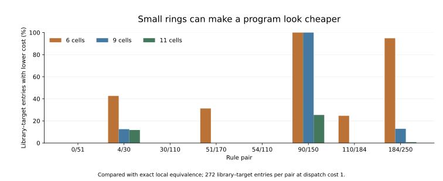

# Does the shortcut survive a larger world?

One striking six-cell shortcut does not survive a change of scale. The broader
cost comparison does: when we require programs to work on arbitrary binary
configurations, revision still often pays for nearby changes under the declared
prices, while replacement usually costs less for distant changes.

**Status: exact local-map audit with an eight-tick program bound.** This
follow-up was chosen after seeing the [finite macro comparison](2026-09-07-costed-primitives.md).
Its own protocol was committed before the new enumeration. It is a robustness
extension, not an independent discovery of the original effect.

## A finite ring can identify different transformations

For rules A=4 and B=30, the words ABBBA and ABBAABBA produce the same complete
transformation on a six-cell ring. So do AABBBA and ABBAABBA. These equalities
helped make the first selected revision example cheaper.

Both equalities fail on unrestricted configurations. A 17-cell window with
integer encoding 16 is a counterexample: only its cell at index four is one;
the central cell is index eight. Of all 131,072 assignments to that window,
11,264 give different central outputs for each claimed equality.

The [audit record](../../results/macro_local_equivalence_20260907_audit.json)
preserves both failed equalities and the first counterexample. It also
preserves the equalities that survived. The six-cell measurement was correct
within its stated scope; the failure is an attempted extension beyond it.

## How we remove the ring-size assumption

A chronological word of at most eight radius-one CA steps can influence a
central cell only through 17 input cells. We compute its output for all
131,072 assignments to that causal window. Two words with identical outputs
on all assignments define the same local map. Translation invariance makes
their complete transformations equal on arbitrary binary configurations,
including every positive periodic ring width.

All 511 words of length zero through eight are checked for the eight declared
rule pairs. Shorter words are embedded in the same window, with the center
aligned. We group words by these exact local maps and repeat the unchanged
macro-cost calculation. The search still excludes programs longer than eight
ticks. “All widths” describes the validity of its program equivalences, not
an unbounded claim about optimal computation.

## How much the finite rings concealed

At dispatch cost one there are 2,176 library–target entries in the panel:
eight rule pairs, 17 libraries including the uncompiled baseline, and 16
target transformations. Their finite-ring minimum costs can be smaller than
the costs of programs required to work everywhere.

| Ring width | Entries with a lower finite-ring cost | Finite-only equalities among distinct target words |
| --- | ---: | ---: |
| 6 | 798 / 2,176 | 117 |
| 9 | 341 / 2,176 | 6 |
| 11 | 103 / 2,176 | 1 |

The second column concerns costs; the last concerns unordered pairs of target
words, summed within rule pairs. They count different objects. Neither is a
statistical sample of all automata.

## What survived

At the primary prices, among inherited macros that paid for themselves:

- Revision beats replacement for 364 of 384 one-letter changes, with mean
  saving 0.802 resource units.
- It beats replacement for 91 of 1,056 larger literal changes, but costs
  1.902 units more on average over that group.
- It loses for all 96 unchanged literal tasks.

These are exact configurations of the declared model. A one-transition gain
over replacement remains bounded by 5 minus the prepaid trace reserve, so
at the primary reserve of four it cannot exceed one unit. The audit removes
finite-size coincidences without removing the price assumptions that generate
that bound.

A surviving example uses W=AABB and V=ABBB under rules 4/30. Both adaptable
policies install ABBB; their execution plans agree on all configurations.
Revision's total is 135 versus replacement's 136, because a one-letter patch
plus its trace reserve costs seven rather than eight. No exotic shortening
is needed for that example.

## Checks and source record

The [protocol](protocols/macro-local-equivalence-20260907.md) was committed in
[7bfb81a](https://github.com/bombadil-labs/groovy-commutator/commit/7bfb81a7830eaf472a13905d5e4b399847e0c7f8).
The implementation was committed in
[d5b3fa2](https://github.com/bombadil-labs/groovy-commutator/commit/d5b3fa274542cc01fc5c15b9a274b36f67f28b45)
before execution.

The audit checks 9,360 minimal-window outputs against the separate vectorized
CA engine, 3,407,872 selected program/window outputs with an independent
shrinking-window evolution, and 26,112 finite/local cost entries. Every local
equality implies its finite-ring counterpart, and every finite-ring minimum
cost is no larger than the corresponding all-width cost. Price-bound,
physical-only, and policy-dominance controls pass. The repeated cost comparison
contains 98,304 configurations and 1,404 aggregate rows.

Sources: [script](../../scripts/experiment_macro_local_equivalence.py),
[CSV](../../results/macro_local_equivalence_20260907.csv),
[finite comparison](../../results/macro_local_equivalence_20260907_finite_comparison.csv),
[local cost kernels](../../results/macro_local_equivalence_20260907_kernels.json),
[audit and witnesses](../../results/macro_local_equivalence_20260907_audit.json),
and [metadata](../../results/macro_local_equivalence_20260907_metadata.json).

The next comparison should use these local kernels so that conclusions about
returning tasks do not inherit a small-ring shortcut. Perfect current-task
knowledge, free planning, a fixed macro vocabulary, and the eight-tick bound
remain explicit limitations.
