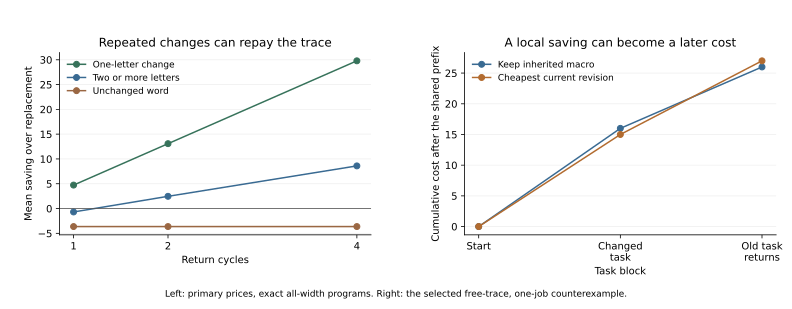

# When an earlier task returns

The cheapest current revision can make a returning task more expensive.
Conversely, a construction record that barely pays for one change can become
useful over repeated changes. Available revision options and a good policy
for using them are distinct objects.

**Status: exact task-sequence comparison under the declared resource model.**
This extends the [costed primitives experiment](2026-09-07-costed-primitives.md)
using its [all-width program kernels](2026-09-07-macro-local-equivalence.md).
No new rule, price schedule, or finite-ring shortcut is introduced.

## Tasks leave and return

Eight old-task jobs establish the inherited macro W. Then blocks requesting
VV and WW alternate for one, two, or four cycles. Each block contains one,
four, or sixteen jobs. The current four-letter macro occupies one slot;
returning to an old construction is not free. The editable trace belongs to
the current macro, and its reserve is paid once at the start.

The same physical, dispatch, compilation, replacement, and patch costs apply.
Every program is valid on arbitrary binary configurations, with an
up-to-eight-physical-tick search bound. All inherited and target words and
all parent resource settings are retained.

For replacement and revision, compare a full-sequence oracle with two reactive
policies. The oracle knows every forthcoming task and chooses the cheapest
whole macro path. A reactive policy minimizes only current-block management
plus execution cost. One breaks ties lexicographically; the other prefers to
keep the current macro when tied, then uses lexicographic order.

The oracle therefore has more future information. Its advantage is a
hindsight/planning benchmark, not a fair comparison of learning algorithms.
The reactive benchmark deliberately does not learn the repeating schedule.
All policies know the current task and dynamics, and search remains unpriced.

## A saving now, an extra cost later

The first selected regret witness uses A=4, B=30, inherited W=AABB, and
changed target V=ABAB. Dispatch costs one, the trace is free, and each block
contains one job. Both policies share the same old-task prefix, costing 88.

| Choice | Changed-task block | Returning old-task block | Total after shared prefix |
| --- | ---: | ---: | ---: |
| Keep AABB | 16 | 10 | 26 |
| Revise to ABAB, then keep it | 15 | 12 | 27 |

The revision costs five to patch and ten to execute the new job, saving one
unit now. When the old task returns, the new macro no longer gives its former
execution cost: keeping it costs twelve, and patching back is not worth it
for one job. The local saving is outweighed by two extra units later.

The full-sequence oracle keeps AABB and totals 114 including the prefix.
Reactive revision totals 115. Since the trace is free, this example isolates
the sequence effect from the cost of preserving an editable record. It does
not show that the former transformation became physically unreachable.

## Even a present tie can matter

A second witness uses inherited ABBB and changed target AAAB under the same
rules, free trace, and one-job blocks. Keeping ABBB costs eight for the current
block. Patching to ABAB also costs eight after including management. A
lexicographic tie rule changes the macro; a stay-on-tie rule preserves it.

When the old task returns, the first path costs thirteen and the second ten.
Their totals are 109 and 106. Equal immediate objective values therefore do
not guarantee equal future costs. The declared tie-rule control exposes this
without attributing foresight to a policy that does not use it.

## Repeated changes can repay the trace

At the primary dispatch price one and prepaid trace reserve four, with four
jobs per block, the exact comparisons below condition on inherited compilation
having paid for itself. Each cycle contains a changed task and a return.
Costs compare revision and replacement with the **same full-sequence
information**. Counts share the same rules and tasks across cycles.

| Cycles | Literal task change | Cases | Revision cheaper than replacement | Mean saving over replacement |
| --- | --- | ---: | ---: | ---: |
| 1 | One edit | 384 | 368 | +4.729 |
| 1 | Two or more edits | 1,056 | 430 | −0.691 |
| 2 | One edit | 384 | 370 | +13.083 |
| 2 | Two or more edits | 1,056 | 455 | +2.463 |
| 4 | One edit | 384 | 372 | +29.792 |
| 4 | Two or more edits | 1,056 | 893 | +8.599 |

The [full primary table](../../results/returning_tasks_20260907_table.md)
includes unchanged literal tasks and reactive regret. At primary prices,
reactive revision with stay-on-tie has positive regret in 32 of 1,056 farther
changes for one cycle, and 33 for two or four cycles. There is no such regret
in the 384 one-edit cases at those settings. Its two tie policies have the
same costs at the primary settings; the tie witness comes from the declared
one-job, free-trace sensitivity.



One four-cycle witness gives totals 364 for replacement with hindsight and
342 for revision with hindsight. The latter repeatedly patches between nearby
constructions and pays its trace reserve only once. Reactive replacement
costs 376 in this example, while reactive revision matches 342. The distinction
between management policy and available editing operations matters here.

Some unchanged-word cases also become worth revising over longer sequences.
Inherited constructions were required to be useful, not globally optimal;
more repetitions can repay a previously unprofitable improvement even without
a task change. This is not evidence of novelty arising spontaneously.

## The price bound still applies

Every management transition can save at most five units relative to full
replacement. A sequence with c return cycles has 2c such opportunities, so

\[
 C_{\rm replacement\ oracle}-C_{\rm revision\ oracle}\leq 10c-t.
\]

This is a conservative accounting bound; individual histories may not exploit
all opportunities. The one-transition ceiling in the earlier experiment did
not imply a universal limit across repeated changes. The reserve is amortized
across a different number of opportunities here.

## Verification and provenance

The [protocol](protocols/returning-tasks-20260907.md) was committed in
[95ed1e7](https://github.com/bombadil-labs/groovy-commutator/commit/95ed1e74682e6d0788da10acc47f169997880d66),
and the implementation in
[4c67a64](https://github.com/bombadil-labs/groovy-commutator/commit/4c67a64e41d6fdbc82544dbe8f3b0fd2349d3182),
before running the task sequences.

The experiment covers 294,912 configurations and produces 4,212 aggregate
rows. Dynamic programming agrees with direct enumeration of 4,194,304
two-block macro paths across the declared pairs, dispatch prices, and W/V
combinations at K=4. Four selected witnesses independently replay their
management charges, expanded execution costs, and totals. Oracle/reactive,
physical-only, free-trace, and sequence price-bound controls all pass.

```bash
python scripts/experiment_returning_tasks.py
python scripts/report_returning_tasks.py
```

Sources: [experiment](../../scripts/experiment_returning_tasks.py),
[CSV](../../results/returning_tasks_20260907.csv),
[witness paths](../../results/returning_tasks_20260907_witnesses.json),
[metadata](../../results/returning_tasks_20260907_metadata.json),
[summary](../../results/returning_tasks_20260907_summary.json), and
[report generator](../../scripts/report_returning_tasks.py).

## What this adds to the program

The inherited construction, available management operations, decision policy,
and future task sequence jointly determine costs. “Revisable” alone does not
specify how a system will use that capacity. A locally adequate choice can
leave a different construction for what comes next.

Learning task structure, paying for search, changing the operation vocabulary,
and maintaining an organization remain untested. These results sharpen the
relationship between a history and its subsequent possibilities within an
explicit model; they do not reduce that relationship to a memory score.
