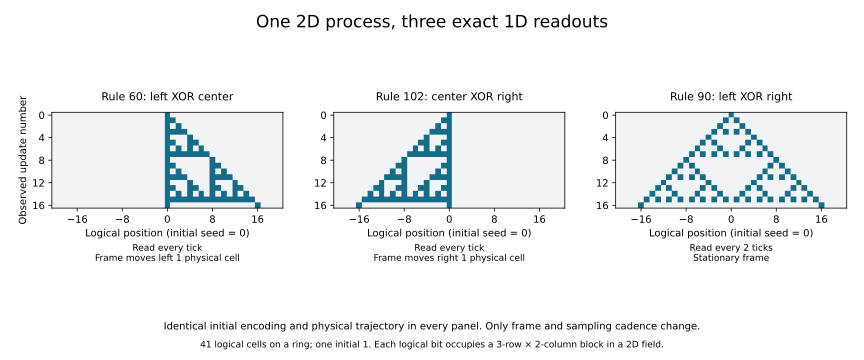

# One 2D process, three exact 1D readouts

The fixed 2D interpreter can do more than carry encoded data along a conveyor.
With each logical bit represented by a six-cell block, it implements **Rule
90**, combining the left and right logical neighbors by XOR. The equality is
exact for every input, with two physical ticks per logical update.

The same code also implements **Rules 60 and 102** when read every tick in
oppositely moving frames. We have one physical law, one encoding, and three
effective descriptions with explicit relationships. This is a concrete example
of how the law attributed to a process depends on its observation coordinates
and cadence. It is not uncertainty about which physical law generated the data.

## Protocol and evidence

The [protocol](protocols/block-compatibility-20260908.md) was
[committed before evaluation](https://github.com/bombadil-labs/groovy-commutator/commit/a968c9dac31fa40731642f6341abb583e3be48a6).
Both the primary instrument and a separate Boolean truth-set audit were then
[committed before evaluation](https://github.com/bombadil-labs/groovy-commutator/commit/6d246c4ce0cac1146b0ac7fa296af4527e43343c).
The algebraic explanation and illustrative figure below are follow-ups to the
census. No dynamical class labels were used.

- [Primary instrument](../../scripts/experiment_block_compatibility.py) and
  [independent audit](../../scripts/audit_block_compatibility.py).
- [Complete outcomes](../../results/block_compatibility_20260908_outcomes.json),
  [all successful encodings](../../results/block_compatibility_20260908_successes.csv),
  [census](../../results/block_compatibility_20260908_census.csv), and
  [rejection witnesses](../../results/block_compatibility_20260908_rejections.json).
- [Summary and minimal witnesses](../../results/block_compatibility_20260908_summary.json),
  [primary checks and source hashes](../../results/block_compatibility_20260908_metadata.json),
  and [independent audit record](../../results/block_compatibility_20260908_audit.json).
- [Report and figure script](../../scripts/report_block_compatibility.py),
  [generated comparison table](../../results/block_compatibility_20260908_table.md),
  and [illustrative replay record](../../results/block_compatibility_20260908_replay.json).

```bash
python scripts/experiment_block_compatibility.py
python scripts/audit_block_compatibility.py
python scripts/report_block_compatibility.py
```

## The frozen search

Keep the [ternary 2D interpreter](2026-09-08-dimensional-lift.md) fixed:

$$
F(X)(y,x)=X\bigl(y+2X(y,x)-1,\;x+X(y,x-1)+X(y,x+1)-1\bigr).
$$

Choose two distinct binary blocks $A,B$ of height $m$ and width $w$. Logical
bit $s_i$ selects its block in physical columns $wi$ through $wi+w-1$; repeat
the block rows with vertical period $m$. This defines an injective encoding
$E$ of the whole logical row, including every overlap used by the physical law.

We exhaust every ordered block pair in every rectangle with $mw\le6$: 14
shapes. Cadence $k$ is 1, 2, or 3. A fixed horizontal displacement $u$ and
vertical displacement $v$ each lie between $-k$ and $k$. Vertical displacements
equivalent modulo $m$ are counted once. Positive translation moves content
toward increasing coordinates. The tested equation is

$$
F^k E=T_{v,u}E\phi_r.
$$

The frame is fixed before seeing any trajectory. In laboratory coordinates,
this implies

$$
F^{kt}E(s)=T_{tv,tu}E\bigl(\phi_r^t(s)\bigr).
$$

Translations describe observation, not extra physical operations. The physical
field evolves freely between explicitly declared interventions. The budget is
six physical cells per logical bit **per vertical period**; this family does
not encode arbitrary independently varying 2D inputs.

For each block and frame, the physical causal interval is
$[u-k,u+w-1+k]$. We enumerate all assignments to the corresponding logical
interval, enlarged when necessary to include the central triple. This proves
the local identity for all inputs, hence for every logical ring width and the
infinite line. Failures distinguish leaving the two-block code from remaining
in the code but depending on logical bits outside the central triple.

The complete outcome matrices store a rule number, -1 for leaving the code,
or -2 for requiring outer context. The JSON records shape, parameter order,
little-endian signed 16-bit representation, compression, and raw hashes; the
protocol specifies code-pair order. Sparse success and witness files accompany
the complete matrices.

## What the census finds

The **781,050** candidates produce **9,022** successful records and **22**
literal elementary targets. Removing the declared encoding symmetries and
repeated vertical periods leaves **1,218** canonical records. These records
are representations, not independent statistical samples. The targets occupy
11 conventional reflection/state-complement rule orbits.

| Encoding and observation | Distinct ECA targets |
| --- | ---: |
| Columns, stationary | 2 |
| Columns, fixed frames allowed | 8 |
| All rectangles, stationary | 14 |
| All rectangles, fixed frames allowed | 22 |

These are nested or overlapping search restrictions, not separate experiments.
The earlier [column-only exclusion](2026-09-08-column-compatibility.md) remains
valid under its stationary, width-one restriction. Horizontal packing changes
what the fixed interpreter can represent.

| Actual input dependence | Target rules |
| --- | --- |
| Constant | 0, 255 |
| One input, possibly complemented | 15, 51, 85, 170, 204, 240 |
| Multiple inputs, affine over XOR | 60, 90, 102, 153, 165, 195 |
| Multiple inputs, nonlinear | 23, 128, 136, 192, 232, 238, 252, 254 |

The affine targets first appear at block area six, using a $3\times2$ block,
within the declared search. Neither Rule 54 nor Rule 110 has a witness in
this budget. That is not an exclusion for larger blocks, other cadences,
other encodings, or another interpreter. We have not defined or tested a
Class-IV enrichment score.

## The six-cell construction

Encode logical bit $s_i$ as

$$
E(s_i)=\begin{pmatrix}s_i&1\\0&1\\0&1\oplus s_i\end{pmatrix}.
$$

Thus $A=42$ and $B=11$ when position $(y,j)$ has bit index $2y+j$, starting
from zero. Two of the six cells change when the logical bit flips. The exact
identities are

$$
FE=T_{0,-1}E\phi_{60}=T_{0,1}E\phi_{102},\qquad F^2E=E\phi_{90}.
$$

| Readout | Physical ticks per logical update | Frame displacement per update | Logical update |
| --- | ---: | ---: | --- |
| Rule 60 | 1 | left 1 cell | $s_{i-1}\oplus s_i$ |
| Rule 102 | 1 | right 1 cell | $s_i\oplus s_{i+1}$ |
| Rule 90 | 2 | none | $s_{i-1}\oplus s_{i+1}$ |

Direct substitution gives the following three rows in physical block $i$
after one tick:

$$
\begin{pmatrix}
1&s_i\oplus s_{i+1}\\
1&0\\
1\oplus s_{i-1}\oplus s_i&0
\end{pmatrix}.
$$

This is exactly a one-cell right shift of $E\phi_{102}(s)$, which is also
a one-cell left shift of $E\phi_{60}(s)$. The identity holds locally for
every logical input, rather than only for the pictured seed.



The figure replays one physical trajectory on a 3-by-82 torus. Every plotted
readout is checked both for valid code blocks and equality to the independent
elementary CA engine. All panels start from the same encoded single logical
one. Row number counts observed updates, so the Rule-90 panel spans twice as
many physical ticks.

### Why the middle terms cancel

Let $\tau s_i=s_{i-1}$ be logical right translation. Then
$\phi_{102}=I\oplus\tau^{-1}$ and a physical two-cell translation obeys
$T_{0,2}E=E\tau$. Translation equivariance of $F$ gives

$$
F^2E=T_{0,2}E\phi_{102}^2
=E\bigl(\tau(I\oplus\tau^{-1})^2\bigr)
=E(\tau\oplus\tau^{-1})
=E\phi_{90}.
$$

The two identical middle terms cancel over binary XOR. This explains the
stationary Rule-90 update through the moving Rule-102 description. It supplies
an exact instance of cancellation across descriptions; it does not yet define
the proposed operation that feeds a remainder back into the physical law.

## Actions, checks, and limits

A matched logical flip toggles the physical mask $A\oplus B$ at the translated
block footprint. For the six-cell witness that is two physical flips per
vertical period. This action map intertwines with logical flipping, and the
dynamical identity therefore preserves arbitrary finite sequences of matched
actions and updates. It does not establish repair after arbitrary cell damage.

The primary run checked 47,211,984 causal assignments across candidates,
reproduced all 16,002 earlier stationary column conditions, and checked 60,778
encoding symmetry relationships. Code swap, vertical translation, and combined
state complement/full spatial reflection supply controls; arbitrary horizontal
rotation within a block is not treated as a symmetry.

For 26 deterministically selected witnesses, direct laboratory-frame replay
checked every input on logical rings of widths 5 and 7 for four coarse
updates (16,640 state comparisons), and every length-three no-op/fixed-cell-flip
word at width 5 (19,968 state comparisons). These finite replays corroborate
the local proof and explicitly check action placement in moving frames.

The separate audit uses Boolean truth sets and shrinking horizontal windows,
without importing the primary update or decoder. It independently checks the
parameter grid and **all 781,050 outcomes**, using 284,550 truth-set evolutions.
Every result agrees. This is an independent implementation audit within this
research session, not external replication.

The result establishes exact encoded dynamics combining neighboring inputs.
It does not establish robust structures under arbitrary noise, universal
computation, an evolving rule table, or a recursively compatible family through
successive dimensions. A useful next mathematical target is to identify the
structural features of this block construction that could support a genuine
2D input field inside the 3D interpreter, with an explicit encoding and action
map. Carrying the proof across that step would test more than transport.

## Open hypothesis: something exceptional about three dimensions

During this run, Myk reported a parallel research hypothesis: three dimensions
may admit kinds of representation unavailable in either lower or higher
dimensions. This is recorded as a [proposed theory](../knowledge/three-dimensional-exception.md),
not a finding of the block experiment. The exact object, permitted transformations,
meaning of dimension, and argument from the parallel work are still needed.

Three rows in the present block are **not three spatial dimensions**. Everything
in this search happens in a 2D field. The earlier all-dimensional conveyor also
cannot establish a three-only property; it demonstrates transport in every
positive lower dimension.

At the level of storing data alone, adding a constant coordinate can retain a
lower-dimensional representation. A three-only claim must therefore specify
the relation or operational property whose preservation changes when additional
directions and transformations are allowed. The next comparison should fix
that property before evaluating dimensions two, three, and four. We should not
choose a convenient mechanism merely because it makes three look special.

This hypothesis can guide the next unit once its precise formulation is
available. It does not change the frozen budget or interpretation of this run.
The separately recorded boundary/individuation question remains parked.
