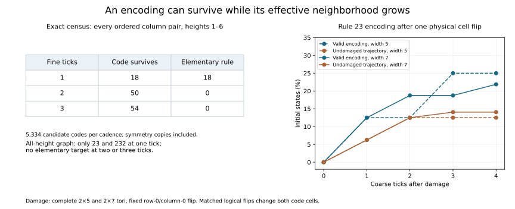

# When an encoding survives evolution

We now have explicit families inside the fixed 2D interpreter whose evolution
agrees exactly with a lower-dimensional process. The result also separates two
questions that were easy to conflate: whether an encoding survives, and whether
its decoded update still uses the original neighborhood size.

The frozen search considers every elementary 1D rule, with each logical bit
encoded as one of two repeating vertical columns. At one fine tick per logical
step, only Rules **23 and 232** admit such an encoding. At two or three ticks,
none does. This exclusion covers **every finite column height**, through a
complete local-constraint graph, not just the finite-height examples.

Other codes do survive at two or three ticks, but their effective 1D rules
depend on a wider neighborhood. A deductive follow-up gives a particularly
transparent family in every positive lower dimension: data planes separated
by zero planes move diagonally under the same interpreter. After a vertical
lap, the encoding returns with its data shifted. Matched interventions are
preserved; arbitrary physical damage is a separate question.

## Protocol and evidence

The [protocol](protocols/column-compatibility-20260908.md) was
[committed before evaluation](https://github.com/bombadil-labs/groovy-commutator/commit/9143873c3bf11874bd9a695f3276652fb862f1db),
followed by the
[implementation note](https://github.com/bombadil-labs/groovy-commutator/commit/ce5cd3be5335cfd11332f1ec20cc0cb4e1cda872).
The conveyor argument and independent audit were written after the primary
enumeration and are identified below as follow-ups. No class labels were loaded.

- [Primary instrument](../../scripts/experiment_column_compatibility.py).
- [All 16,002 finite-height conditions](../../results/column_compatibility_20260908.csv).
- [All 768 rule/cadence graph decisions](../../results/column_compatibility_20260908_graph.csv)
  and [local constraints](../../results/column_compatibility_20260908_constraints.json).
- [Summary](../../results/column_compatibility_20260908_summary.json),
  [cycle and rejection witnesses](../../results/column_compatibility_20260908_witnesses.json),
  and [primary checks and hashes](../../results/column_compatibility_20260908_metadata.json).
- [Finite damage measurements](../../results/column_compatibility_20260908_damage.csv).
- [Independent audit and conveyor checks](../../scripts/audit_column_compatibility.py),
  [audit record](../../results/column_compatibility_20260908_audit.json), and
  [figure/report script](../../scripts/report_column_compatibility.py).

```bash
python scripts/experiment_column_compatibility.py
python scripts/audit_column_compatibility.py
python scripts/report_column_compatibility.py
```

Comparing CA through encodings and time rescaling has an established formal
literature; see Delorme, Mazoyer, Ollinger, and Theyssier's
[Bulking II](https://arxiv.org/abs/1001.5471). This experiment fixes a particular
interpreter and a restricted periodic column representation. It is not a new
definition of intrinsic universality.

## A globally consistent representation

Keep the [ternary interpreter](2026-09-08-dimensional-lift.md) fixed. In 2D,
its update is

$$
F(X)(y,x)=X\bigl(y+2X(y,x)-1,\;x+X(y,x-1)+X(y,x+1)-1\bigr).
$$

Choose different binary columns $a,b$ of height $m$. Encode each 1D bit by

$$
E(s)(y,x)=\begin{cases}a_{y\bmod m}&s(x)=0,\\b_{y\bmod m}&s(x)=1.\end{cases}
$$

This defines every cell of the infinite 2D field. Neighboring patches overlap
consistently because they read the same field. It avoids the earlier demand
that every overlapping patch store an identical complete rule table.

The image $M=E(\{0,1\}^{\mathbb Z})$ is a family with one logical bit per
column and $m$ physical cells per vertical period. The decoder recognizes $a$
or $b$ in each period. The sought identity is

$$
F^k E=E\phi_r.
$$

It requires the image family to be invariant under $F^k$, with one fixed
elementary rule $r$ describing its decoded dynamics. Intermediate fine ticks
may leave the family. There is no fitted trajectory decoder, horizontal block
packing, moving coordinate frame, or extra channel in this search.

This represents 1D organizations within a 2D CA. It does not provide independent
2D variation inside the encoded family, nor store every ECA rule in every
neighborhood. Nevertheless, all 256 possible lower rules are considered as
targets. Unlike the original outer-totalistic table-domain restriction, an
unsuccessful rule here fails an explicit encoding-and-cadence test.

## Why the search covers every column height

At vertical position $y$, the pair $(a_y,b_y)$ is one of four functions of the
logical bit: constant zero, complement, identity, or constant one. Call this
the row type. After $k$ fine ticks, a cell depends on a square of side $2k+1$.
We enumerate every vertical word of row types and every horizontal bit window
of that size.

For each proposed rule $r$, a vertical word is allowed when its evolved
central output equals its central row type applied to $r$'s output for every
horizontal window. Overlapping allowed words form a finite directed graph:
vertices have length $2k$ and edges length $2k+1$.

A repeating column pair exists exactly when this graph has a directed cycle
containing a variable row type. A cycle of constants would give $a=b$ and
encode no logical distinction. Checking whether a variable-center edge lies
in a strongly connected component decides existence. Conversely, repeating
the row types of such a cycle constructs a valid code. This is a finite
decision for arbitrary periodic height, at each of the three fixed cadences.

The graphs have 16, 256, and 4,096 vertices. The independent audit reconstructs
all 17,472 local constraints with Boolean truth sets, then checks every one of
the 796 eligible variable edges by direct return-path search. These methods
agree with the primary array evaluation and component algorithm on all 768
rule/cadence decisions.

## What passes, and what each failure means

At one tick, the two primitive families are:

| Lower update | Minimal code for 0 | Minimal code for 1 | Physical flips per logical flip |
| --- | --- | --- | ---: |
| Rule 232: majority of left, center, right | $(0)$ | $(1)$ | 1 per vertical period |
| Rule 23: complement of that majority | $(1,0)$ | $(0,1)$ | 2 per vertical period |

The first repeats the same logical row vertically. The second alternates the
row and its complement. Vertical repetitions, translation, and consistent
symmetry transformations produce the 18 successful finite-height records;
there are only two canonical families after those identifications.

The finite census separates leaving the encoding from requiring outer context:

| Fine ticks per logical update | Codes tested | Code family preserved | Elementary update |
| --- | ---: | ---: | ---: |
| 1 | 5,334 | 18 | 18 |
| 2 | 5,334 | 50 | 0 |
| 3 | 5,334 | 54 | 0 |

These are ordered code pairs at heights 1–6, with symmetry copies included.
They are not independent samples. The 50 and 54 returning codes genuinely
define lower-dimensional updates, but some outer bits beyond the central
triple matter. Thus zero in the last column does not mean all dimensional
compatibility has failed.

An explicit example uses the one-row identity encoding at cadence two.
Horizontal windows with integer encodings 10 and 11 have the same central
triple but give different central outputs after two majority updates. In
left-to-right bit order these windows are $(0,1,0,1,0)$ and $(1,1,0,1,0)$.
Their decoded outputs are respectively 0 and 1. The code survives; radius-one
closure fails.

By contrast, the two-row code $0\mapsto(0,0)$, $1\mapsto(1,0)$ leaves its
code family after one tick for four of the eight input triples. Its first
saved witness has input $(1,0,0)$ and output column $(0,1)$. The following
construction explains what that column is doing.



## Deductive follow-up: a conveyor in every dimension

Let $S$ be any binary field in positive dimension $d$. Place it in one plane
of a $(d+1)$-dimensional field, with $m-1$ all-zero planes between repeats,
where $m\ge2$. Write this encoding as $E_{d,m}(S)$, with data initially at
transverse phase zero. Let

$$
\tau_d S(\mathbf x)=S(\mathbf x-\mathbf 1)
$$

denote a diagonal spatial shift. The same ternary interpreter $\Phi_{d+1}$
from the earlier dimensional construction obeys

$$
\Phi_{d+1}^m E_{d,m}(S)=E_{d,m}(\tau_d^m S).
$$

The proof is local and applies to every positive $d$ and every $m\ge2$.
All cells in an occupied data plane read from adjacent zero planes and become
zero. A cell in the zero plane immediately above it has center zero and zero
central-plane neighbor count; its selected offset is $(-1,-1,\ldots,-1)$,
so it copies the diagonally preceding data bit. Other zero planes remain zero.
Each tick moves the whole data plane one transverse step and one step in every
spatial coordinate. After $m$ ticks it returns to its original transverse phase.

This gives an invariant family at cadence $m$, with a fixed decoder and an
explicit representation cost. It also explains why the two-row example fails
at one tick but succeeds at two: its data is in transit at the intermediate
phase. Its lower update shifts by two cells, which lies outside the elementary
radius-one target family.

Checks cover every 1D input on widths 5 and 7, heights 2–9, and two vertical
laps: 14,080 state/tick comparisons. Additional full-field checks in lower
dimensions 2 and 3 cover heights 2/3/4, spatial side three, eight seeded fields,
and two laps, for 288 field/tick comparisons. The all-dimension claim rests
on the argument above, not extrapolation from those finite checks.

This is a dimension-independent construction preserving arbitrary data and
its translated relationships. Its dynamics are simple transport. It does not
show that $\Phi_{d+1}$ simulates $\Phi_d$, produce a self-modifying rule, or
identify a Class-IV family. It supplies a concrete positive control for the
larger proposal: a change of dimension can preserve dynamics and still select
something much simpler than the hoped-for interacting regime.

## Preserving actions is different from repairing damage

For a logical flip $A_i$, define its physical representative by XORing column
$i$ with $a\oplus b$. Then $\widetilde A_i E=EA_i$. Together with
$F^kE=E\phi_r$, this proves preservation of every finite sequence of matched
actions and updates. The test directly verifies four-step continuations and
all length-three no-op/flip words on the declared rings. The conveyor has the
same action relationship at its sampled phase, with one flip per data-plane
period. No inference of missing provenance is involved: the code, phase,
cadence, and action map are explicit.

A single physical cell flip can be a different intervention. In the two-row
Rule-23 code, a logical flip changes both cells, while one physical flip
creates an invalid column. On the complete 2×7 torus, flipping row zero at
column zero starts outside the encoding for all 128 logical states. After
four ticks, **28** trajectories are back in the valid family, but only **18**
match their undamaged counterparts. Ten have recovered a valid representation
with different logical content. The row-one and code-swap controls give the
same aggregate counts.

The saved five-cell witness starting at logical state 9 returns to a valid
code after one tick but decodes to 31, while its undamaged evolution decodes
to 15. Another witness, starting at 4, returns after two ticks and does agree
with the undamaged trajectory. Both behaviors are retained.

These damage tests use tiny periodic tori of heights one and two, widths five
and seven, and four coarse ticks. A torus cell flip corresponds to periodic
copies when unfolded into the infinite plane. The matched logical action also
acts once per vertical code period. No robustness to an isolated defect in
an otherwise infinite 2D field, stochastic noise, or persistent attacks is
established. Once a trajectory reenters a proven invariant family at the
sampled phase, its subsequent undamaged evolution remains in that family.

## What this completes, and the next open step

The fixed interpreter now has explicit globally compatible encoded families,
an exact elementary-target exclusion within a declared architecture, and
action-preserving simulations with representation costs. Verification covers
2,130,432 primary local window pairs, 40,960 independent ECA engine comparisons,
16,002 finite-code/graph agreements, 150 symmetry checks, 5,120 matched finite
trajectory comparisons, and 3,072 action-word state comparisons. The separate
truth-set and return-path audit checks the all-height conclusion.

The broader recursive-family question is partly answered. The frozen search
excluded horizontal block packing and drift; the conveyor makes the cost of
that restriction visible. A next selective test can admit a declared amount
of horizontal packing or a fixed moving frame, while keeping the interpreter
and action vocabulary fixed. Its challenge is to preserve nontrivial
interactions beyond transport without choosing a decoder separately for each
trajectory. Remainder feedback remains a later explicit intervention on that
compatibility problem. The parked boundary question does not change this
experimental priority.
