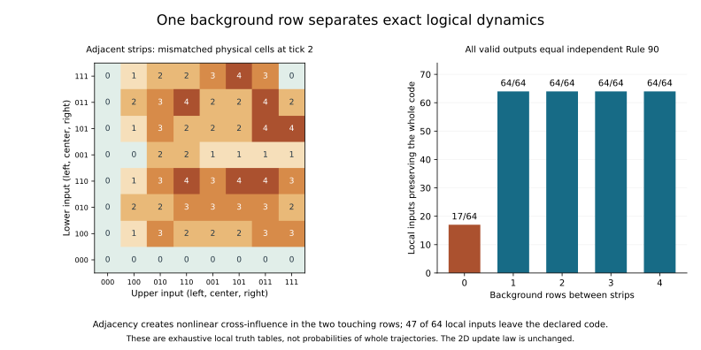

# When exact strips meet

The two-row Rule-90 organizations compose exactly when at least one background
row separates them. That row maintains their independence under the same 2D
physical law, including arbitrary finite sequences of matched logical actions.

Direct adjacency produces a different result. Each strip influences the
other, but **47 of the 64 local input pairs leave the two-strip code after two
fine ticks**. The interaction is real; it is not an exact coupled logical rule
within this representation. All 17 local inputs that do remain valid give the
same outputs as independent Rule 90.

This experiment locates both a condition for exact composition and a specific
failure of closure. It does not rule out a larger representation that retains
the information in the interacting interface.

## Protocol and evidence

The [protocol](protocols/coupled-strips-20260908.md) was
[committed before evaluation](https://github.com/bombadil-labs/groovy-commutator/commit/c186318f673acb7da32b185f101ab3714bb66440),
followed by the
[primary, independent audit, and action instruments](https://github.com/bombadil-labs/groovy-commutator/commit/06edcb93fd62b8283ee669aff62db90fc6926bf1).
The compact formulas and arbitrary-gap argument below are deductions from the
local setup, checked against the completed census. No new physical update law
or fitted decoder is introduced.

- [Primary local instrument](../../scripts/experiment_coupled_strips.py),
  [independent local audit](../../scripts/audit_coupled_strips.py), and
  [paired-state and action checks](../../scripts/check_coupled_strip_actions.py).
- [All local fields, residuals, truth tables, polynomials, and witnesses](../../results/coupled_strips_20260908_local.json).
- [Source hashes and primary counts](../../results/coupled_strips_20260908_metadata.json),
  [local audit](../../results/coupled_strips_20260908_audit.json), and
  [action check totals](../../results/coupled_strips_20260908_actions.json).
- [Formula checks](../../results/coupled_strips_20260908_formula_checks.json),
  [generated table](../../results/coupled_strips_20260908_table.md), and
  [report and figure script](../../scripts/report_coupled_strips.py).

```bash
python scripts/experiment_coupled_strips.py
python scripts/audit_coupled_strips.py
python scripts/check_coupled_strip_actions.py
python scripts/report_coupled_strips.py
```

## A fixed composition map

Keep the [finite strip encoding](2026-09-08-defect-fates.md) and alternating
background $B(y,2i)=0$, $B(y,2i+1)=1$. A strip beginning at row $j$ stores
logical row $s$ as

$$
\begin{array}{c|cc}
 &2i&2i+1\\\hline
y=j&0&1\oplus s_i\\
y=j+1&s_i&1
\end{array}.
$$

Put independently variable logical rows $a,b$ in strips beginning at $0$ and
$2+g$. The gap $g$ is the number of background rows between them. All remaining
cells stay in $B$. Denote this globally defined injective composition by
$V_g(a,b)$.

We test $g=0,1,2,3,4$, with the original shared horizontal alignment and cadence
two. The desired independent identity is

$$
F^2V_g(a,b)=V_g(\phi_{90}(a),\phi_{90}(b)).
$$

More generally, the same code could admit a joint update $H_g$ that depends on
both inputs. We therefore first check whether the entire physical output can
be written as $V_g(a',b')$, including its constant cells and surrounding
background. Merely reading two candidate logical bits is not enough.

Every assignment to the six input bits $(a_L,a_C,a_R,b_L,b_C,b_R)$ is checked.
Two shrinking fine updates take input columns -2 through 3 and rows -4 through
$g+7$ to output columns 0 and 1 and rows -2 through $g+5$. This covers the full
central-block causal cone and all potentially altered vertical rows. The local
identities extend to all logical inputs and ring widths; no finite-width
assumption is needed for them.

## The exact local result

| Background rows between strips | Valid local inputs | Independent Rule-90 inputs | Maximum Boolean output degree |
| ---: | ---: | ---: | ---: |
| 0 | 17/64 | 17/64 | 5 |
| 1 | 64/64 | 64/64 | 1 |
| 2 | 64/64 | 64/64 | 1 |
| 3 | 64/64 | 64/64 | 1 |
| 4 | 64/64 | 64/64 | 1 |

Degree means algebraic normal form over binary XOR and multiplication, using
the six input variables. It is a property of these exact local functions,
not a dynamical class label or a measure of universal computation.

The independent audit reconstructs the physical evolution with Boolean truth
sets, using its own encoder and code-validity check. It agrees on all **320
local cases**, all output and residual fields, all validity and influence
decisions, and **200 cell polynomials**. Coefficients are independently recovered
by subset parity and checked by reconstructing their complete truth tables.



The fractions in this table count local input patterns. They are not
probabilities that a whole trajectory remains valid. A whole configuration
must satisfy the local condition at every column, and later updates impose
their own conditions. In particular, the 17 valid adjacent patterns do not
establish a new invariant family by themselves.

## Why one background row suffices forever

The separating row is active: it alternates between $B$ and its complement
at successive fine ticks. Its update nevertheless stays independent of both
strips' data.

At the initial phase, a background row is $(0,1)$ in each horizontal block.
Its even cell reads an odd cell from the row above, which is fixed at one
whether that row is background or the bottom of a strip. Its odd cell reads
an even cell from below, fixed at zero whether that row is background or the
top of a strip. Thus the background row becomes $(1,0)$.

At the intermediate phase, the bottom of a correctly evolving strip has
constant even cells equal to one, and the top has constant odd cells equal
to zero. The separating row's even cell now reads a zero from below, and its
odd cell reads a one from above. It returns to $(0,1)$.

These constants also provide exactly the surroundings used in the single-strip
proof. Each strip therefore completes its Rule-90 update, and the same reasoning
repeats. It applies to **any gap $g\ge1$** and to **any collection of aligned
strips with at least one background row between neighbors**, including an
infinite stack with independently varying data in each strip.

This all-gap and many-strip statement rests on the local argument, not
extrapolation from the five tested gaps. It gives a family of independent
logical processes in one physical plane. It does not yet give logical exchange
between those processes.

## Matched actions remain independent

A logical flip in either strip changes its two designated physical cells.
The action maps commute for different strips and satisfy the encoding identity
individually and together. Combined with the dynamical identity, this preserves
arbitrary finite words of the declared actions and updates.

For gaps one and two, checks cover every pair of logical states on rings of
widths five and seven for four coarse updates. At gap one and width five, every
length-three word over no action, upper flip, lower flip, and both flips is
checked on every joint initial state. Vertical windows shrink with sufficient
padding, so there is no vertical torus. Horizontal wrap is the declared logical
ring.

These checks include **671,744 independent fine-field comparisons**, **139,264
coarse paired-state comparisons**, and **196,608 action-word state comparisons**.
The expected logical updates use the package Rule-90 engine separately on each
row. The physical action cost is two flips per changed logical bit, with the
prepared background still part of the representation.

## What changes when the strips touch

For adjacent strips, put

$$
h_a=a_{i-1}\oplus a_i,\quad g_a=a_i\oplus a_{i+1},\quad
h_b=b_{i-1}\oplus b_i,\quad g_b=b_i\oplus b_{i+1}.
$$

Write $a=a_i$, $b=b_i$. After one fine tick the four strip rows are exactly

$$
\begin{array}{c|cc}
 &2i&2i+1\\\hline
y=0&1\oplus h_a&0\\
y=1&1\oplus ab&(1\oplus b)g_a\\
y=2&1\oplus(1\oplus a)h_b&ab\\
y=3&1&g_b
\end{array}.
$$

All exterior rows equal the complemented background. The products involving
both logical rows express genuine interaction. Relative to independently
evolving strips, the first-tick interaction is confined to the two touching
rows and has the compact form

$$
\begin{pmatrix}ab&b g_a\\a h_b&ab\end{pmatrix}.
$$

The compact formulas agree with every saved first-tick local field. They show
how removing the separator changes which variable cells are read. Neither the
physical update law nor the local coordinate convention was changed.

At two ticks, define the composition residual

$$
C_g(a,b)=F^2V_g(a,b)\oplus V_g(\phi_{90}(a),\phi_{90}(b)).
$$

For every $g\ge1$, this residual vanishes by the independence proof. For $g=0$,
it is nonzero on 47 local inputs and is still confined to the two touching rows.
Two physical cells in each strip depend on the other strip's logical input.
Every nonzero residual monomial mixes variables from both strips; the full
audited formulas have degrees four or five and are retained in the data.

This is an explicit mismatch between evolving the composed state and composing
the independent evolutions. It is not a newly imposed feedback rule. Keeping
or acting on that residual would be a further experiment.

## A concrete failure, and a cancellation

The first saved failure has upper and lower logical triples both equal to
$(1,0,0)$. Independent Rule 90 would output one in each strip. The two candidate
decoded bits are indeed both one, but physical cell $(y=2,x=0)$ also becomes
one where the lower strip code requires a constant zero. The decoder can read
plausible outputs while the physical representation has already failed.

Conversely, interaction at an intermediate tick need not survive the sampling
cadence. For both rows identically one, the first-tick interaction matrix is
$\left(\begin{smallmatrix}1&0\\0&1\end{smallmatrix}\right)$ in every block;
after two ticks the composition residual vanishes and both logical rows become
zero. This is an exact cancellation for that specified input, not evidence of
a general robust coupling. In the full local census, the first-tick interaction
is nonzero on 32 input patterns and the two-tick residual on 47; these evaluate
different stages and do not imply monotone growth for each pattern.

## What the result does and does not settle

For this fixed geometry, one background row is the minimum gap that guarantees
independent evolution of arbitrary strip data. Adjacency provides physical
cross-influence but does not preserve the declared two-logical-bit code on all
inputs. There is therefore no total exact coupled update $H_0$ within that
code at cadence two.

The next question is whether an enlarged representation can retain the
interface residual as additional state and close under repeated evolution.
That would test whether interaction changes the appropriate description of
the joint organization. The extra state, decoder, and evaluation budget need
to be fixed explicitly; reading only the two familiar bits would conceal the
failure we have now measured.

Other strip alignments, variable separators, longer cadences, and alternative
encodings are not excluded. The 3D hypothesis and the separate philosophical
boundary/individuation question remain parked.
