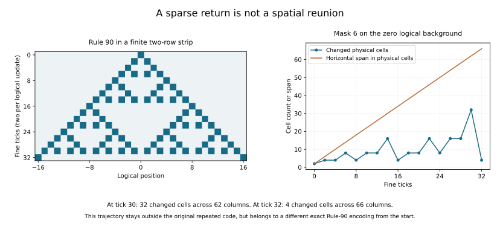

# Outside one code, exact under another

Longer defect runs produced no return to the original encoding and no recurring
whole shape under the declared screen. They did expose a different exact
organization: **Rule 90 can live in a two-row strip of the same 2D system**.
A logical flip in this representation changes just two physical cells, with
no vertical repetition of the action.

The route to that finding matters. Two perturbations of the zero logical
background stayed two rows high while repeatedly becoming sparse. Their
activity contracted, but their horizontal span kept growing. A separate
post-census calculation identified an invariant strip family containing those
states from the start. This is a new usable description of departures from
our original code, not spontaneous physical recovery or a demonstrated
fan-out/fold-in process.

## Protocol, chronology, and evidence

The [long-run protocol](protocols/defect-fates-20260908.md) was
[committed before evaluation](https://github.com/bombadil-labs/groovy-commutator/commit/751292746fcac0d2628eee1e0cef397cb1d8b5ad).
Both instruments and a wording clarification were
[committed before evaluation](https://github.com/bombadil-labs/groovy-commutator/commit/1a9a923aee31ce834d7ac840c499e2ef4e8e543b).
The [strip hypothesis and exact-check protocol](protocols/defect-fates-strip-followup-20260908.md)
were formulated after inspecting the census, then
[committed with their check](https://github.com/bombadil-labs/groovy-commutator/commit/58c9f6f45df7241cdf80283ace369e33fc8036e4)
before testing that hypothesis. The two stages are kept separate below.

- [Primary long-run instrument](../../scripts/experiment_defect_fates.py) and
  [independent audit](../../scripts/audit_defect_fates.py).
- [Exact input words](../../results/defect_fates_20260908_backgrounds.json),
  [all trajectory cases and response hashes](../../results/defect_fates_20260908_cases.json),
  [complete indexed metrics](../../results/defect_fates_20260908_metrics.json),
  and [certificate list](../../results/defect_fates_20260908_certificates.json).
- [Summary](../../results/defect_fates_20260908_summary.json),
  [table](../../results/defect_fates_20260908_table.md),
  [source hashes and primary totals](../../results/defect_fates_20260908_metadata.json),
  and [independent audit record](../../results/defect_fates_20260908_audit.json).
- [Strip proof checks and matched actions](../../scripts/check_defect_strip.py),
  [strip check record](../../results/defect_fates_20260908_strip.json), and
  [figure/report script](../../scripts/report_defect_fates.py).

```bash
python scripts/experiment_defect_fates.py
python scripts/audit_defect_fates.py
python scripts/check_defect_strip.py
python scripts/report_defect_fates.py
```

## What the longer experiment covers

Keep the physical law and original six-cell code fixed. Test all 64 block XOR
masks, both repeated vertically and confined to one block, for 32 fine ticks.
There are 22 aligned periodic logical backgrounds: every word of minimal period
one through four, retaining spatial phases. Two independent seeded cohorts
supply 16 random backgrounds each. The saved 65-bit words specify every input
needed within the observation horizon; they do not specify infinite random
extensions for an all-future claim.

The 6,912 runs yield **117,504** full response samples at even times zero
through 32. Each sample includes the whole possible difference support.
Horizontally shrinking causal windows avoid wraparound artifacts. Isolated
mode also shrinks vertically; periodic mode uses exactly its declared three-row
vertical period. The results therefore hold for any infinite extension of
each sampled input word within the finite horizon.

An independent uint64 implementation packs the 64 perturbations into Boolean
truth sets and evolves them with an explicit multiplexer. It imports no
primary encoder, update, metric decoder, or recurrence decisions. It agrees
on every response hash, every metric, every first-return result, and every
recurrence decision. Undamaged and matched-action samples also agree with the
separate package Rule-90 engine.

This is exhaustive over masks and the declared short-period background set,
but **sampled over general backgrounds**. The previous four-tick experiment
exhausted all causal backgrounds. Extending the horizon does not carry that
exhaustiveness forward.

## No original-code recovery or recurring whole shape

The screen compares complete nonempty difference shapes after removing
translation. It requires three equal shapes at a constant displacement over
fine periods 2, 4, 6, or 8. Periodic mode allows horizontal translation;
isolated mode allows both coordinates. A putative permanent recurrence also
requires the entire periodic background to recur under the same translation.

That extra requirement matters. If both the background and its complete
difference obey the translation identity, then the full perturbed state does
too. Translation equivariance of the CA proves recurrence for all subsequent
periods. A difference-shape match on its own would not supply that proof.

No nonempty trajectory passes the declared three-shape screen, including the
valid logical-action controls. Hence there are no certified objects eligible
for the protocol's conditional perturbation stage. Zero masks remain undamaged;
the repeated matched logical flip remains valid but has an expanding Rule-90
pattern, not a fixed translating shape.

| Perturbation mode | Background cohort | Initially invalid cases | Original-code returns | Shape screens | Median changed cells at tick 32 |
| --- | --- | ---: | ---: | ---: | ---: |
| Repeated | Periodic | 1,364 | 0 | 0 | 98 |
| Repeated | Random A | 992 | 0 | 0 | 98 |
| Repeated | Random B | 992 | 0 | 0 | 97 |
| Isolated | Periodic | 1,386 | 0 | 0 | 988.5 |
| Isolated | Random A | 1,008 | 0 | 0 | 977 |
| Isolated | Random B | 1,008 | 0 | 0 | 998 |

The 6,750 initially invalid cases remain outside at every sampled time.
Repeated-mode mass counts one vertical period; isolated-mode mass counts the
entire finite disturbance. Those numbers have different physical meanings.
The table reports the selected masks and backgrounds, not a class-wide measure
of typical behavior.

No screen within this budget does not exclude longer periods, multiple moving
components, another observation, or structure appearing after tick 32. The
screen specifically tests recurrence of the *whole* difference shape.

## The exceptional trajectories

On the zero logical background, masks 6 and 24 end with just four changed
cells in both modes. Other initially invalid periodic-mode cases end with at
least 67 changed cells per period; other isolated cases end with at least 306.
These are observations of the declared census, not selection thresholds set
before the run.

For either exceptional isolated mask, the even-time response masses are

$$
2,4,4,8,4,8,8,16,4,8,8,16,8,16,16,32,4.
$$

The support stays two rows high, while its horizontal span grows from 2 to
66 columns. At tick 30 there are 32 changed cells across 62 columns; at tick
32 there are four across 66 columns. Activity becomes sparse without
reassembling spatially.



## Post-census deduction: a finite strip

Let the fixed reference field alternate horizontally, at every vertical row:

$$
B(y,2i)=0,\qquad B(y,2i+1)=1.
$$

For any logical row $s$, define $U(s)$ by replacing only rows zero and one:

$$
\begin{array}{c|cc}
 &2i&2i+1\\\hline
y=0&0&1\oplus s_i\\
y=1&s_i&1
\end{array}
$$

All other rows stay equal to $B$. This is injective, and the same physical
interpreter satisfies

$$
\boxed{F^2U=U\phi_{90}.}
$$

This identity holds for every infinite logical input and every logical ring
width. It describes independently variable data in two adjacent physical rows,
surrounded by a specified alternating background. Its logical actions are
finite: flipping $s_i$ toggles only $(0,2i+1)$ and $(1,2i)$.

### Direct verification of the identity

Put $h_i=s_{i-1}\oplus s_i$ and $g_i=s_i\oplus s_{i+1}$. Substitution into
the physical update gives, after one fine tick,

$$
\begin{array}{c|cc}
 &2i&2i+1\\\hline
y=0&1\oplus h_i&0\\
y=1&1&g_i
\end{array}
$$

with every other row equal to the complemented background $1\oplus B$.
Since $g_i=h_{i+1}$, a second substitution returns the background to $B$ and
the two data rows to the form $U(q)$, where

$$
q_i=h_i\oplus g_i=s_{i-1}\oplus s_{i+1}.
$$

The exact check covers all eight input triples and every potentially altered
vertical row, using two separately implemented updates. Beyond those rows,
finite propagation gives the undamaged background. Horizontal locality then
extends the calculation to arbitrary inputs and widths.

Additional checks cover all inputs on logical rings of widths five and seven:
1,280 fine-field comparisons between independent updates and 640 coarse-state
comparisons to package Rule 90. At width five, every length-three no-op/flip
word yields 768 matched-action state comparisons. There is no vertical torus.
The action identity and dynamical identity prove preservation of arbitrary
finite matched action/update words by induction; the finite tests corroborate
that statement and the placement of the physical action.

## How this changes the coupling picture

The earlier representation $E$ encoded a logical bit through repeating
vertical blocks. Its matched logical flip therefore acted in every vertical
period. The new representation $U$ confines its independently variable data
to a two-row strip; a logical flip has physical cost **two cells total**.

Both use the same 2D update law. Their backgrounds and admissible states differ.
The two-row strip is not repeated every two rows. Its surrounding background
is part of the encoding, so this does not contradict the earlier six-cell
minimum within the restricted periodically repeated block search. The two-cell
cost counts a logical intervention after that background has been prepared;
it is not the cost of preparing the whole physical configuration.
The new proof does not make arbitrary physical damage a logical operation, or
establish robustness of the strip to changes in its surrounding background.
It also does not erase the existing non-recovery result: these trajectories
remain outside $E$ while evolving exactly within $U$.

An isolated mask 6 on $E(0)=B$ is already $U$ applied to a single logical one.
Mask 24 is its vertical translate. For periodic versions, the same initial
states are vertical translations of the original repeated encoding with a
logical flip. The post-census insight is therefore a new exact representation,
not a transient that constructs that representation later.

## Cancellation is not spatial reunion

The exceptional pulse has an exact explanation at every even fine time
$t=2n$. Rule 90 acts by the XOR of left and right translations. In binary
arithmetic, powers at $2^j$ reduce to the two translations by $2^j$; multiplying
the factors selected by the binary digits of $n$ produces
$2^{\operatorname{popcount}(n)}$ distinct pulse positions. Each logical one
changes two strip cells. Thus

$$
\text{changed cells}=2^{1+\operatorname{popcount}(n)},\qquad
\text{horizontal span}=4n+2.
$$

This follows from the shift polynomial and the exact strip encoding; it is
not extrapolated from the finite mass sequence. Sparse returns at powers of
two reflect XOR cancellation across an expanding span. They do not demonstrate
reassembly into a bounded object.

The next concrete 2D question is whether independently variable strips can
coexist and interact while retaining an exact coupled description. Separated
strips and adjacent strips give a natural control/comparison pair. That would
test composition of these organizations without choosing a new physical law.
The proposed 3D exception and the boundary/individuation thread remain parked.
