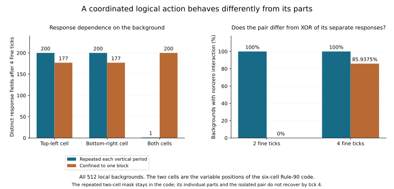

# What happens outside the Rule-90 encoding?

The six-cell encoding gives exact Rule-90 dynamics, but it does not automatically
repair nearby states. We exhaustively perturbed one code block and followed
every relevant local background. At the sampled times through four fine ticks,
**none of the initially invalid cases recovers the encoding**.

There is also a sharper positive result. The two physical flips that together
represent a logical flip have a background-independent combined response when
repeated with the code's vertical period. Each part on its own has a strongly
background-dependent response. Applied only in one block, even the combined
pair loses the simple logical behavior. Exact linear dynamics belong to the
specified organization and its action map, not to arbitrary physical changes.

## Protocol and evidence

The [protocol](protocols/encoded-defects-20260908.md) was
[committed before evaluation](https://github.com/bombadil-labs/groovy-commutator/commit/ef79c56155ede6316182f9ab0fc055e70054940f).
The primary array instrument and independent Boolean truth-set instrument were
also [committed before evaluation](https://github.com/bombadil-labs/groovy-commutator/commit/a2b59a235642a251f689aeaf4814b3992991d719).
The fixed 2D interpreter and encoding are unchanged from
[Research 015](2026-09-08-block-compatibility.md). The three-dimensional hypothesis
is parked at the user's request; no dimension comparison is part of this run.

- [Primary instrument](../../scripts/experiment_encoded_defects.py) and
  [independent audit](../../scripts/audit_encoded_defects.py).
- [All response and pair-interaction records](../../results/encoded_defects_20260908_responses.json),
  [per-background classifications](../../results/encoded_defects_20260908_classifications.json),
  and [deterministic interaction witnesses](../../results/encoded_defects_20260908_witnesses.json).
- [Source hashes and primary counts](../../results/encoded_defects_20260908_metadata.json),
  [audit record](../../results/encoded_defects_20260908_audit.json),
  [figure/report script](../../scripts/report_encoded_defects.py), and
  [selected four-tick table](../../results/encoded_defects_20260908_table.md).

```bash
python scripts/experiment_encoded_defects.py
python scripts/audit_encoded_defects.py
python scripts/report_encoded_defects.py
```

The independent audit agrees on all **196,608 sampled response fields**, all
384 aggregate records, every per-background classification, and all 90 pair
records. It uses bitsets representing all backgrounds simultaneously and an
explicit Boolean multiplexer update; it imports neither the primary update nor
the primary encoder or codeword decoder. This is an independent implementation
check within the session, not external replication.

## The physical experiment

Recall the code, repeated vertically and tiled horizontally:

$$
E(s_i)=\begin{pmatrix}s_i&1\\0&1\\0&1\oplus s_i\end{pmatrix},
\qquad F^2E=E\phi_{90}.
$$

Position $(y,j)$ within a block has mask bit index $2y+j$. We test every
six-bit XOR mask, including no change. Mask 33 flips the top-left and
bottom-right cells; these are precisely the two positions that differ between
the codewords for zero and one.

Each mask is applied in two ways. **Periodic:** apply it at logical column zero
in every vertical period. **Isolated:** apply it only to the single block in
rows 0–2. The periodic action changes an infinite repeated set of cells in the
plane; the isolated action changes at most six cells. Their physical costs and
constraints differ. They are not interchangeable noise models.

We exhaust all 512 assignments to logical positions -4 through 4 and sample
fine times 0, 2, and 4. These nine bits cover every initial dependency of every
possibly changed output block over the declared horizon. The output rectangle
has rows -6 through 8 and columns -4 through 5; its four-tick causal expansion
has rows -10 through 12 and columns -8 through 9.

Both implementations shrink the initial window at each tick, so no periodic
edge or invented exterior value enters the measured output. Outside the
defect's causal support, the field remains identical to undamaged evolution.
Each result therefore applies to **every infinite extension of the enumerated
nine-bit background**. Unlike the earlier tiny-torus damage experiment, the
isolated mode here is a finite defect in an otherwise infinite 2D field.

The repeated mode has vertical period three. Its reported changed-cell totals
use five periods in the common output rectangle; these repeated cells are not
independent observations. Counts over backgrounds refer to uniform enumeration
of local bits, not a claimed statistical measure of typical CA states.

## Valid blocks are not always a valid global encoding

We distinguish three global outcomes: equal to the undamaged evolution,
different logical content but still in the encoding, or outside the encoding.
We also record whether every affected block is individually one of the two
valid codewords.

The last condition alone is insufficient. At time zero, isolated mask 33 turns
one block into the other valid codeword. Every block remains locally valid,
but this block disagrees with the unchanged vertical copies of its logical bit.
The field is outside the image of $E$.

More generally, a finite isolated perturbation cannot reach a globally valid
encoding with changed logical content at any finite time. Finite propagation
leaves remote vertical copies unchanged; those copies fix every decoded logical
bit. If the whole field returns to $E$, it must therefore equal the undamaged
evolution. This is a consequence of this infinitely repeated encoding, not a
general prohibition on localized computation or error-correcting codes.

## No recovery within the declared horizon

| Intervention | Nonzero masks tested | Backgrounds per mask | Initially outside the global code | Recovered at fine tick 2 | Recovered at fine tick 4 |
| --- | ---: | ---: | ---: | ---: | ---: |
| Periodic | 63 | 512 | 31,744 | 0 | 0 |
| Isolated | 63 | 512 | 32,256 | 0 | 0 |

In periodic mode, the 512 cases of mask 33 start valid and remain valid with
changed logical content. The other 62 nonzero masks start invalid and are
still invalid at both later samples. In isolated mode, all 63 nonzero masks
start globally invalid; all remain invalid. At ticks two and four they also
fail the weaker local-block test. The zero mask always matches the undamaged
trajectory.

Because the code is invariant under $F^2$, a trajectory that regained it at
tick two would remain in it at tick four. These are statements about the
stationary even-tick code. Odd ticks use a shifted representation, and this
experiment does not classify recovery there. Survival through four ticks is
not proof of survival forever; no eventual-healing conclusion is claimed.

## A simple combined action can have context-dependent parts

For a mask $M$, define its response on background $s$ as

$$
\delta_M(s,t)=F^t(E(s)\oplus M)\oplus F^t(E(s)).
$$

The number of distinct response fields across backgrounds measures whether a
fixed perturbation acts the same way in different contexts. At fine tick four:

| Physical change | Periodically repeated: distinct responses | Isolated: distinct responses |
| --- | ---: | ---: |
| Top-left cell, mask 1 | 200 | 177 |
| Bottom-right cell, mask 32 | 200 | 177 |
| Both cells, mask 33 | **1** | **200** |

The periodic combined action is a matched logical flip. Rule 90 is XOR-linear,
so its propagated logical difference is independent of the underlying logical
state. Encoding that difference changes the two variable positions in each
affected block. The primary instrument also checks this response against the
package's separate elementary CA engine.

This background independence is exact at all even times by the established
encoding identity and Rule-90 linearity. The numeric counts for individual
parts and isolated changes above are bounded four-tick results.



## Nonlinear interaction and cancellation

For each of the 15 pairs of distinct cell flips, measure

$$
J_{A,B}(s,t)=\delta_{A\oplus B}(s,t)\oplus\delta_A(s,t)\oplus\delta_B(s,t).
$$

A nonzero field means the pair's joint response differs from XORing its
separate responses. It detects nonlinear interaction in the physical system;
it does not by itself demonstrate a gate, glider, or useful computation.

At tick four, all 15 periodic pairs have nonzero interaction on all 512
backgrounds. For isolated pairs, 14 do so on every background. The exception
is the pair forming mask 33: its interaction is nonzero on 440 of 512
backgrounds at tick four, versus zero on every background at tick two.

For that same pair in periodic mode, the interaction is nonzero on every
background at both ticks two and four, even though the combined response is
background-independent. These facts are consistent. By definition,

$$
\delta_{A\oplus B}=\delta_A\oplus\delta_B\oplus J_{A,B}.
$$

The interaction term is part of how the context-sensitive individual effects
combine into the exact logical response. It would be wrong to infer that each
physical component independently follows the logical linear law. Conversely,
the presence of physical nonlinear interaction does not preclude an exact
linear description of the organized family.

The isolated pair's initial absence of interaction is limited to that pair,
mode, and sampled time. Its later nonzero interaction prevents extending the
two-tick observation into a lasting independence claim.

## What this adds, and what remains open

We now have an exact distinction between preserving a logical action within
the code and perturbing its physical implementation. The Rule-90 family is
invariant, but the tested neighboring states do not return within four ticks.
Background dependence and joint response make the encoding's coordination
requirements measurable.

The next unresolved issue in this 2D workstream is what the invalid responses
become: spreading damage, transported defects, or states with another usable
description. A longer declared causal horizon or a structural argument is
needed to distinguish those possibilities. Looking only at whether the original
code reappears would miss alternatives, just as the earlier column experiment
separated loss of a code from growth of its effective neighborhood.

No new feedback operation, fitted decoder, or claim about a special spatial
dimension is introduced here. The 3D proposal and boundary/individuation thread
remain parked.
