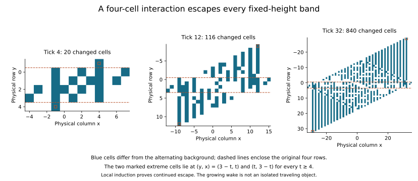

# The interface does not stay put

Keeping all four interface cells repairs the adjacent-strip description for
one coarse update, but not the next. Some actual trajectories leave the
original four physical rows by fine tick four. The failure is not just an
artifact of allowing interface states that the dynamics never creates.

A finite example gives a stronger result. Put one active logical bit in
each adjacent strip, with the upper bit one position to the right of the
lower bit. Their four physical changes launch two extreme disturbances that
move apart vertically forever. A local induction proves this continued escape.
Consequently, **no encoding confined to a fixed-height band against the same
alternating background can contain this entire trajectory**, even if it keeps
every cell inside the band or translates the band as a whole.

This is a limit of a particular kind of representation, not a limit on every
compact description. The physical law is unchanged. A different description
could track moving fronts, a constrained growing region, or other collective
variables; this experiment does not establish such a description.

## Protocol and evidence

The [main protocol](protocols/interface-state-20260908.md) was
[committed before evaluation](https://github.com/bombadil-labs/groovy-commutator/commit/740e12f9ac555528c23ec713e76b5014f65280e2).
The [two instruments and lossless-storage clarification](https://github.com/bombadil-labs/groovy-commutator/commit/bd222be0d7e3149585810fe0217fd867d844a33e)
followed. The first invocation stopped on a NumPy integer-type error before
producing any results; a [one-line index conversion](https://github.com/bombadil-labs/groovy-commutator/commit/a7d38d5f20b0e0c1ae5676edcb8788f148ae5a93)
was committed before the successful run. Neither the test domain nor the
criterion changed.

The [finite-witness protocol](protocols/interface-witness-20260908.md) and its
[scalar audit instrument](https://github.com/bombadil-labs/groovy-commutator/commit/53d9e9b481845dd18dd98753f4a8102c0c9eda23)
were committed after the census selected that witness, before following it
for 32 ticks. The all-time front argument below is a subsequent deduction,
not a preregistered prediction.

- [Primary instrument](../../scripts/experiment_interface_state.py) and
  [independent truth-set audit](../../scripts/audit_interface_state.py).
- [Census counts, all fixed-cell counts, witnesses, and source hashes](../../results/interface_state_20260908_census.json).
- [Complete enlarged-encoding output table](../../results/interface_state_20260908_free_outputs.json),
  stored as zlib-compressed hex of little-endian uint64 words, and
  [independent audit totals](../../results/interface_state_20260908_audit.json).
- [Finite-witness instrument](../../scripts/check_interface_witness.py),
  [all changed coordinates through tick 32](../../results/interface_state_20260908_witness.json),
  [front-lemma checks](../../results/interface_state_20260908_front_checks.json),
  and [figure and lemma-check script](../../scripts/report_interface_state.py).

```bash
python scripts/experiment_interface_state.py
python scripts/audit_interface_state.py
python scripts/check_interface_witness.py
python scripts/report_interface_state.py
```

## What the larger state retains

Use the same binary 2D law as [Research018](2026-09-08-coupled-strips.md):

$$
F(X)(y,x)=X\bigl(y+2X(y,x)-1,\ x+X(y,x-1)+X(y,x+1)-1\bigr).
$$

Its background is $B_t(y,x)=(x\bmod2)\oplus(t\bmod2)$.
The enlarged encoding $W$ has six freely variable physical bits per
two-column block:

$$
\begin{array}{c|cc}
 &2i&2i+1\\\hline
y=0&0&u_{i,0}\\
y=1&u_{i,1}&u_{i,2}\\
y=2&u_{i,3}&u_{i,4}\\
y=3&u_{i,5}&1
\end{array}.
$$

All other rows are $B_0$. The decoder reads the six displayed variables;
the encoding is injective. The original adjacent pair $V_0(a,b)$ is the
subfamily $u_i=(1\oplus a_i,a_i,1,0,1\oplus b_i,b_i)$.
Research018's entire two-tick output fits inside $W$, including all four
interface residual cells. Thus this enlargement really does retain the
information the earlier two-bit description omitted.

At cadence two, a central output depends on three six-bit symbols. We check
all $64^3=262{,}144$ triples, including the fixed outer cells and every
possibly changed exterior row. A candidate decoded symbol is accepted only
when the whole output is its $W$ encoding.

## Unrestricted symbols and reachable inputs both fail

Only **69,264 of 262,144** unrestricted symbol triples preserve $W$ after
two ticks. On 114,688 triples, at least one cell outside rows 0 through 3
changes from background. The only potentially violated fixed cells at this
horizon are $(-1,0),(0,0),(3,1),(4,1)$, using the central block's columns.

These freely chosen symbols include physically possible states that might
never arise from an original pair. We therefore also enumerate the actual
images $F^tV_0(a,b)$ at four declared horizons:

| Fine ticks | Original causal inputs | Fit the enlarged encoding | Change an exterior row | Union of affected rows |
| ---: | ---: | ---: | ---: | :--- |
| 2 | 64 | 64 | 0 | 0 through 3 |
| 4 | 1,024 | 625 | 183 | −1 through 4 |
| 6 | 16,384 | 3,544 | 10,321 | −3 through 6 |
| 8 | 262,144 | 11,200 | 237,892 | −5 through 8 |

Each row exhausts both original logical rows on the complete central-block
causal interval. The intervals grow with the horizon; these counts are
not a longitudinal survival sample or whole-trajectory probabilities.
Failing a fixed cell inside the band also invalidates $W$, which is why
its failure count can exceed the exterior-change count.

Independent array and Boolean truth-set implementations agree on **541,760
complete output fields**, their digests, all validity and exterior counts,
and every saved deterministic witness. They use separate encoders, update
implementations, and validity checks. Causal windows shrink without wrapping
in either physical direction.

This establishes that the six-bit enlargement fails on genuinely reachable
states by tick four. The census alone would not establish indefinite escape.

## A finite counterexample

The first tick-four failure has $a_{-1}=1$, $b_{-2}=1$, with the other causal
bits zero. Translating by two logical cells and extending by zeros gives
$a_1=1$, $b_0=1$. Its complete physical perturbation is just four toggles:

$$
\{(0,3),(1,2),(2,1),(3,0)\}.
$$

Each strip on its own would remain in its two-row Rule-90 organization.
Together, with no separator, they escape. At tick four the uppermost changed
row contains exactly one changed cell, $(-1,4)$; the lowermost likewise
contains exactly one, $(4,-1)$. The finite-witness run compares every retained
physical cell at every tick with a scalar coordinate implementation:
341,968 cell comparisons through tick 32 agree.



These are differences from the alternating background, not the raw binary
state. Each panel has its own labeled coordinate range. At tick 32 the
perturbation has 840 changed cells and spans 62 physical rows. Its growing
wake is not an isolated traveling object.

## Why the two extreme cells continue forever

Write $\delta_t=X_t\oplus B_t$. Suppose every row above row $r$ is background.
At the next update, row $r-1$ still has background-valued center and horizontal
neighbors as its inputs. A center equal to one reads below and one column
left; a center equal to zero reads above and one column right. Therefore

$$
\delta_{t+1}(r-1,x)=B_t(x)\,\delta_t(r,x-1).
$$

If row $r$ is the bottommost changed row instead, the corresponding identity is

$$
\delta_{t+1}(r+1,x)=\bigl(1\oplus B_t(x)\bigr)\,\delta_t(r,x+1).
$$

These formulas use no information from the interior beyond the extreme row.
They hold for arbitrary extreme-row patterns. The report script corroborates
them on all five-bit row patterns, both phases and both directions: 384 local
cell checks. The identities themselves follow directly from the selector law.

The tick-four upper tip has background value zero and actual value one.
It is copied one row up and one column right, where the next background
again equals zero. The lower tip has background value one and actual value
zero; it is copied one row down and one column left, where the next background
again equals one. No cells can change beyond these new extreme rows in one
radius-one update. The singleton extreme rows therefore persist by induction:

$$
(y_{\rm top},x_{\rm top})=(3-t,t),\qquad
(y_{\rm bottom},x_{\rm bottom})=(t,3-t),\qquad t\ge4.
$$

The changed field's vertical span is exactly $2t-2$ rows for every $t\ge4$.
This all-time result uses the verified finite starting configuration plus
the local induction, rather than extrapolating the 32-tick plot.

## What this excludes, and what remains open

An exact encoding supported in a horizontal band of fixed finite height,
with the same background outside, cannot contain the full orbit of this
one original adjacent pair. Retaining more interface bits, every bit in
four rows, or every bit in any larger fixed number of rows cannot fix that.
Neither a fixed sampling cadence nor translation of the entire band avoids
the divergence of its two extremes.

This does not exclude special adjacent input families, other alignments,
separators, a description with a growing spatial support, or a finite symbolic
description that represents such growth. It establishes neither universality
nor a Class-IV characterization. The separate 3D and individuation questions
remain parked.

The next useful test is how the encounter geometry controls this escape:
hold the law and two pulse shapes fixed, vary their relative horizontal
position, and distinguish encounters that launch outward fronts from those
that remain confined or cancel. That returns to the fan-out/fold-in question
with a concrete launch mechanism and an exact test for continued outward
motion. No fold-in or recoverable interacting logical gate has yet been shown.
