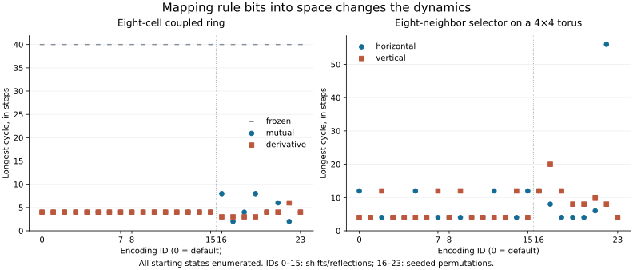

# When the same bits are both a state and a rule

An elementary one-dimensional rule has eight output bits. An eight-cell binary
ring has eight state bits. The eight surrounding cells of a square neighborhood
also supply eight bits. Can these be a shared substrate for configurations,
instructions, and changes?

**Yes, with an explicit decoder.** We implemented two constructions and checked
how changing that decoder changes the dynamics. The two-dimensional construction
has a particularly clean result: all 40,320 assignments of rule entries to
surrounding positions produce genuinely nine-input, degree-four Boolean rules.
They give exactly 36,000 distinct functions for each of the two address axes.
The complete finite dynamics depend substantially on the assignment.

This is an exact result about the specified constructions. It does not establish
open-ended evolution, computational irreducibility, intelligence, or a preferred
physical encoding. The shared-space discussion follows the user's Narrative
Calculus motivation; the full latest parallel-chat tail was unavailable, and no
unretrieved argument from that conversation is treated as evidence.

## Protocol and evidence

The [protocol](protocols/shared-state-rule-20260907.md) was
[committed before evaluation](https://github.com/bombadil-labs/groovy-commutator/commit/dd7e079e7a16156f61d85e68cbb553170e786c56).
The implementation was separately
[committed before evaluation](https://github.com/bombadil-labs/groovy-commutator/commit/d605690792b74e71e1e7276b25a2535b66cb9cd4).
The enumeration began September 7; this report was completed September 8, UTC.
The algebraic proof and independent polynomial audit below were developed after
seeing the exhaustive local results and are labeled as such.

- [Enumeration script](../../scripts/experiment_shared_state_rule.py), [aggregate graph data](../../results/shared_state_rule_20260907.csv), and [metadata/checks](../../results/shared_state_rule_20260907_metadata.json).
- [Cycle and predecessor histograms](../../results/shared_state_rule_20260907_graphs.json), including a longest cycle for every graph.
- [All-permutation local census](../../results/shared_state_rule_20260907_local.json) and [selected 512-output tables](../../results/shared_state_rule_20260907_tables.json).
- [Independent polynomial audit](../../scripts/audit_shared_state_rule.py) and [audit results](../../results/shared_state_rule_20260907_audit.json).
- [Report script](../../scripts/report_shared_state_rule.py), [summary](../../results/shared_state_rule_20260907_summary.json), and [table](../../results/shared_state_rule_20260907_table.md).

Reproduce from the repository root:

```bash
python scripts/experiment_shared_state_rule.py
python scripts/audit_shared_state_rule.py
python scripts/report_shared_state_rule.py
```

## One space, two roles

Let $X=\{0,1\}^{8}$. Pattern bit $i$ occupies ring cell $i$, with the least
significant bit at cell zero. An encoding is a permutation $p$ such that rule
output bit $k$ is pattern bit $p[k]$. The default is $p[k]=k$.

Write $E_p(r,s)$ for applying the rule decoded from pattern $r$ to pattern $s$.
The elementary input address is $4L+2C+R$, and the ring is periodic. Thus
$E_p:X\times X\to X$ is closed: its output can serve as another configuration
or another rule pattern. Closure is true by construction. It does not mean
that all possible maps $X\to X$ are encoded by these 256 patterns.

There is no canonical spatial identification here. A cell position and a
truth-table address play different roles. We explicitly change their mapping
and distinguish that intervention from consistently relabeling coordinates.

## The coupled eight-cell ring

We enumerate all 65,536 complete states $(r,s)$. Every update is simultaneous:

$$
s'=E_p(r,s).
$$

The three rule updates are:

| Mode | Rule-pattern update | Interpretation |
| --- | --- | --- |
| Frozen | $r'=r$ | Retain the current instruction pattern. |
| Mutual | $r'=E_p(s,r)$ | Each pattern acts as the other's rule. |
| Derivative | $r'=s\oplus s'$ | The current change becomes the next instruction pattern. |

The derivative remains a pattern and is decoded by $p$ on its next use. We do
not decode it twice or use an inverse permutation. These are chosen update
laws, not unique consequences of sharing a space.

For each mode we use 24 encodings: eight cyclic shifts, eight reflected shifts,
and eight additional unique permutations drawn with NumPy seed 20260907.
The exact permutations are saved. These correlated interventions are not
independent samples from a physical population.

## A square neighborhood that reads itself as a rule

Number the surrounding positions clockwise, beginning at north. The center is
an additional ninth bit:

| Northwest | North | Northeast |
| --- | --- | --- |
| $n_7$ | $n_0$ | $n_1$ |
| $n_6$ (west) | $c$ | $n_2$ (east) |
| $n_5$ | $n_4$ (south) | $n_3$ |

Decode the surrounding pattern as the rule table $r_k=n_{p[k]}$. Use the
horizontal triple as its input address:

$$
q=4n_6+2c+n_2,\qquad c'=n_{p[q]}.
$$

The vertical alternative uses $q=4n_0+2c+n_4$. Every site updates together on
a periodic square grid. Thus the same sheet supplies both rule tables and
inputs, with overlapping neighborhoods. The center participates in addressing;
it is not one of the eight stored outputs.

For a concrete default-encoding example, $W=0,C=1,E=0$ gives address 2, so
$c'=n_2=E=0$. Address 3, with $W=0,C=1,E=1$, selects southeast. No random
choice or hidden rule layer is involved.

Each update copies one surrounding value. Consequently the uniform zero and
one configurations are fixed, and an isolated live cell disappears. This is
**not population conservation**: many sites can copy the same value.

## Exact local results across every assignment

There are $8!=40{,}320$ assignments. For each axis we enumerate all 512 local
inputs for every assignment. The following results therefore concern local
rules, without a finite-grid-size restriction:

| Property | Horizontal | Vertical |
| --- | --- | --- |
| Assignments checked | 40,320 | 40,320 |
| Distinct local Boolean functions | 36,000 | 36,000 |
| Essential inputs for every function | 9 | 9 |
| Algebraic degree for every function | 4 | 4 |
| Assignments with 192 / 256 / 320 one-outputs | 10,080 / 20,160 / 10,080 | 10,080 / 20,160 / 10,080 |

The two fixed-coordinate families are disjoint: 72,000 distinct functions in
total. They are related by spatial rotation, so they are not two physically
independent populations. Degree means degree of the multilinear polynomial
over GF(2), not Wolfram class, visual complexity, or computational power.

### Why degree four is forced

This proof was developed after the census. Each selected output can be written
as a data bit times the indicator polynomial for one three-bit address. Sum
these eight terms over GF(2). An address indicator has degree three, so the
output has degree at most four.

Six data positions are independent of the address bits. Each contributes a
unique quartic term: that data bit multiplied by all three address variables.
Those six terms cannot cancel because their data variables differ. The two
data positions that also serve as address variables contribute degree at most
three. The degree is therefore exactly four, with exactly six quartic terms.
Their common intersection identifies the three address variables. This also
explains why horizontal and vertical fixed-coordinate families cannot overlap.

Each free data bit is essential because its address can select it. Each address
variable is essential too: pair the eight addresses by flipping that variable.
At least one of the four pairs selects two free data positions, whose values
can differ. Flipping the address variable then changes the output. All nine
inputs are essential.

### Why some assignments give the same rule

The free data positions identify six entries uniquely. Only the two data bits
that also occur in the address can be exchanged without necessarily changing
the function. They are indistinguishable at addresses where those two address
bits agree. Four of the eight addresses have that property.

Choosing two of those four addresses and assigning the remaining six free data
positions yields $\binom{4}{2}6!=4{,}320$ duplicate pairs. Therefore:

$$
8!-\binom{4}{2}6!=36{,}000.
$$

For the output counts, six selected data bits are unbiased when the address is
fixed. Selecting either address-data bit shifts its contribution by plus or
minus 32 relative to the 256-output baseline. The only possible totals are
192, 256, and 320; counting distinct placements of the two address-data bits
gives the 1:2:1 assignment proportions above. These counts use uniform local
inputs, not the distribution generated by a trajectory.

## Complete finite dynamics

We build 168 full functional graphs: 72 coupled-ring graphs, plus 96 selector
graphs across 24 encodings, two axes, and $3\times3$ / $4\times4$ tori. A
recurrent state lies on a cycle; transient states eventually enter one.

The default is encoding zero. Ranges cover the 24 declared encodings:

| Model | Size | Longest cycle: default / range | Recurrent states: default / range |
| --- | --- | --- | --- |
| Frozen ring | 8 cells per pattern | 40 / 40–40 | 15,120 / 15,120–15,120 |
| Mutual ring | 8 cells per pattern | 4 / 2–8 | 155 / 86–250 |
| Derivative ring | 8 cells per pattern | 4 / 3–6 | 14 / 6–24 |
| Horizontal selector | 3×3 | 12 / 3–15 | 95 / 11–110 |
| Horizontal selector | 4×4 | 12 / 4–56 | 710 / 138–1,192 |
| Vertical selector | 3×3 | 3 / 3–12 | 38 / 11–113 |
| Vertical selector | 4×4 | 4 / 4–20 | 342 / 342–860 |



Mutual feedback does not automatically sustain novelty. In this finite model,
its recurrent set is much smaller than the frozen control's; direct derivative
replacement contracts it further. The default mutual graph has 56 recurrent
states whose next rule pattern changes, out of 155 recurrent states. Rules can
continue changing on a short cycle. Neither that movement nor a long transient
establishes open-endedness.

The default selector gives a particularly clear geometry comparison on the
4×4 torus. Horizontal addressing has only two fixed points and largest basin
2,860; vertical addressing has 66 fixed points and largest basin 61,081.
Their longest cycles are 12 and 4. Merely changing the address axis while
keeping the table-position mapping fixed is a real intervention.

By contrast, rotating the entire construction by 90 degrees—both the address
axis and the positions used for rule outputs—gives conjugate dynamics. This
was checked at every state of both tori for all selected encodings. It is a
coordinate control, not evidence that arbitrary encoding choices are neutral.

## Checks and the commutator's scope

All checks pass: 65,536 base-engine transitions; 5,376 independently traversed
orbits; accounting for every state of all 168 graphs; 24 frozen-rule conjugacies;
24 mutual swap symmetries; 24,576 scalar local outputs; and 1,585,152 rotated
state comparisons. The post-enumeration polynomial audit independently expands
the indicators and checks another 24,576 outputs, including the six quartic
terms and their address-variable intersection. A separate scalar grid update
replays all 628 steps of the saved longest selector cycles, including closure.

The CSV also records the nonzero count of the joint-map commutator. For the
ring, encode $z=256r+s$ and use the complete fixed update map $F$:

$$
D_F(z)=z\oplus F(z),\qquad G_F(z)=D_F(F(z))\oplus F(D_F(z)).
$$

The same construction applies to each complete finite 2D map. This avoids
silently changing the underlying rule between two applications of a supposedly
fixed derivative. Nonzero counts are diagnostics only; the experiment does not
validate them as a classifier of interesting behavior.

## What this changes in the wider program

The construction makes the shared substrate literal. The same pattern can be
read as configuration, instruction, or change, and local context can determine
which output is selected. This supplies a concrete object for the broader
[history-and-possibility program](2026-09-07-history-and-possibility.md).

Reading instructions from the same-time neighborhood can always be expanded
into a fixed local rule. That is a statement about mathematical representation.
It does not show that instructions are meaningless, that nothing interesting
can happen, or that memory is the only worthwhile mechanism. Earlier project
shorthand about self-reference “buying nothing” was too broad; this note and
the continuation guidance narrow that interpretation.

These systems still have a fixed decoder and a fixed complete update law.
Every full state has exactly one successor. Their predecessor sets can branch;
multiple futures require specified alternatives, partial observations, or a
branching transition relation. Describing an internal pattern as a changing
rule does not, by itself, supply that branching.

## Next questions

The immediate spatial question is whether a principled assignment performs
differently from an arbitrary one. Binary three-bit addresses form a cube;
the surrounding positions lie around a square. A cyclic Gray-code ordering
would preserve one-bit differences along the perimeter, but not all cube
adjacencies. That is an explicit candidate encoding, not a canonical isomorphism.
It was included in the all-permutation local census, but was not separately
selected for the present global-graph comparison.

Next, test that geometric choice and its controls on larger grids before
interpreting the tiny-torus cycles. Separately, a locally represented, changeable
decoder could test whether the interface between rule and state can itself be
transformed. Its storage and update law must be explicit. Neither proposal
requires treating retained memory as the only important variable.
