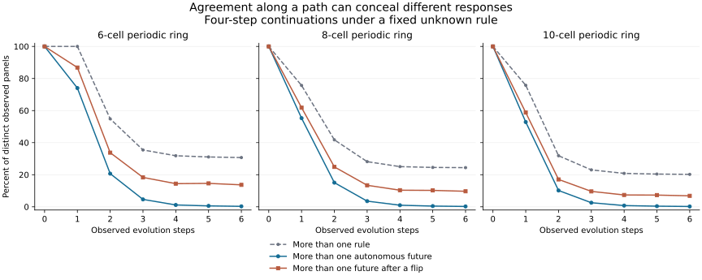

# Same spacetime, different possibilities

Can several one-dimensional processes produce the same two-dimensional
spacetime picture? Yes. The important distinction is whether the remaining
provenance ambiguity changes what happens next—or what happens after an action.

We enumerated all 256 elementary rules and every initial state on rings of
widths 6, 8, and 10. In the eight-cell case, after six observed evolution steps,
only **96 of 42,718 distinct panels** leave the next four unperturbed rows
ambiguous. After flipping the same single cell, **4,134 panels** have multiple
possible four-step continuations. The difference is not prediction error: both
counts come from exact compatible-rule sets.

A particularly simple example has unlimited observed history: all 128 rules
with output zero on input 000 produce the all-zero panel and keep it zero
forever. After one cell is flipped, those rules give 38 distinct four-step
continuations on the six-cell ring. Agreement along one path can conceal
operational differences among its possible generators.

## Protocol, data, and reproduction

The [protocol](protocols/spacetime-provenance-20260908.md) was
[committed before evaluation](https://github.com/bombadil-labs/groovy-commutator/commit/80639b11948ca39766c7a0c998f60ea885a33045).
The [implementation](../../scripts/experiment_spacetime_provenance.py) was also
[committed before evaluation](https://github.com/bombadil-labs/groovy-commutator/commit/dbe181546806a130e3a23a0481d4bc55abf53add).
The primary comparison is two observed transitions and four future steps; the
full grid covers observed transitions 0–6, future horizons 1–4, and both the
unperturbed and single-flip cases.

- [Complete aggregate rows](../../results/spacetime_provenance_20260908.csv): 168 conditions.
- [Candidate/continuation histograms](../../results/spacetime_provenance_20260908_histograms.json).
- [Checks and source hashes](../../results/spacetime_provenance_20260908_metadata.json).
- [Witness provenance graph](../../results/spacetime_provenance_20260908_provenance.json): eight nodes and 135 replayed derivation edges.
- [Summary](../../results/spacetime_provenance_20260908_summary.json), [table](../../results/spacetime_provenance_20260908_table.md), and [figure/report script](../../scripts/report_spacetime_provenance.py).

```bash
python scripts/experiment_spacetime_provenance.py
python scripts/report_spacetime_provenance.py
```

This experiment concerns **stacking 1D evolution rows into a 2D observation**.
It does not evolve the picture under a separate 2D CA rule and does not yet
establish dimensional compatibility. It supplies an explicit many-to-one
representation for the [dimensional-lift program](2026-09-08-dimensional-lift.md).

## What the observer receives

Each panel contains complete periodic rows $S_0,\ldots,S_t$, including the
initial state. Width, spatial orientation, periodic boundary, unit cadence,
and forward time direction are known. The elementary rule is unknown but
fixed throughout the run. There is no cropping, observation noise, hidden
initial row, or rule switching.

Each generating process is a pair $(r,S_0)$. There are 16,384, 65,536, and
262,144 such pairs for widths 6, 8, and 10. Different pairs may generate
identical panels; every distinct literal panel is counted once in the primary
analysis. The CSV separately reports weighting by generating pairs. Symmetry-
related panels remain distinct literal observations, not independent replicates.
No class labels are loaded or scored.

For each panel, we hold each compatible rule fixed and generate its next
$h$ rows. We also repeat this after flipping cell zero of the last observed
row once, before evolution. The same intervention is used for every candidate.
We count complete continuation sequences, not only final endpoints. We do not
choose a new rule at each future step.

## Exactly which rules fit a panel?

An observed cell transition fixes one output of the elementary rule table.
Let $M$ be an eight-bit mask recording which input triples were encountered
in rows $S_0$ through $S_{t-1}$, and let $V$ record their observed outputs.
The compatible set is exactly

$$
\mathcal R(P)=\{r:(r\mathbin{\&}M)=V\},\qquad
|\mathcal R(P)|=2^{8-\operatorname{popcount}(M)}.
$$

Necessity follows because every compatible rule must reproduce the observed
cell transitions. Sufficiency follows by induction from the shared initial
row: agreeing on each visited input reproduces every subsequent observed row.
The unvisited table entries are unrestricted. More observations along a fixed
trajectory can only shrink this set, although they need not identify every bit.

At fixed width and observation length, $(S_0,M,V)$ identifies the complete
panel's equivalence class among performed runs. The script verifies the mask
partition against direct partitions of the actual row arrays on every width-six
panel, and on declared deterministic seed subsets at larger widths.

## Rule identity and future identity differ

For one panel and target, let $K$ be the number of distinct continuations among
its compatible rules. Then

$$
1\le K\le|\mathcal R(P)|.
$$

The rule identifier requires $8-\operatorname{popcount}(M)$ additional bits in
the worst case. A fixed-length code identifying only the continuation requires
$\lceil\log_2K\rceil$ bits, conditional on the known panel, horizon, and action.
This is a purpose-specific coding bound with a sender who knows the generating
rule. It is not an algorithm for inferring unavailable provenance, a reusable
rule code, or a claim that the decoder is free to implement.

For the all-zero six-cell panel, rule identity requires seven bits. Its natural
future needs no additional bits, while its 38 four-step responses after the
flip need six. Provenance relevance depends on the question being asked.

## Results

All counts below use distinct observed panels and a four-step future. Two
observed steps mean three visible rows; six steps mean seven rows.

| Width | Observed steps | Panels | Rule ambiguous | Multiple natural futures | Multiple flipped futures |
| --- | --- | --- | --- | --- | --- |
| 6 | 2 | 6,696 | 3,672 (54.84%) | 1,384 (20.67%) | 2,260 (33.75%) |
| 8 | 2 | 36,154 | 15,098 (41.76%) | 5,444 (15.06%) | 8,998 (24.89%) |
| 10 | 2 | 173,148 | 55,148 (31.85%) | 17,604 (10.17%) | 29,548 (17.07%) |
| 6 | 6 | 8,416 | 2,584 (30.70%) | 24 (0.29%) | 1,152 (13.69%) |
| 8 | 6 | 42,718 | 10,430 (24.42%) | 96 (0.22%) | 4,134 (9.68%) |
| 10 | 6 | 193,362 | 39,122 (20.23%) | 400 (0.21%) | 13,230 (6.84%) |



In the primary eight-cell comparison, the mean additional rule budget is 0.558
bits per distinct panel. The mean purpose-specific future budget is 0.167 bits
for natural continuation and 0.315 bits after the flip. These fractional means
average integer code lengths across panels; they are not fitted entropy estimates.

The action does not always expose more alternatives. At width eight and two
observed steps, the flip increases the four-step continuation count for 4,028
panels and decreases it for 298. Both directions are retained. At six observed
steps the corresponding counts are 4,046 and eight. A perturbation can also
bring different candidate dynamics into agreement over the requested horizon.

Weighting changes the prevalence. At width eight and six observed steps, uniform
weight over performed generating pairs gives 0.293% natural future ambiguity and
23.804% flipped future ambiguity, compared with 0.22% and 9.68% under uniform
panel weighting. Panels with many compatible generators receive more weight in
the first calculation. Neither denominator is a distribution-free probability.

## Explicit witnesses

The witnesses were selected by a rule specified before enumeration, not by
visual complexity or class labels. Integers below encode cell zero in the
least significant bit.

### Unlimited agreement without identifying the rule

The six-cell observed rows are $0,0,0$. Its only visited input is 000 with output
zero, so all 128 even-numbered rules fit. Every such rule keeps the state zero
forever; this statement is exact beyond the measured horizon.

After flipping cell zero, Rule 0 returns to zero; Rule 204 keeps the isolated
bit. Across all 128 rules the measured four-row continuations form 38 groups.
The witness graph records all 128 performed derivations into the same panel.

### One more matching row does not guarantee later agreement

The first declared delayed-ambiguity witness is the six-cell panel
$3,25,8$, compatible with exactly Rules 9 and 137:

| Rule | Next row | Following row | Third future row | Fourth future row |
| --- | --- | --- | --- | --- |
| 9 | 35 | 40 | 2 | 56 |
| 137 | 35 | 41 | 32 | 14 |

Both provenance alternatives predict the next row exactly, then disagree.
Future sufficiency must specify its horizon.

### A simple process can identify its entire rule in one step

The smallest eight-cell initial state visiting all eight input triples is 23.
The observed transition $23\to0$ identifies Rule 0 uniquely: all eight table
outputs have been observed and are zero. No complex dynamics is required for
complete identification. The recorded rule-uniqueness control passes for both
natural and perturbed continuation.

A fourth saved witness, panel $1,3,5$, has four compatible rules and three
natural four-step continuations. Full rule lists and paths are in the JSON.

## Provenance representation

The witness graph separates content from derivation:

- A panel node is addressed by SHA-256 of its canonical JSON content: kind,
  width, periodic boundary, cadence, bit order, and complete row sequence.
- An initial-configuration node has its own content identity.
- A derivation edge names the initial node, panel node, rule, number of steps,
  stacking decoder, and performed replay verification. Its own hash includes
  those fields. Distinct rules therefore produce distinct edges even when the
  endpoints coincide.

Canonical JSON uses sorted keys and compact separators. This schema is an
experimental witness graph, separate from the site's semantic knowledge graph.
It stores eight nodes and 135 edges, not the complete enumeration. All listed
alternatives were actually replayed; inferred alternatives in future observational
work must be labeled separately from performed derivations.

Keeping provenance does not assert that an agent can infer which generator was
historically actual from an ambiguous panel. It records which derivation was
performed in the experiment, while the compatible set records what the panel
alone permits.

## Validation and limitations

All checks pass: 32,768 comparisons with the independent package engine;
candidate multiplicities for 1,300,744 panel conditions; 189 direct partition
comparisons; future-count and code-budget bounds over 10,405,952 panel/target
conditions; nested masks along 2,064,384 trajectory extensions; and 135 witness
replays. The panel conditions span different widths and observation lengths;
they are not independent statistical samples. The all-zero and one-step full-
identification controls pass.

The ambiguity comes from an unknown fixed rule. Each full rule/state pair has
one successor; there is no intrinsic nondeterministic branching here. Spatial
cropping, unknown boundaries, noise, variable rules, and larger alphabets would
change the inference problem. The measured future counts are bounded to four
steps; only the explicit zero-panel argument establishes indefinite agreement.

This experiment does not classify Class IV, test a self-modifying higher-
dimensional law, or prove a scale-agnostic invariant. It establishes a concrete
reason to retain provenance when a representation is used to predict responses
to actions. The earlier exact local rule/input packing is still injective under
its fixed decoder; row stacking deliberately omits the rule, so its ambiguity
is a different property of a different map.

## Next within the dimensional program

The next compatibility test can now distinguish three targets: retaining the
rule, retaining its natural continuation, and retaining its responses to a fixed
set of actions. Define which target the representation must preserve before
choosing its budget or quotient. Two processes that look identical along their
observed histories may belong to different action-response classes.

This connects the [future-repertoire distinction](2026-09-07-future-repertoire.md)
to the [dimensional encoding problem](2026-09-08-dimensional-lift.md). A useful
candidate invariant may concern preservation of specified action responses,
with explicit provenance and context limits. Whether such a criterion selects
an interesting dynamical family remains open.
