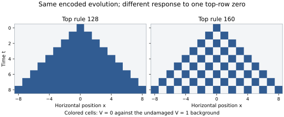

# The encoded dynamics does not uniquely determine its larger world

Date: 2026-09-10. Evidence: exact local census, complete physical controls, and stated algebraic deductions. No novelty claim.

The Rule32 correction representation admits multiple ambient updates with identical encoded evolution. Even at the same radius and stored-program budget, two top rules agree on every prepared source state and differ after one off-image data edit. An endogenous program can also circulate compatible instruction variants while its represented data stays unchanged. This is neutral instruction transport, not yet a change in the represented source law.

This checkpoint quantifies a choice left open by the [physical-cap construction](2026-09-10-rule32-physical-cap.md). Exact compatibility does not by itself select the dynamics outside the compatible subset.

## Why this experiment

The user clarified the intended dimensional program after the physical-cap checkpoint: seek a recurring way of passing from 1D to 2D to 3D and onward, with coherent lower-dimensional trajectories and genuinely additional possibilities at higher levels. They call the sought continuity a "turtle beam," with "unus mundus" as an interpretive analogy. These names are motivation, not established physical or metaphysical conclusions.

Correction depth, spatial dimension and time are distinct. A correction row is part of a plane; adding another row does not add a spatial axis. The guarded constructions remain useful instruments and controlled examples. Their prepared roles must not silently replace the stronger objective of finding a consistently generated higher-dimensional organization.

Minimum representation dimension is meaningful only relative to an encoding, dynamical-equivalence and resource contract. In a compatible tower of total adjacent lifts, levels cannot be skipped along a composed lift. For injective lifts, minimum ancestral dimension is invariant under lifting and can only decrease under the compatible dynamics. These are consequences of those assumptions, not a discovered arithmetic-prime classification or proof of intrinsic dimension. A code-specific rank might merely recognize padding. The user also explicitly retained Class IV as background intuition only.

The immediate diagnostic is therefore: **how much ambient behavior remains free after the encoded trajectories are fixed?**

## Protocol, instruments and domain

The [protocol](protocols/extension-freedom-20260910.md) was frozen at `f4caa22f762bc4df47a0f777b85abbd13e38bdb1`; the [verifier](../../scripts/verify_extension_freedom.py) at `1ecaba36f299af2c89dd1aac48e8df3e22a29dcf`, before evaluation. There were no implementation corrections or protocol deviations. The [canonical result](../../results/extension_freedom_20260910.json) retains every forced local map, all free patches, rejection witnesses, stored-program aliases, signatures and the physical/program traces. CI reproduces it exactly.

The fixed source is homogeneous Rule32 on the full infinite binary lattice. Its encoded data is K_1(S)=(U,V)=(A_0(S),A_1(S)). All128 seven-bit source windows cover both the radius-one encoded patch and next central pair. Integer truth-table composition and independent Boolean shrinking-window evaluation agree on every case. No periodic window is used for these local claims.

An alternative pair update agrees with the required K_1(F_32(S)) on every realized neighborhood if and only if it has the specified local outputs there. The resulting pair is again in K_1's image; induction gives the same encoded data evolution for every time. Nothing requires an arbitrary off-image initial pair to follow a source trajectory.

## Freedom depends on the declared grammar

| Allowed update grammar | Encoded constraints | Compatible choices |
| --- | --- | --- |
| Arbitrary radius-one update of both binary rows | 15 of64 six-bit inputs, two outputs each | 2^98 distinct local maps |
| Arbitrary four-input top update; bottom held fixed | 8 of16 inputs (V_left,V_center,V_right,U_center) | 2^8 distinct top functions |
| Existing top program(q,h), positive guard0; bottom(32,60) | Same8 four-input contexts | 128 stored tuples, giving4 effective functions |
| Top ECA word; bottom(32,60) and top stage240 fixed | 7 of8 top neighborhoods | Exactly128 and160 |

The first row is a logical binary-pair grammar: 64 possible neighborhoods times two output bits, with30 bits forced and98 free. It is equivalent to a four-state 1D CA or a row-typed two-layer update. It is not a count of guard-free binary 2D laws, nor a claim that the existing table-chain interpreter realizes all2^98 maps.

All65,536 native top tuples were enumerated. A second selector-tree implementation independently checks all1,048,576 candidate/context outputs and each candidate's first source-window conflict. The result's rejection matrix gives that first word for every rejected(q,h); passing entries are-1. Distinct effective functions are counted on the complete16-input domain with the positive guard fixed to0. They may differ further if that guard condition is removed.

Writing l,c,r for top neighbors and u for the bottom central bit, the four compatible effective top functions are lcru, lru, lcr and lr. Each has32 stored-program encodings. Thus syntax multiplicity and freedom in actual data dynamics are different counts.

## A literal polynomial freedom

The two compatible top ECA rules have

\[
F_{128}(V)_x=V_{x-1}V_xV_{x+1},\qquad F_{160}(V)_x=V_{x-1}V_{x+1}.
\]

Their difference over GF(2) is

\[
F_{160}(V)_x\oplus F_{128}(V)_x
=V_{x-1}(1+V_x)V_{x+1}.
\]

This polynomial is the indicator of top neighborhood101, which never occurs in A_1(S). It vanishes on the encoded image while remaining nonzero elsewhere. The difference is exactly instruction bit5, an input address unused on that image.

More generally, two Boolean local functions agree on the realized patch set precisely when their XOR vanishes there. Each unrealized patch supplies an independently selectable truth-table value. This is the concrete polynomial connection here; it establishes no number-theoretic prime correspondence.

Both top choices preserve uniform zero and one, are monotone, and are invariant under exchanging left and right. Those properties alone do not pick one. Their stored words and local radius have equal cost, although their polynomial degrees differ. Choosing minimum degree would impose an additional criterion, not recover a uniquely determined choice from the source dynamics.

## Same encoded data, different off-image evolution

The physical controls use the unchanged interpreter, bottom(32,60), top(q,240), and two zero-data guard rows with(204,240). For every source word at widths4 and6 and both q=128/160, complete physical fields agree with native evolution and fresh source preparation through8 ticks. This is160 hold-mode cases; corresponding encoded-data trace hashes agree between the two programs.

**The full physical encodings are different:** they contain different stored top instructions. The shared subset in this comparison is the encoded data image. Each physical encoding separately satisfies its complete commuting identity under the same hold-mode interpreter. Do not say the two full physical program fields are identical.

Now start the active data at U=1 everywhere, V=1 except V_0=0. The forbidden101 neighborhood proves this initial pair is outside the full-shift encoded data image. The undamaged pair(1,1) comes from an alternating infinite source. A width21 physical control leaves the defect's radius-eight causal cone unwrapped; it does not require a width21 source preimage.

The [plotter](../../scripts/plot_extension_freedom.py) uses only the saved traces. Both top programs start from exactly the same data defect. At tick8, top128 has17 zeros, top160 has9. Both spans have radius8. These are counts of disagreement with the undamaged top background, not information entropy or a dynamical class score.

A post-enumeration induction gives the all-time full-lattice formulas. Under128 the zero set is [-t,t]; a zero persists at its site and spreads to both neighbors. Under160 it is {-t,-t+2,...,t}; the next zero set is the union of the left and right shifts of the old one. Neither restores the undamaged pair. The same encoded source behavior therefore coexists with different off-image defect dynamics, without changing the radius or program layout.

## Endogenous instructions can change neutrally

At each top site put word128+32*lambda_x, with binary lambda_x. Both choices give the same next V on every encoded source state. Select the existing state-gated whole-program copying mode, which uses the old local datum as its gate. On the top row this implements

\[
\lambda'_x=\begin{cases}\lambda_{x-1},&V_x=1,\\\lambda_x,&V_x=0.\end{cases}
\]

The encoded data still obeys U'=F_32(U) xor V and V'=F_128(V). The other rows have uniform programs within their rows and retain those programs under copying. Since every next data pair is again a valid source image and every copied top word remains in{128,160}, this neutral extension is exact for all source states, all lambda fields and all times. No source oracle updates the physical field.

The frozen width4 audit exhausts all16 source words and16 lambda fields, for256 cases through4 ticks. Every complete physical field agrees with independent native copying and the separately evolved lambda field. There are288 actual top instruction-bit changes.

For example, an alternating width4 source has U=V=1111. Starting lambda at integer1 gives1,2,4,8,1 while the data remains(15,15) throughout. A stored instruction circulates under the data-driven update, but its distinguishing truth-table address is never used on the encoded image. This is a precise endogenous higher-order control, with neutral represented-data effect. It does not establish autonomous revision of the represented Rule32 law.

Across hold, defect and neutral-copy controls,2,738 field timepoints compare922,216 stored physical symbols. All omitted blanks remain blank by the unchanged absorbing rule;2,738 remote blank checks are recorded separately. The physical resource budget remains68 occupied symbols per horizontal site, span36, radius9, scale9 and one tick per native tick. Hold and copying are the two already defined interpreter modes; selecting a mode selects its corresponding fixed law.

## What this changes in the program

The earlier cap result survives intact. Its ambient completion is demonstrably nonunique, and its neutral instruction freedoms can themselves support autonomous dynamics. Thus increasingly rich higher-dimensional behavior need not be forced by lower-dimensional ancestry. Some may reside in choices the encoded dynamics never constrains.

This is a diagnostic for the user's concern about forcing compatibility, not a failure of all dimensional constructions. It gives a sharper criterion for subsequent candidates: declare the dimension-raising constructor on the entire state space before fitting an encoding, account for free choices, and then test which compatible families it supports.

The [next frozen protocol](protocols/guard-free-axial-lift-20260910.md) begins that comparison with a binary, guard-free family applying the original ECA along each spatial axis. It has no reserved row roles or program-cell tags. Axis order, preparation restrictions and processing costs remain explicit, and it has not been evaluated here. This is one proposed control for a uniform constructor, not a claim that it is the uniquely natural one. Wider neighborhoods, additional state and correction structure remain available in later, separately frozen attempts.
