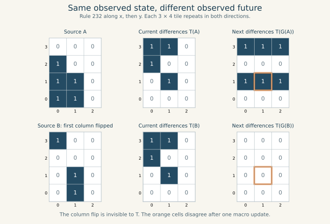

# Transverse differences close for six rules; the other sixty need more information

For the66 replication-compatible axial ECA sources, can differences between neighboring slices evolve without access to the underlying binary field? **Exactly six can:0,150,170,204,240,255.** For every other source in this family, two complete infinite fields have identical full difference fields and different next differences. No deterministic update on these differences alone can work, even if it reads the entire observed field.

This is an exact result for one declared observation under the unchanged axial laws. It identifies information discarded by that observation, not a universal obstruction to higher-dimensional organization. The [vision and interpretation record](2026-09-10-dimensional-vision-and-interpretation.md) explains how this distinction guides the research.

## Construction and frozen execution

Keep $G_r=F_{r,2}\circ F_{r,1}$, with the first-axis ECA pass followed by the second. Test every source in the [guard-free compatible set](2026-09-10-guard-free-axial-lift.md):0,255 and every even word from128 through254. Observe

$$
T(X)(x,y)=X(x,y)\oplus X(x,y+1).
$$

The proposed closure is $T\circ G_r=Q_r\circ T$ for all infinite binary fields. Radius-zero and radius-one caps are tested without altering the law, observation, or cadence.

The [original protocol](protocols/transverse-difference-closure-20260910.md) is present at main commit `869bc08f998b0b3afe47c878acdf6f2fc3869103`. The [verifier](../../scripts/verify_transverse_difference_closure.py) was committed at `0b0475a9f563a14374d627c77a1c6dbb9a0c3d2d` before evaluation. It required no implementation corrections or protocol deviations. The original [canonical census](../../results/transverse_difference_closure_20260910.json) is preserved unchanged.

After the census, an extension proof upgraded every radius-one conflict to a full-field witness. The [supplement protocol](protocols/transverse-witness-extension-20260910.md) and [certificate verifier](../../scripts/verify_transverse_witness_extension.py) were committed at `2bfd6fb86d9d9221613e5e903a79d59337576e5a` before certificate replay. This separately frozen validation supplement uses every failed radius-one witness; it performs no search or repair. Its [canonical certificates](../../results/transverse_witness_extension_20260910.json) pin the original census SHA-256, `bebab62447d2839df75fb47ed4a0500ba10d5768d21401ae038b7f3b4bf01d88`.

## The closed laws

| Source ECA | Autonomous difference update | Smallest tested radius that suffices |
| --- | --- | ---: |
| 0,255 | $Q(Z)=0$ | 0 |
| 204 | $Q(Z)=Z$ | 0 |
| 170 | $Q(Z)(x,y)=Z(x+1,y+1)$ | 1 |
| 240 | $Q(Z)(x,y)=Z(x-1,y-1)$ | 1 |
| 150 | XOR of the nine values in the3-by3 neighborhood of Z | 1 |

These are exactly the six affine sources within the66-rule domain. Affine closure has a direct explanation: if $G(X)=L(X)\oplus c$, linear translation-invariant $L$ commutes with taking a spatial XOR difference, while the constant cancels. Hence $T(G(X))=L(T(X))$.

The exhaustive local audit finds3 passing radius-zero budgets and6 passing radius-one budgets. Each of the512 possible radius-one T neighborhoods is realized by the3-by4 source windows, so each passing table is fixed on its entire local domain. An arbitrary infinite T field can also be integrated after one baseline bit per column is supplied. No inaccessible local T patterns need an arbitrary completion here.

## What the observation forgets

If $T(X)=T(Y)$, then

$$
(X\oplus Y)(x,y)=(X\oplus Y)(x,y+1).
$$

Therefore $X\oplus Y$ is constant along each column. The observation forgets a freely chosen baseline bit for every x coordinate. A column flip is invisible to the current T field. For the60 failing sources, some such invisible change alters the next T field.



The figure uses the certified Rule232 pair, source words91 and530. Bit x+3y indexes each3-by4 periodic tile. The common observed word is1616; next observed words are3640 and0. At(1,1), the predicted difference is1 versus0. The fields repeat across the whole plane, so this is equality of complete observations, not just equality inside a cropped window. The [plot script](../../scripts/plot_transverse_difference_witness.py) reads the saved certificates without recomputing or selecting a new experiment.

## From a radius-one conflict to an all-radius obstruction

The next central difference depends on two overlapping3-by3 G windows, with union a3-by4 source patch. Its current radius-one observation contains all nine vertical edges within that patch. If two source patches agree on those edges, their XOR is constant down each of the three columns.

Repeat each source patch periodically with x period3 and y period4. Their XOR remains column-constant across the seams, so their full infinite T fields agree. Both causal windows for the next difference at the center are already inside the original patch; therefore the two certified different outputs survive this extension unchanged.

Any proposed Q would have to assign two different next observations to the same complete input observation. This is impossible, independently of its radius, locality, or implementation. The argument applies to every one of the60 failed radius-one budgets. It does not upgrade the radius-zero conflicts, and is not a general rule for unrelated observations or window geometries.

The supplement independently replayed all60 witness pairs:120 macro updates and1,440 output-cell comparisons on3-by4 periodic fields. It verified full current T equality, complete next T inequality, column-constant source XOR, and exact agreement with each original central-bit certificate.

The obstruction also survives copying these witnesses into further spatial dimensions, retaining the same observed second-axis direction. Every tested source has exact replication intertwining, so the copied full observations still agree and their next observations still differ. This corollary does not classify a differently oriented observation under a differently ordered constructor.

## Why the3-by3 periodic control missed three cases

The original finite control finds full-field ambiguity for57 sources. Nine look functional on that finite system: the six genuinely closed sources plus128,232,254. These three are AND, majority, and OR. On a periodic line of length3, each neighborhood visits all three positions. Their first pass makes each row uniform; the second makes the entire3-by3 field uniform. Thus every next T is zero on this small torus, hiding the infinite-lattice obstruction.

The primary JSON field `full_field_obstruction_rules` records only the57 cases found by that original3-by3 control. The supplement's same-named field records all60 proved by extended local witnesses. Both artifacts retain their declared domains; the smaller control has not been rewritten to match the stronger conclusion.

| Rule | Certified local source pair | Equal full T after3-by4 extension | Different next full T |
| --- | --- | ---: | --- |
| 128 | 511,950 | 4032 | 63 versus0 |
| 232 | 91,530 | 1616 | 3640 versus0 |
| 254 | 73,512 | 576 | 0 versus63 |

Every pair differs by flipping the first column. Their saved central outputs disagree too. Finite non-conflict was preserved as a finite observation, rather than promoted to global closure.

## Audit and reproduction

The primary integer pipeline was checked against a separate Boolean truth-word and shrinking-array evaluator. Native periodic lattice passes were checked against an independent recursive local evaluator. The affine identities, constants, and projection controls all passed.

| Audit | Exact amount |
| --- | ---: |
|3-by4 local source windows across66 rules | 270,336 |
|Local source-window/budget checks, R=0 and1 | 540,672 |
|Original3-by3 periodic macro updates | 33,792 |
|Original periodic output-cell comparisons | 304,128 |
|Passing-cap predictions on periodic cells | 41,472 |
|Supplement3-by4 periodic macro updates | 120 |
|Supplement output-cell comparisons | 1,440 |

The local primary and independent checksum is `9c4e4f3d0f2fcbfae50913e8074f646350f5e61d4223936c34cf8aa6f58fd336`. The original finite checksum is `eb4dcd694b4b99c9c3ca8454463f19fb880877300f1bc28ddafe320fceddcf15`; the supplement checksum is `e262603af2e6c3b94bff71e44e660f12c31299f063b7608cb12b2001577e1391`.

```bash
python scripts/verify_transverse_difference_closure.py > /tmp/transverse-difference-closure.json
diff -u results/transverse_difference_closure_20260910.json /tmp/transverse-difference-closure.json
python scripts/verify_transverse_witness_extension.py > /tmp/transverse-witness-extension.json
diff -u results/transverse_witness_extension_20260910.json /tmp/transverse-witness-extension.json
```

## Consequence for the research direction

The replicated beam remains invariant. The new result concerns a stronger question: whether departures from it admit a complete autonomous description using T alone. For60 sources, the forgotten column baselines remain causally consequential. A larger neighborhood of the same complete observation cannot supply them.

Changing the retained information is still a well-posed next attempt. The [next frozen protocol](protocols/full-gradient-closure-20260910.md) retains both horizontal and vertical differences under the same66 laws. On a connected lattice, the complete pair loses only a global complement choice, rather than an independent baseline per column. It costs two component bits per site, has gradient-image constraints, and is not raw storage compression or a canonical interpretation. It has not been executed.

This follows the user's instruction to treat failed attempts as scoped evidence and to make possible rescues explicit. No correction row, source state, alternate axis order, or different observation was added to the completed transverse-only experiment. No novelty, self-assembly, Class-IV, intrinsic-dimension, or prime-factorization claim follows.
