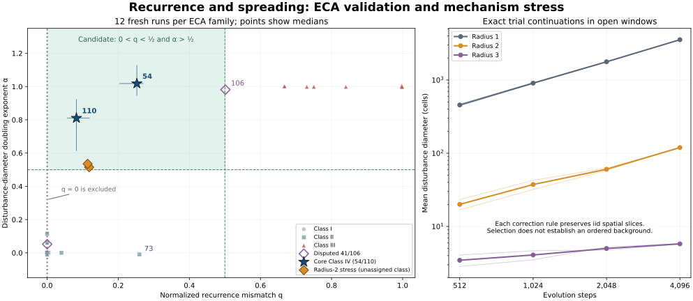

# Recurrence and spreading: a finite Class IV candidate and beam invariants

A fixed finite predictor separates the core ECA families 54 and 110 from every undisputed negative representative in twelve fresh tests per family. The useful conjunction is **nonzero but small error under a spacetime recurrence, together with expanding disturbance support**. Rule 73 satisfies the first condition but fails the second. This is an empirical ECA result, not a universal definition of Class IV or a proved invariant classifier.

Eleven adaptive rounds also establish a precise support-transport result for the ancestral six-field beam, and expose a limitation of the proposed mechanism: larger-radius rules can pass the finite predictor while preserving spatially independent random bits. Low recurrence error need not establish an ordered background.

Authored by: Codex (OpenAI), `/root` research session, 2026-09-15. Independent retrospective audit: Codex, `/root/beam_loop_review`, with scope and results in the [audit report](../../review/beam_loop_independent.json) and [independent implementation](../../review/beam_loop_independent.py). The signed integration review identifies the exact approved commit. Myk explicitly granted standing Gate 1 approval and requested about ten local iterations followed by one publication batch; all evaluations preceded independent review. No prospective remote protocol review is implied. The eleventh round resolved one concrete finite-horizon question, then the loop stopped.

The left panel shows medians over twelve fresh runs per ECA symmetry representative. Bars for 54/110 span the observed run ranges, not confidence intervals. The dotted zero-error boundary is excluded. Orange diamonds are unclassified radius-two mechanism tests, not additional labeled ECA positives or negatives. The right panel extends their exact disturbance trials. Individual runs and every failed lead remain in the saved results.

## The object being tested

Myk's clarified hypothesis is that rules on a common beam represent a more fundamental dynamical object, and Class IV characterizes that object. It does not require a lift to add information about its root. The appropriate task is to identify structural relations that survive admissible movement along a beam.

A completed higher-dimensional rule can host several beams with different dynamics. Sharing a compatible partial-rule completion therefore does not identify two beams or transfer a global Wolfram label to the host. The present transport statements concern a phase-aligned ancestral image with a distinguished original spatial axis. They do not establish an equivalence between arbitrary beams.

All comparisons preserve the distinction between a forced zero and an unspecified entry. The native archived default is **no flip**, not next-state zero. No arbitrary off-beam completion contributes to the dynamic predictor: its trajectories use the fixed native ECA. The earlier [completion-response failure](2026-09-15-response-quotient.md) and [partial-cohabitation audit](2026-09-15-partial-cohabitation.md) retain their original scope.

## The finite predictor

For a sampled trajectory X, consider the eighty spacetime translations with p=1,...,8 and -p<=v<=p. Define

$$
\epsilon_{p,v}=\operatorname{mean}_{x,t}\bigl[X(x,t)\mathbin{\oplus}X(x+v,t+p)\bigr],
\qquad q=\frac{\min_{p,v}\epsilon_{p,v}}{2f(1-f)}.
$$

Here f is the fraction of ones in the saved trajectory, including its eight lookahead frames; the numerator uses the declared usable frames. Constant trajectories receive q=0. The denominator is the mismatch probability of independent bits with marginal f. It is a normalization reference, not an assumption that samples are independent. Ties in the minimizing translation use p, absolute v, then v, without class labels.

At each of 32 evenly spaced sites in the first retained state, flip one bit, hold the rule fixed, and compare the two evolutions. Let d_j(t) be the diameter of their differing-cell support, or zero after extinction. Set

$$
\overline d(t)=\frac1{32}\sum_j d_j(t),
\qquad \alpha_T=\log_2\frac{\overline d(T)}{\overline d(T/2)}.
$$

The implementation assigns zero when either diameter is zero. The frozen candidate selects a run exactly when

$$
0<q<\tfrac12\quad\hbox{and}\quad\alpha_T>\tfrac12.
$$

Both cutoffs were selected **after** the R5 discovery results. R6 and R8 retained them unchanged. These are finite measurements: a doubling exponent above one-half does not prove asymptotic expansion, and a small q does not prove a domain or particle interpretation.

The [archived label convention](../../experiments/on_beam_256_4d_20260914/labels.json) is unchanged. Core positives are 54 and 110; 41 and 106 remain disputed and are reported separately. Reflection/conjugation copies are not independent positive families. All 88 representatives were inspected in discovery; validation holds out input realizations and conditions, not previously unseen rule families.

| Fresh test | Conditions per representative | 54 | 110 | Undisputed negatives | Disputed 106 |
| --- | --- | ---: | ---: | ---: | ---: |
| R6 | Four new seeds, density 0.5 | 4/4 | 4/4 | 0/336 | 1/4 |
| R8 | Two new seeds at densities 0.1, 0.3, 0.7, 0.9 | 8/8 | 8/8 | 0/672 | 3/8 |
| Combined | Twelve realizations/conditions | 12/12 | 12/12 | 0/1,008 | 4/12 |

Rule 41 passes no fresh run. The declared majority decisions select exactly 54/110 in both tests. These denominators count dependent tests of a small, fully inspected rule collection; they are not estimates of universal classifier accuracy.

Both tests use width 2039, burn 2048, 1024 usable frames, T=512, and radius-one lightcones that do not wrap around the ring. R6 seeds are 6041511–6041514; R8 uses 6041531–6041532. In R6, rule 54 has q=0.245–0.264 and alpha=1.038–1.129; 110 has q=0.056–0.099 and alpha=0.798–0.862. Rule 73 has comparably small q=0.197–0.234 but alpha=-0.037–0.072. This explains the earlier 73 confounder without relabeling it.

Exhaustive local reflection and complement-conjugation identities support exact covariance under matched inputs, perturbations and reflected velocity sets. The finite q and diameter formulas are invariant under those transformations. This does not establish invariance under arbitrary nonlinear recodings or ambient higher-dimensional completions.

## What actually survives a lift

Let J_d map a root configuration into its dimension-d ancestral six-field representation. For the encoding theorem, the next layer is defined from J_d(X), J_d(EX), and J_d(E squared X); it is computable from root evolution without independently synthesizing a total native child rule. Interpreting it as native higher-dimensional evolution additionally requires the compatible commuting law. One macrocolumn comprises every transverse phase at one original spatial coordinate. For a pair X,Y, let A be the root disagreement support, and B_d the set of macrocolumns containing at least one disagreement.

**Support theorem.** For the ECA-rooted six-field construction,

$$
A\subseteq B_d\subseteq A+[-R_d,R_d],\qquad R_d=2(d-1).
$$

The decoder F4 XOR F5 recovers the parent within the same macrocolumn. Iterating it recovers the root at that same spatial coordinate, proving the first inclusion. For locality, J_1 has radius zero. Each next layer uses the prior representation, spatial comparisons costing at most one root cell, and its first and second evolved versions costing at most one and two root cells. Thus the root radius increases by at most two. The newest-axis comparison changes a transverse phase, not the original spatial coordinate. This proves the second inclusion inductively for the encoding.

Consequently empty supports match; nonempty finite-support endpoints change by at most R_d. Bounded disturbance extent and the limsup/liminf linear spreading rates are unchanged at every **fixed** floor. The encoding is x-translation equivariant, so the same support inclusions apply to a fixed spacetime-recurrence pair. Identifying those encoded trajectories with a native child evolution additionally requires the commuting law on that image.

R7 materializes these statements through D6 for seven roots, six times and two pair types, with all 504 support/decoder checks passing. This is not independent certification of a native phase-free D6 rule. Identity 204's one-cell disturbance acquires diameter eleven at D6 despite having no temporal growth. Raw size, density, covariance and component counts are therefore unsuitable as automatic invariants. Nor does the theorem apply uniformly to a limit where dimension increases with observation time.

**Interval-tail corollary.** For a spatially stationary pair ensemble, let P_A(L) be the probability that an interval of length L contains no root disagreement. Then

$$
P_A(L+2R_d)\leq P_{B_d}(L)\leq P_A(L).
$$

If the asymptotic rate

$$
\kappa_A=-\lim_{L\to\infty}\frac1L\log P_A(L)
$$

exists, the same rate exists for B_d and equals it, including extended zero/infinite cases. The fixed additive length shift does not change the exponential rate. This supplies a conditional beam invariant; it does not supply a Class IV threshold, establish stationarity or justify pooling distinct components.

R9 verifies all 189 finite interval-probability inequalities on 21 actual D1–D3 residual tables. Its finite tail slopes for 54/110 vary little in the displayed samples even while raw densities change. However, two rule-122 runs reach zero during the observation window. Their 140 and 534 fully empty epochs dominate long-interval probabilities and give zero long-tail slopes. A globally pooled tail statistic can reward absorption. The proposed replacement classifier is therefore not established.

The background/structure motivation has substantial prior art. Rupe and Crutchfield describe coherent structures through persistent localized departures from spacetime domains; our recurrence residual is a simpler instrument, not their local causal-state reconstruction or a claim of discovering that framework. [Local Causal States and Discrete Coherent Structures](https://arxiv.org/abs/1801.00515).

## An exact wider-radius mechanism challenge

The disputed 106 boundary has an algebraic explanation. Define

$$
F_r(X)_i=X_{i+r}\mathbin{\oplus}\prod_{j=-r}^{r-1}X_{i+j}.
$$

For r=1 this is ECA 106. The rightmost input is permutive: after choosing the first 2r input bits, an n-bit output block determines the remaining n input bits uniquely. Every output block therefore has exactly 2^(2r) preimages of length n+2r. The iid Bernoulli(1/2) spatial measure is invariant on the infinite line, although successive times are correlated.

For p=1,v=-r the residual is the AND of the 2r bits immediately left of the compared root cell. Hence its expected mismatch is 2^(-2r), and its normalized error is 2^(1-2r). That is an exact value for this translation, not a theorem about the minimum over all tested translations. Strong translated recurrence can thus arise from a rare local correction to a moving random field.

R10 uses adequately padded, shrinking open windows, observed width 4093, two new seeds, and radius-appropriate velocities |v|<=rp. Pure-shift controls have q=alpha=0 and diameter one. Both radius-two correction runs pass the unchanged finite cutoffs, with q=0.118/0.114 and alpha=0.515/0.535. Radius three has still smaller q but initially fails the growth clause.

R11 reconstructs and embeds the **exact original iid input windows** in independent margins, then extends disturbance evolution to 4096. Every original t=0,...,512 aggregate entry matches before continuation is interpreted. R10 q is held fixed; only the damage horizon changes. Both radius-two cases remain selected at every doubling. Their final diameters are 118.44/120.59 and final doubling exponents 0.920/1.051. Radius-three decisions show a transient threshold crossing in one trial, then both are negative at 4096.

No Wolfram labels are assigned to these wider-radius rules. They are not certified Class III false positives. They do, however, invalidate the inference that passing this finite score establishes a spatially ordered background, and warn against promoting an ECA separation directly to a radius-independent Class IV definition.

## What the adaptive loop rejected and established

Each round's question, source freeze, outcome, implications and next ideas is preserved in the [round index](../../experiments/beam_discriminator_loop_20260915/INDEX.md). The [canonical summary](../../results/beam_discriminator_loop_20260915.json) records all result/source hashes.

| Round | Experiment | Outcome |
| --- | --- | --- |
| 1 | Every nine-cell source word, all 256 first lifts | Native local update and uniform decoder both consistent on the full infinite-line input domain |
| 2 | Physical cohabitation, D2 and D3 | Nearly all D3 pairs compatible; raw degree is uninformative |
| 3 | Remaining D3 conflicts followed into D4 | Only 2/62 and 12/56 survive, with different surviving pairs between widths; none involves 54/110 |
| 4 | Recurrence residuals on width 512 | 73 confounds simple structure scores; power-of-two ring kills rule 90 |
| 5 | Prime widths, fresh seeds, local damage | Recurrence plus expansion gives a post hoc finite candidate |
| 6 | Frozen larger fresh test | Core pair separated; disputed 106 remains near boundary |
| 7 | Actual support transport through D6 | Encoding theorem and 504 finite checks agree |
| 8 | Four input-density stress conditions | Core separation retained on every fresh run |
| 9 | Empty-interval tails and floor transport | Bounds pass; absorption defeats a naive pooled-tail classifier |
| 10 | Right-permutive wider-radius family | Rare corrections can pass without an ordered spatial marginal |
| 11 | Exact-trial extension to 4096 | Radius-two mechanism challenge persists through the finite continuation |

R1's full-input claim is narrow but exact: a radius-[3,2] child key depends on at most nine root cells, while its target depends on at most seven. Enumerating all 512 nine-cell words covers every unrestricted root context; all six phases are included. The independent audit used cropped open windows and reproduced every table. This closes the first-lift arbitrary-ECA-input check, not the arbitrary-parent or all-dimension local-rule theorem.

For physical cohabitation, exact full-input D2 has 20,533 compatible pairs among 32,640, of which 14,338 have shared pinned support. D3 width-seven/eight have 32,578/32,584 compatible pairs. No D2-compatible edge is lost in either tested finite family. The selected D4 persistence test does not search for newly introduced conflicts and is not a complete D4 graph. D2 raw degrees vary within 74 of 88 root symmetry orbits; the D3 degree spreads vanish in this sample. These representation and source-domain effects defeat the tested simple static discriminator, not the underlying beam hypothesis.

The R3 generator encountered 31 empty cache files after writing its tables. Its original script/protocol/freeze are preserved. A separate recovery script recorded the unreadable files before rebuilding only those tables and running the same comparison. The independent reviewer reconstructed every repaired table plus controls. The cause is unknown; the interrupted run is not an exact performance benchmark. All other reported timings are local wall times for their declared tasks, not controlled cross-machine speed comparisons.

## Reproduction, review and next boundary

The [raw archive manifest](../../experiments/beam_discriminator_loop_20260915/raw-archive.json) preserves every array and the original immutable cache in three downloadable volumes, with member hashes and extraction paths. The repository supplies every frozen script, protocol, JSON result, recovery record, and plotting source. Extract the volumes into one parent directory and place these repository sources in its gc-discriminator directory, alongside gc-pilot as recorded. Run round scripts in order in a fresh output directory; completed scripts refuse to overwrite their canonical result. R3's separate recovery script reproduces the repair procedure when tables are unreadable; it does not reproduce the unexplained original failure, and a clean original-script run may finish normally. The original input SHA-256 is **766e4db7083fbdb551bc4aee66abc554079c5d118905f6d65aa5e5372c9418d1**.

Automatic CI verifies source/result provenance and compilation only. Full scientific runs and independent replays occur outside Actions. The audit report distinguishes complete replays from the bounded R3 physical-table audit and targeted R8 damage replays; it does not imply every large calculation was rerun by identical code.

The next conceptual target is the organization of persistent interactions, rather than compatibility by vacancy or recurrence by rare updates. A new unit should specify how it distinguishes those mechanisms before selecting another statistic, retaining this fixed ECA predictor and the radius-two family as controls. The present work supports a finite diagnostic and useful beam invariants. It does not yet identify the universal property that makes an underlying beam Class IV.
