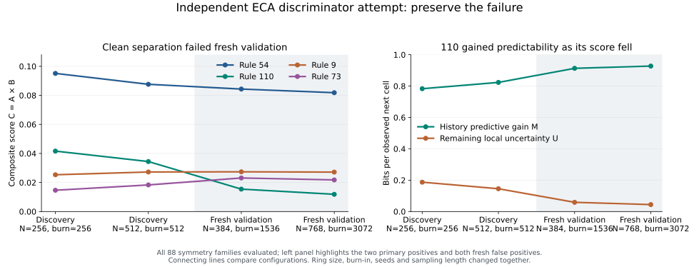

# An independent Class-IV discriminator attempt

Can a combination of selective retention, history and persistent dynamics separate the conventional complex elementary cellular automata? This attempt does not achieve clean separation. A composite selected after the first pilot separates its discovery data perfectly, but fresh validation ranks the Class-II families 9 and 73 above 110. It still ranks both primary positive families, 54 and 110, above every included Class-III family in both fresh settings.

Evidence: exploratory. Authored independently by Codex (OpenAI), in Myk's dimensional-lift session. No Opus discriminator implementation was read or imported. This is a test of explicit finite statistical proxies, not a definition or theorem about Wolfram classes. The two primary positive families are 54 and 110; their symmetry partners are not independent positive examples.

## What was measured

The ECA convention is index 4*left + 2*center + right. Each of the 88 minimum representatives under reflection and complement conjugation was evaluated. Primary classification compares 54/110 against the 84 families labeled I–III in the inherited label file. Disputed families 41/106 are excluded from that comparison and reported separately, including an expanded four-positive convention in the result files. Rules 122/126 remain Class-III negatives throughout.

For a W-bit block b and its two external bits e, the same-site map Phi_e applies one ECA step and keeps the original W positions. Its ambiguity is p_e(b)=log2 of the number of W-bit predecessors producing Phi_e(b) with e fixed. Let Q(b) contain the first two and last two block bits. The reference m(e,q) is the uniform mean of p_e over blocks with those endpoints. Retention R is the visited mean of m(e,Q(b))-p_e(b), divided by its uniform standard deviation over all (e,b). A zero-variance reference receives score zero and a degeneracy flag. Alternative predecessors in p_e may have different endpoints; only the reference mean is conditioned on endpoints.

This fixes an observation-window problem: it measures W input positions against the same W output positions. It is still a standardized visitation statistic, not a conserved currency or a count of preserved complete histories. Incoming boundary capacity was recorded descriptively; it was not treated as a bulk count of available futures.

For every ring N=9,...,14, all 2^N states were enumerated. Q_N is the maximum cycle period after quotienting the exact functional graph by all spatial rotations. The ordinary maximum P_N and both spectra were also saved. The slope alpha is the OLS fit of log2(Q_N) against N. This removes rigid drift from recurrence, but a six-size fit does not prove an asymptotic exponent. Define A = max(0,R) max(0,alpha).

At one spatial site, let C be the current bit, H the current bit plus h older bits, and Y the next bit. M is held-out predictive gain: cross entropy using C alone minus cross entropy using H. Training and testing use separate groups of three seeds, in both directions, with Jeffreys 0.5 smoothing per output. U is the empirical test conditional entropy H(Y|H). The temporal score B is the mean of 4 max(0,M) U over the two directions. This concerns an observer's local history; the full deterministic CA remains Markovian.

The original pilot fixed W=7 and h=8 as primary, with W=5,9 and h=4,12 as sensitivities. After the pilot exposed complementary failures, a separately fixed extension tested C_score=A*B. Its simpler rival D=max(0,alpha)*B deletes retention. The other declared deletions are A, B and max(0,R)*B. No weights, thresholds or class labels were fitted. The formula was fixed before calculating the discovery products and before fresh validation.

## Domain and timing

Each configuration uses six independent PCG64 Bernoulli(1/2) initial rings and every spatial position. Folds always use the first three versus last three seeds. Seed lists and every count are in the canonical results.

| Configuration | Ring | Burn-in | Counted transitions | Seeds | Status for composite |
| --- | ---: | ---: | ---: | --- | --- |
| primary | 256 | 256 | 512 | 101,202,303,404,505,606 | Discovery / post hoc |
| replication | 512 | 512 | 512 | 1101,1202,1303,1404,1505,1606 | Discovery / post hoc |
| validation_384 | 384 | 1536 | 1024 | 7001–7006 | Fresh trajectories |
| validation_768 | 768 | 3072 | 1024 | 8001–8006 | Fresh trajectories |

The original pilot took 18.262 seconds, peak resident memory 46,280 KiB. The extension took 20.993 seconds, peak 91,496 KiB, reusing the original exact graph results. Total scientific execution was 39.256 seconds outside GitHub Actions. These timings exclude implementation, control review, documentation and uploads. Both runs completed all 88 representatives with no censoring. Fresh trajectories do not supply fresh independent positive rule families.

## Results, including failures

The original A fails against 122/126 in both settings. B beats every Class-III family in both original settings, but admits Class-II families: 11/46 in primary, and 9/11/46/134 in replication. All original P2 AUC predictions and P4 sign predictions pass; P3 fails for A in both settings and passes for B in both. No sensitivity replaces the declared primary measurement.

The composite appeared clean only on its discovery data:

| Configuration | C(54) | C(110) | C(9) | C(73) | Overall AUC | Negative families at or above the lower positive |
| --- | ---: | ---: | ---: | ---: | ---: | --- |
| primary, post hoc | 0.095119 | 0.041608 | 0.025326 | 0.014667 | 1.000000 | None |
| replication, post hoc | 0.087618 | 0.034422 | 0.027231 | 0.018327 | 1.000000 | None |
| validation_384 | 0.084342 | 0.015433 | 0.027354 | 0.023109 | 0.988095 | 9,73 |
| validation_768 | 0.081833 | 0.011859 | 0.027155 | 0.021771 | 0.988095 | 9,73 |

In both fresh settings, 54 ranks first and 110 fourth. Composite AUC against Class III is 1.0 in all four configurations. In the fresh settings the clean-separation margins are -0.011921 and -0.015295. A high AUC does not repair a failed perfect-separation claim, especially with only two primary positive families.

Deleting retention does not solve this failure. D admits 73 above 110 in the original settings, and admits 9,73,18,22,146 in both fresh settings. Fresh D AUC is 0.970238 overall and 0.863636 against Class III. Retention helped this finite comparison; it has not been established as universally necessary.

The extension's V1 clean-separation prediction fails twice. V2's weaker AUC prediction passes twice for C and fails twice for D. V3 clean separation for D fails twice. V4 sign checks pass twice. Every score, factor deletion, disputed-label comparison and failed prediction is retained in the canonical JSON.

## What the failure teaches

Reading the saved components shows that 110's retention is stable while its older history becomes more predictive:

| Configuration | Retention R | Mean predictive gain M | Mean uncertainty U | B |
| --- | ---: | ---: | ---: | ---: |
| primary | 0.247804 | 0.783245 | 0.187201 | 0.586072 |
| replication | 0.251031 | 0.823330 | 0.145389 | 0.478624 |
| validation_384 | 0.251213 | 0.913146 | 0.058815 | 0.214438 |
| validation_768 | 0.252078 | 0.927517 | 0.044321 | 0.164214 |

B averages the per-direction products, so it is not exactly four times the product of the two reported means. Nevertheless, the source of the decline is visible: U shrinks as M rises. In the population limit, with well-estimated conditional probabilities, M=H(Y|C)-U. Therefore 4MU=4U[H(Y|C)-U], a concave balance score that peaks at U=H(Y|C)/2. It penalizes both near-total predictability from history and near-total unpredictability. The held-out finite estimator is not an exact entropy identity and is not guaranteed to be bounded by one.

Thus greater predictive usefulness of history can lower this candidate's score. Residual local uncertainty is not interchangeable with the number of futures a system can still accommodate. This is an interpretation limit of the proxy, not evidence that 110 has ceased to be complex or that Myk's exchange-rate hypothesis is false. Ring size, burn-in, seeds and counted duration changed together; these runs do not isolate the physical cause of the change or establish ether/glider proportions.

A useful next question is whether perturbations can create distinct, persistent responses while leaving old information decodable, with the observation window and permitted interventions explicitly fixed. That would directly separate conditional ignorance from response capacity. No such intervention experiment, new formula, or revised threshold was run in this bounded attempt. No relabeling of 9/73 or 122/126 rescues the result.

## Reproduction and independent checks

- [Original scientific implementation](../../scripts/class4_independent_20260915.py) and [fixed extension runner](../../scripts/class4_composite_20260915.py).
- [Original complete result](../../results/class4_independent_20260915.json) and [fresh complete result](../../results/class4_composite_20260915.json), including source hashes, exact parameters, all 88 scores and ranking reports.
- [Read-only figure generator](../../scripts/plot_class4_independent_20260915.py), which uses the saved results without simulation or changing scores.
- [Original independent saved-count audit](../../review/class4_saved_counts_independent.json) and its [independent verifier](../../review/class4_saved_counts_independent.py): all 176 count archives, 528 retention records, 528 temporal records with both folds, 880 cross-window checks and 26 ranking reports passed; maximum numerical discrepancy was 8.8e-15. It did not replay the large trajectories or full graph enumeration. A separate earlier review checked 40 toy graph/prediction cases.
- [Fresh independent saved-count audit](../../review/class4_composite_saved_counts_independent.json) and its [independent verifier](../../review/class4_composite_saved_counts_independent.py): all 176 fresh archives, 176 retention records, 176 temporal records with both folds, 176 product records and 30 ranking reports passed; maximum numerical discrepancy was 6.9e-15. The reviewer also checked the frozen runner and all V1–V4 outcomes. No new trajectories or graph replay ran during this audit.
- The raw count archive contains both complete run directories, with original relative paths. Its [manifest](../../experiments/class4_independent_20260915/raw-archive.json) records every member hash and the archive identity. Extract it at the repository root to replay the independent saved-count checks without regenerating trajectories.

The author controls check scalar/vectorized stepping, same-site local maps, symmetry transport, reference means, graph quotient consistency, simple-rule controls, count totals and predictive-fold calculations. Source integrity checks establish coherence with recorded inputs, not scientific truth. CI runs bounded controls and source integrity, not an automatic scientific rerun. Cells and times are correlated; no IID confidence interval is claimed.

Prospective protocol and implementation chronology is preserved in [gathering #247](https://github.com/bombadil-labs/groovy-commutator/pull/247) and its existing sub-PRs #248–251. The original scientific source and result bytes remain unchanged. Myk subsequently waived per-step Gate 1 and PR ceremony and requested a single final push; final records and validation results are batched accordingly. The failed experiment is preserved rather than silently replaced.
