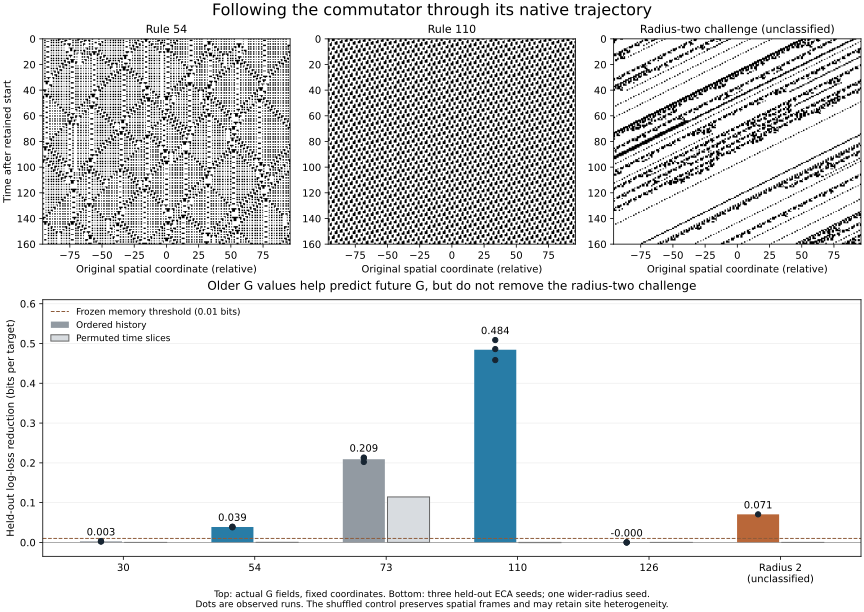

# Commutator history and repeated perturbation do not yet isolate Class IV

Tracing the actual commutator along native trajectories reveals substantial predictive history. Rule 110 gains 0.458–0.509 bits per target from three older commutator values, beyond a model of its current local commutator neighborhood; rule 54 gains 0.038–0.039 bits. The frozen memory criterion retains both core families. It also retains the unclassified radius-two challenge, which gains 0.071 bits. No held-out baseline decision changes.

This is a positive result about finite observed memory and a negative result for this particular discriminator augmentation. No threshold was retuned after seeing these measurements. The wider-radius rule has no assigned Wolfram class, so its survival is not a certified Class III false positive.

A separately frozen follow-up tests whether an earlier perturbation changes the response to a later one. That effect also occurs broadly outside the core Class IV families. Both studies narrow the stronger hypothesis of adaptive, historically conditioned responsiveness without establishing it.

Author: Codex (OpenAI), /root, 2026-09-15. Myk granted standing Gate 1 authorization and requested local iteration followed by publication. Evaluation preceded independent implementation/result review; an independent reviewer checked the fixed protocol while implementation proceeded. The [independent audit](../../review/commutator_history_independent.json) states its exact replay scope. The signed integration review pins the final head. One pre-implementation protocol correction fixed the count of additional core symmetry variants; no scoring or input change followed evaluation.

## Which prediction error?

For a native trajectory S[t+1]=E(S[t]), define

$$
D_t=S_t\oplus S_{t+1},\qquad
G_t=D_{t+1}\oplus E(D_t).
$$

The closure predictor applies the native rule to the current change mask. G measures its discrepancy from the next observed change mask. This is precisely the statewise commutator D(E(S)) XOR E(D(S)); it is not an optimal probabilistic predictor or a claim that the fully observed deterministic CA is unpredictable.

We record G(S[t]) along the native state trajectory. Evolving G(S[0]) repeatedly under E is a different experiment and was not done. No lifted off-beam completion is involved.

## Frozen conditional prediction test

The [protocol](../../experiments/commutator_history_20260915/protocol.md) fixes the observation, geometry, split, estimator, threshold and controls before measurement. Inputs are the immutable R6 and R10 trajectories from the [eleven-round investigation](2026-09-15-beam-discriminator-loop.md). No native simulation was regenerated.

For a radius-r root, the current-only model predicts G[t+4,x+4v] from all 2r+1 bits in the radius-r neighborhood of G[t] around x. Three nested extensions add G[t-4,x-4v], then G[t-8,x-8v], then G[t-16,x-16v]. Velocities are 0, -r/2, +r/2, -r, +r. Displacements are integer at these time lags. Binary conditional count tables use probability (ones+1/2)/(total+1).

Tables are fitted on the first saved seed, source times 16–479. The velocity is chosen by the largest log-loss improvement on times 528–1025 of that same seed. Those intervals have a gap even after accounting for older features, prediction horizon and the two native steps used in G. No held-out seed is used to choose the direction or refit a table.

Evaluation uses source times 16–1025 of each other seed: three seeds per ECA representative and one per wider-radius family. The ECA study includes all 88 representatives and four additional matched core-orbit variants, giving six labeled core rules but still only two core families. R10 supplies radii 1–3 with and without the nonlinear correction. Original q, alpha and baseline selection flags are retained.

Let L0 be held-out bit log loss for the current neighborhood model and L3 the loss after adding all three historical bits. Define

$$
M=L_0-L_3,\qquad
\text{augmented} = \text{baseline selected}\;\land\;(M>0.01).
$$

M is out-of-sample predictive gain for these finite count models. It is not an exact conditional mutual information or an optimum over all histories. The current-only comparator sees a radius-r neighborhood, not the full current G field: older samples could recover information available in a wider present neighborhood. Irreducible temporal memory is therefore not established. Negative gains are retained. The radius-family calculations use valid open-window G arrays and crop 17r cells at each side before scoring histories and targets. No wrapped value enters those contexts.

## Held-out outcomes

| Case | Gain in bits per target | Original decision | Augmented decision |
| --- | ---: | --- | --- |
| ECA 30 | 0.0025–0.0028 | Reject, 3/3 | Reject, 3/3 |
| ECA 54 | 0.0378–0.0393 | Select, 3/3 | Select, 3/3 |
| ECA 73 | 0.2022–0.2133 | Reject, 3/3 | Reject, 3/3 |
| ECA 110 | 0.4583–0.5087 | Select, 3/3 | Select, 3/3 |
| ECA 126 | Slightly negative, about -0.00002 | Reject, 3/3 | Reject, 3/3 |
| Radius-two correction family | 0.0705 | Select, 1/1 | Select, 1/1 |

All 264 held-out representative decisions are unchanged: the core pair supplies six selected runs, the 84 undisputed negative representatives supply zero of 252, and the disputed representatives supply zero of six. All twelve extra matched core-variant evaluations remain selected. The five other held-out wider-radius cases remain rejected. These are dependent measurements of familiar rules on fresh-for-this-predictor seeds, not unseen-rule generalization or a new universal accuracy estimate.

The earlier baseline-positive rule-106 seed is 6041511, now the fitting seed. Its three held-out cases already fail the baseline. This unit therefore does not independently test removing that earlier positive instance.

Rule 110 has the highest mean M among the 88 representatives; rule 54 ranks fourteenth. Several non-core rules have substantially more predictive G history than 54. Moreover, the radius-two challenge exceeds every observed rule-54 gain. A larger lower-bound threshold on this scalar cannot retain those 54 runs while rejecting this radius-two case. That is an ordering observation, not a post hoc threshold search.

## What the shuffled control does and does not establish

For six ECA controls and all six wider-radius families, independently permute complete time slices of G, then refit, choose velocity and evaluate the same pipeline. This preserves spatial frames while disrupting their order. Rule 54's shuffled gains fall below 0.00031 bits, rule 110's are slightly negative, and the radius-two challenge's is -0.000091. Their observed gains are sensitive to temporal organization under this control.

Rule 73 retains 0.112–0.117 bits after shuffling, despite an ordered gain of 0.202–0.213. Temporal permutation is therefore not a universal zero-memory null. Whole-frame permutation exactly preserves each site's empirical activity distribution. Persistent differences in those probabilities can make multiple samples at a site informative even after order is removed. This is an explanation compatible with the control, not a proved decomposition of rule 73's score. The control does not preserve every temporal marginal or isolate causal influence.

The radius-two G plot shows long slanted tracks. Thus preserving an iid spatial measure in the underlying rule does not prevent organized temporal structure in a derived observation. The new result reinforces the need to keep that family's behavioral classification open; neither the picture nor M proves Class IV behavior.

## Bit convention and the beam hypothesis

Reflection-matched 110/124 have identical gains; so do reflection-matched 137/193. Complement conjugation changes the measured scores: 110/124 give 0.458–0.509 bits, while 137/193 give 0.347–0.369. Rule 54/147 likewise differ, although every tested core variant passes the frozen binary decision.

This dependence is already visible algebraically. With Ebar(Z)=1 XOR E(1 XOR Z) and Sbar=1 XOR S, the change mask is unchanged, but

$$
\overline G(\overline S)
=D(E(S))\oplus 1\oplus E(1\oplus D(S)).
$$

There is no general identity equating this with G(S). Applying E to a difference field uses a bit convention. Consequently these raw commutator-history scores cannot simply be declared invariants of a beam. The prior support-transport theorem does not establish invariance of their distributions or predictive losses.

The useful next distinction concerns how commutator history participates in persistent interactions. A further unit should specify that distinction before choosing another score and retain the current baseline, rule 73, and the radius-two family. This experiment does not justify another round of scalar threshold tuning.

## Follow-up: does an earlier pulse change the response to a later pulse?

After the first result, Myk proposed remembering through transformed responsiveness. The separately frozen [response protocol](../../experiments/commutator_history_20260915/response-protocol.md) tests one necessary ingredient using four arms: neither pulse (00), first only (10), second only (01), and both (11). Pulses flip one cell. After the second pulse, define

$$
R_0=S_{01}\oplus S_{00},\qquad R_1=S_{11}\oplus S_{10},\qquad I=R_0\oplus R_1.
$$

This removes the direct lingering first disturbance. Nonzero I means the earlier intervention modifies the later response. It does not by itself mean learning, beneficial adaptation, retained plasticity or a feedback mechanism driven by G. A deterministic CA's history is mediated entirely by its current complete state; identical full states and future interventions yield identical futures.

The exact short-delay census uses all seven-cell contexts for every ECA: pulse at the center, one update, the same pulse again, then one update. The three reachable output cells depend only on those seven inputs. **224 of 256 rules** admit nonzero I in this geometry. Rule 30 does so in all 128 contexts. With an all-zero context, its second-pulse response is 111 without the first pulse and 001 with it, giving I=110. Thus the bare response-modification criterion is not specific to Class IV.

Conversely, rule 54 has no short interaction in that exact geometry, although it does at longer delays. This warns against identifying the phenomenon with a single pulse schedule. Rule 4 has interaction in 56 of 128 contexts despite identically zero G on every input; responsive modulation and a nontrivial G signal are not equivalent. The radius-two correction family has interaction in 3,224 of 8,192 thirteen-cell contexts.

The independent reviewer identified the exact short-census zero family as f(l,c,r)=a*c XOR g(l,r), with constant a. The author independently checked that constant center-bit difference characterizes exactly the same 32 tables. The center's pulse response is constant a; each neighbor's response depends only on its opposite neighbor at distance two, which the first pulse has not reached after one update. This explains the zeros for this schedule without implying absence of later interactions. The algebraic explanation was supplied during review and cross-checked by the author.

The delayed experiment uses archived, burned-in initial states for twelve ECA controls on three seeds, plus all six wider-radius controls on one seed. It waits 16 or 64 steps after the first pulse, probes at offsets -r*delay, 0 and +r*delay, and follows the second response for 32 steps. Each condition uses 16 first-pulse origins. The fourth offset, r*(delay+64)+1, is a remote negative control. Adequate initial padding and shrinking windows keep the full response support visible.

| Rule | Changed second responses at horizon 32 | Scope |
| --- | ---: | --- |
| 30 | 244/288 | Both delays, three local offsets, three seeds |
| 54 | 180/288 | Same |
| 73 | 87/288 | Same |
| 90 | 0/288 | Same, affine control |
| 106 | 221/288 | Same |
| 110 | 150/288 | Same |
| 126 | 254/288 | Same |
| Radius-two correction family | 11/96 | Both delays, three local offsets, one seed |

These correlated finite probes are not samples of a universal adaptation rate. Local G-history differences and current radius-2r root-neighborhood matches are retained per trial, with G using only frames available before the second pulse. Their cross-tabulations are descriptive, not a fitted conditional predictor or evidence that G causes the response change. Empty-response union ratios are defined as zero.

All remote interactions vanish. When the first disturbance is erased, the later interaction vanishes. Matching radius-2r probe neighborhoods ensures zero interaction at horizon one, as required by locality; later differences may arrive from outside that neighborhood. The affine and pure-shift controls also pass. Full arrays and the [response result](../../experiments/commutator_history_20260915/response-result.json) are preserved.

This follow-up took 0.842 seconds locally. It establishes finite causal response modulation and refutes the specificity of that weak ingredient. A stronger adaptation theory would need an operational test of selective retention, response quality, generalization or continued plasticity. No biological or clinical analogy is promoted to a result.

Myk subsequently described the stronger conjecture as "metabolizing surprise": disturbances become changes in the capacities through which later disturbances are encountered, while further change remains possible. This is retained as a working interpretation, not a tested result. The present experiments measure predictive history and response modulation; neither measures that proposed conversion into maintained or revised capabilities.

## Reproduction and review

The run took 11.485 seconds locally, including array output and hashing. This is a task wall time, not a controlled performance comparison. All 8,192 ECA scalar five-cell contexts and 17,472 wider-radius scalar contexts passed the direct formula checks. Known constant-G controls were preserved.

The [canonical summary](../../results/commutator_history_20260915.json) hashes the sources, protocols, original results and independent audits. The [raw archive manifest](../../experiments/commutator_history_20260915/raw-archive.json) identifies a single archive containing both exact input caches, every packed G history and sufficient count table, and all four-arm response arrays. Source/result/protocol files are committed. The archive and manifest specify extraction and fresh-run handling; completed output is never silently overwritten.

The independent reviewer reproduced all 110 analysis families, all 380 packed G histories and all 1,406 joint count tables. Selection and test losses, coverage, gains and decisions match; floating loss agreement is within 2e-12 bits. This full independent replay took 25.63 seconds. The root author reviewed the independent implementation and its different truth-table reconstruction and explicit context projection.

The separate [response audit](../../review/commutator_response_independent.json) reproduced all 40,960 exact census contexts, all 84 delayed cases, all 756 saved arrays, and all 16,128 per-horizon measurements in 8.64 seconds. All history timing, local-match, erasure, remote-control and complete-response-cone checks pass. The root author reviewed its separate scalar and batched four-arm implementations.

Automatic CI performs compilation and provenance checks. Scientific evaluation and independent replay run outside Actions. Related instruments for local storage, transfer and modification in CAs are described by [Lizier, Prokopenko and Zomaya](https://arxiv.org/abs/0811.2690); this test uses a smaller fixed predictive model on G, not that complete framework.
