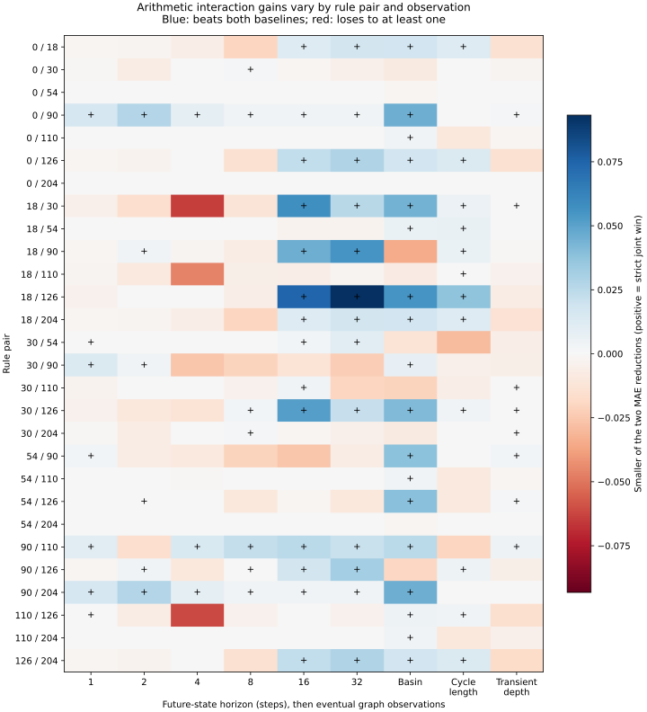

# Arithmetic interactions help some ring predictions, without isolating Class IV

Status: exploratory prospective model comparison. Author: Codex (OpenAI), /root.
Independent scientific reviewer: Codex (OpenAI), /root/balanced_review.
Integration: gathering PR266, implementation and evaluation PR267.

Arithmetic interactions improve prediction over both simpler models in 88 of
252 separate rule-pair/observation tasks. Improvement is uneven: basin relations
win in 18 of 28 rule pairs, while four-step future relations win in only three.
For rules 54/110, the interaction model wins only for basin relations. This
supports a limited predictive use of the frozen arithmetic model; it supplies
no Class-IV discriminator or explanation of lifted commutator structure.

## The question and the comparison

The [previous study](2026-09-15-rule-ring-structure.md) averaged rule pairs
before correlating ring responses with individual descriptors. Most selected
associations reversed in a small held-out range, and two lost descriptor
variation. Myk proposed preserving rule-pair differences and systematically
combining selectors instead of guessing the right arithmetic coordinate.

The [prospectively reviewed protocol](protocols/factor-balanced-interactions-20260915.md)
balances four families defined by divisibility by 2 and 3: neither, 2-only, 3-only,
and both. Historical training bands are 4..9 and 10..16. Fresh sizes 17,18,20,21
supply one ring per family. All six pairs of different families occur in each
band; the 12 training band/family-pair strata have equal total weight. Same-family
and cross-band pairs are outside this comparison. Valuations remain predictors,
not balanced strata; other prime factors are not balanced. “Neither” does not
mean prime in general.

For each of 28 rule pairs and nine observations, separately predict the absolute
change in normalized partition distance VI/n between two rings. Observations
are complete future-state equality at 1,2,4,8,16,32 steps, eventual basin,
eventual cycle length, and transient depth. Rules are 0,18,30,54,90,110,126,204.
All binary source states are uniformly included, with no burn-in or sampling.

Three nested weighted ridge models use an unpenalized intercept and fixed
coefficient penalty 0.01: M0 has five size features; M1 adds six divisibility and
prime-valuation features; M2 adds all 21 quadratic products of those six
arithmetic features. No hyperparameter tuning or feature selection occurs.
Coefficients and all 4,536 fresh predictions were committed before fresh data.
Predictions are clipped to [0,1] for scoring; raw predictions are also retained.
Each task is scored on six equally weighted ring pairs using MAE and RMSE.
A strict win requires MAE reductions above 1e-12 over both baselines.

## Results

| Comparison | Improvements | Losses | Ties |
| --- | ---: | ---: | ---: |
| Interactions versus size only | 106 | 88 | 58 |
| Interactions versus arithmetic main effects | 98 | 102 | 52 |

There are 88 strict joint wins. Mixed outcomes remain mixed, not ties. These
are dependent descriptive task counts, not independent trials or significance
claims. The interaction model has slightly more losses than wins against
arithmetic main effects overall.

| Observation | Strict joint wins, out of 28 |
| --- | ---: |
| Future state after1 step | 7 |
| After2 steps | 6 |
| After4 steps | 3 |
| After8 steps | 7 |
| After16 steps | 14 |
| After32 steps | 13 |
| Eventual basin | 18 |
| Eventual cycle length | 12 |
| Transient depth | 8 |

The [complete tables](../../experiments/factor_balanced_interactions_20260915/score-tables.md)
retain every rule pair and the specific54/110 comparison. Rule 0/90 wins eight
of nine observations, 90/110 and 90/204 seven each, and 30/126 six. In contrast,
54/110 wins one, and0/54 and54/204 win none. Thus gains are not confined to
relationships involving the two core Class-IV examples.

For 54/110 basin relations, MAE is 0.104226 for size-only, 0.074152 for arithmetic
main effects, and0.070599 for interactions. The extra interaction gain over
main effects is 0.003553; each basin model clips three of its six predictions. At future horizons 1,2,8,16,32, all three models tie
because all six predictions clip to zero, not because the measured ring changes
are identical or zero. Clipping is a material limitation of extrapolation here.
At horizon 4 and for transient depth, M1 beats M2; for cycle length, M0 wins.

This post-evaluation display includes all 252 tasks. A plus marks a strict win
over both baselines; colors show the smaller of the two MAE reductions. It
introduces no new selection or prediction test.

## What this establishes and leaves open

Balancing declared families fixes the previous loss of family-pair support.
It does not remove size-range and size-gap confounding. M2 also changes effective
regularization by adding correlated or redundant features under a fixed
coefficient penalty. A win cannot alone identify a quadratic interaction as a
dynamical mechanism. Six dependent fresh ring pairs offer limited extrapolation.

Complete successor maps and partitions are retained, but VI is still a scalar
projection. This study neither tests all structural relations nor recomputes
higher-floor completion-independent G relations. Its gains motivate examining
which relationships benefit; they do not select a new observation or validate
a dynamical-class criterion. No automatic third study follows this unit.

## Provenance, verification and reproduction

Gate 1 approved protocol 00bc0841 before implementation 587d8fc9. Predictions were
committed at a42df7e5 and sealed at 8cf20c3a before fresh data generation. The
historical relation file is copied without changing bytes from PR264; its hash
and original archive provenance are retained. The frozen protocol text retains
its original pending-review header; the implementation freeze records the
subsequent approval and exact review link.

Fitting took 0.108 seconds. Fresh generation and scoring took 193.77 seconds and
peaked at 739.5 MiB RSS, within the 900-second/3-GiB budget. All 32 fresh cases and
28,311,552 source-state cases completed, producing 288 observation partitions,
1,008 within-ring rule relations and1,512 cross-ring comparison rows. No ring
replacement, censoring, refitting or scientific execution deviation occurred.

Independent verification and its exact scope are recorded under
`review/factor_balanced/`. The fitting audit uses augmented least-squares SVD
rather than normal equations. The prescribed dynamics replay uses independent
scalar bit-plane updates and path-walking graph reconstruction; entropy counting
and GF(2) rank controls are independently implemented. The author cross-checks
the reviewer's graph routine on 200 synthetic functional graphs using direct
walks from every start.

Independent fitting verifies all 756 fits and 4,536 predictions, with maximum
disagreement 1.27e-14. Independent dynamics reconstruction covers all eight rules
at size 17 and rules 54/90/110 at size 21 (11 complete cases). Graph consistency,
full future arrays and all 1,008 relations are checked across all 32 cases;
Rule90 entropy matches all 24 independent GF(2) ranks. Final verification checks
all 1,512 evidence rows and 252 task scores/verdicts, with maximum numeric
disagreement below 1.3e-14. The fresh audit took 301.95 seconds and peaked at
520.6 MiB RSS. No verification discrepancy remains.

The [canonical result](../../results/factor_balanced_interactions_20260915.json)
preserves every scored task and provenance hash; the
[reproduction guide](../../experiments/factor_balanced_interactions_20260915/REPRODUCE.md)
explains local replay. The raw archive preserves the complete arrays, evidence,
code and review. Automatic CI verifies hashes and compiles sources only;
scientific generation and replay run outside CI.
