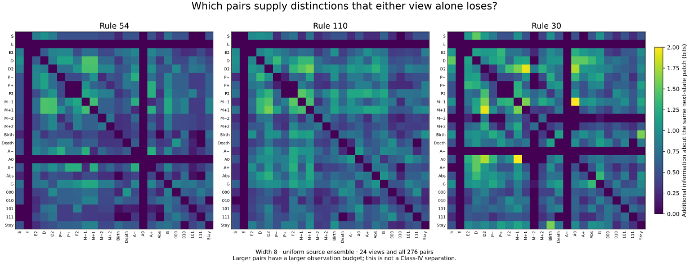

# A catalog of observations survives one width change, but its frozen ranges fail on developed trajectories

Status: exploratory comparative atlas, with exact finite subresults.
Authored by: Codex (OpenAI), /root, 2026-09-15. Independent scientific review:
Codex (OpenAI), /root/relations_review; exact final integration is tracked in PR260.

We enumerated **24 observations and all 276 pairs**, retaining the event
partitions and transitions behind their summaries. Seven mechanically selected
measurement/observation combinations retain all six members of the 54/110
symmetry families on width nine. None retains both canonical rules across both
long-trajectory seeds under its unchanged discovery interval.

This does not reject the 300 representations or their full structural content.
It rejects generalizing these seven scalar ranges from uniformly sampled small
source rings to the tested developed trajectories. The change also enlarges the
ring and introduces sampling, so it does not isolate ensemble choice as the
sole cause. The catalog and event data now make those questions separable in a
future factorial comparison.

## Why enumerate observations together?

Myk proposed borrowing the method that found the lift: enumerate projections of
the source, combine them, and search for relationships without committing to one
favored observable. The [preceding relation audit](2026-09-15-commutator-relations.md)
showed why native completion freedom must be handled explicitly. The earlier
[discriminator loop](2026-09-15-beam-discriminator-loop.md) and
[history comparison](2026-09-15-commutator-history.md) supply controls and known
failures; their thresholds and conclusions are unchanged here.

The [frozen protocol](protocols/observation-catalog-20260915.md) gives every
formula, domain, selector and budget. The observations include state, one/two
future steps, temporal/spatial/moving-frame differences, birth/death/persistence,
local sensitivities, absential cells, four motif masks, and the root commutator.
Each is observed through a three-site longitudinal word. A pair keeps both
words. The dynamics always evolve the source rule; an observation is never
mistaken for an independently evolving CA.

The term gauge follows the repository's run calculus: Q(F^t(S)). It is distinct
from symmetry transformations and from choosing a representative in the affine
family of native completions. Those operations have different invariance claims.

## The retained comparison map

For each event we preserve which observation block it belongs to, the source
successor, and longitudinal shift. These reconstruct counted transition graphs,
spatial incidence, and refinements. The common summaries are observed entropy,
one-step conditional uncertainty, two-step refinement gain, spatial mutual
information, uncertainty about the same raw future patch, branching mass, and
the additional common-target information supplied by a pair over its better
single constituent.

There are **153,600 discovery observation contracts**: 300 observations for each
of 256 ECAs on both widths seven and eight. Checking exact partition aliases
over every 11-bit local context leaves **44 to 284 distinct partitions per
rule**. All nominal names and aliases remain available. These are pointed local
partition equivalences, not a census of whole-field factor maps.

The figure displays the full pair matrix at width eight for three example
rules; larger entries mean that the joint observation reveals more about the
same next-state patch than either constituent. Pair budgets are larger, so this
is not a resource-adjusted synergy claim. Future observations carry anticipatory
support and cannot be promoted as online predictors. The E row is zero because
that constituent already contains the target. The figure was selected for
explanation after evaluation and is not another classification test.

## Seven frozen slots

For each of seven measurements, the selector forms an interval containing all
core-positive symmetry members at both discovery widths. It chooses the
observation whose interval overlaps the fewest undisputed negative symmetry
families; normalized interval width and catalog order break ties. There are
**2,076 attempted measurement/observation slots**, including only pairs for the
pair-gain measurement. The full ranking is saved. The two core positive families
and their symmetry members are not independent class examples.

The negative panel has 84 symmetry families. The disputed 41/106 families are
reported separately. The seven selected slots and discovery hashes were
committed at `c17bc660acf22223b513f7b7e313107bacbf95f0` before confirmation.

| Measurement | Selected observation | Negative families overlapping discovery | Negative families overlapping width 9 | Developed core runs inside the frozen interval |
| --- | --- | ---: | ---: | ---: |
| Symbol entropy | State + two-step future | 3 | 3 | 0/12 |
| Next uncertainty | Left-moving one-step residual + center sensitivity | 3 | 2 | 0/12 |
| Refinement gain | One-step change D | 2 | 2 | 2/12 |
| Spatial information | Two-step future | 8 | 5 | 0/12 |
| Common-target uncertainty | Left- and right-moving one-step residuals | 4 | 4 | 0/12 |
| Branching mass | Left spatial difference + right-moving residual | 9 | 9 | 0/12 |
| Complementary gain | State + two-step change | 2 | 2 | 5/12 |

Every width-nine slot retains **6/6 core symmetry members**. The developed-run
denominator is six related core rules times two seeds, not twelve independent
positive rules. For the two canonical roots: D refinement retains only one
54 run; the state/two-step-change gain retains both 110 runs and neither 54
run. No slot retains both roots at both seeds.

The developed panel contains 16 ECAs and the unclassified radius-two challenge,
with two paired initial-state seeds: width 1021, burn 1024, then 1024 scored
rows at eight fixed sites. The initial draws are shared across rules at each
seed. Samples along a trajectory are dependent. Both radius-two runs fall
outside all seven intervals; excluding that example does not repair the missed
core runs. No new Wolfram label is assigned to it.

Width nine is an exhaustive width extension. The developed runs simultaneously
change width, ensemble and estimation regime. Finite-sample branching in
particular can miss rare edges. Neither test establishes an infinite-lattice
or stationary-distribution claim.

## What the native-view catalog transports

Across the prior 13-root panel, widths seven/eight and D2..D4, we evaluated
**98,280 native views**: 20 completion-independent on-family primitives and
their 190 pairs, at six newest-axis phases in each of 78 stored families.
Older transverse coordinates were fixed at zero. Exact source-state partition
matching found **25,960 matching views**, retaining every root alias and counted
transition witnesses under the common source successor.

These counts include constant partitions and repeated representations; they
are not a class score. For 54, D3/D4 recover only its constant center-sensitivity
partition in the tested slice. For 110 there are no root-catalog partition
matches on those floors in that slice. This is a failure of these particular
small native views to recover those particular root partitions, not failure of
the faithful lift or of larger/other-phase observations.

Native sensitivity and G queries are not guaranteed determined by on-family
constraints, so they were omitted from the numerical native catalog. Individual
queries can already be forced. The prior symbolic G family supplies a separate
completion-invariant relational view instead of an arbitrary completion policy.

## Where the surviving completion relations come from

The preregistered provenance audit annotates each shared-free-key pair after
full spatial quotienting with source identity, one-step merging, eventual basin,
and whether both sources have full spatial period. It covers all **104** prior
symbolic contracts and excludes fixed events from free-pair denominators.

For 54/110 at width eight on D3/D4, no such pair has two full-period source
states. A **post hoc direct endpoint inspection**, independently reconstructed,
sharpens this: every one of these pairs has source periods **(4,4)**.

| Root | D3 free pairs | D4 free pairs | Endpoint periods |
| --- | ---: | ---: | --- |
| 54 | 216 | 1,296 | (4,4) for every pair |
| 110 | 72 | 432 | (4,4) for every pair |

Example source pairs, written in stored spatial order, are 00110011/01100110
for 54 and 10111011/11101110 for 110. Thus the higher-floor relations that
looked promising in the preceding seven/eight comparison live entirely on
period-four source configurations in this width-eight population. A seven-cell
ring cannot contain a configuration of minimal spatial period four. This
identifies their finite-ring provenance; it is not a general mechanism theorem
or an additional Class-IV classifier.

## Verification, cost and reproducibility

Independent Gate 1 preceded implementation. Its numerical clarification was
approved before the first evaluation. Scientific code was committed at
`15967f733af1aa167fb92a3c107145f396a7a2c6`. Primary stages completed in
85.52 seconds (discovery), 48.08 seconds (confirmation), and 8.75 seconds
(native views/provenance), with peak RSS at most 160,396 KiB. None was censored.

The independent implementation uses packed-integer source updates, direct
Boolean projections, dictionary partition labels and tuple-count entropies,
with no primary mathematical helper imports. Its signed report specifies the
reconstructed finite panel, all selector/verdict checks, longer trajectories,
native views and provenance. The author separately cross-reviewed this code.
All 49,824 independently reconstructed finite metric values agree to within
4.45e-15. Verification covers every one of the 2,076 ranking rows, all seven
width-nine verdicts, all 238 developed-run interval decisions, eight fully
reconstructed developed trajectories, all 98,280 native views, and all 104
provenance contracts. A separate author implementation checks the reviewer's
post hoc endpoint claim on all 2,016 pairs in the four reported contracts.

The [canonical result](../../results/observation_catalog_20260915.json),
[reproduction guide](../../experiments/observation_catalog_20260915/REPRODUCE.md),
[primary script](../../scripts/observation_catalog.py), and
[independent review](../../review/catalog-independent-review.md) preserve scope
and execution provenance. The downloadable raw archive includes all event data,
inputs, full ranking and code; the [archive record](../../experiments/observation_catalog_20260915/raw-archive.json)
gives its hash. Automatic CI only compiles and verifies pinned hashes; all
science and independent reconstruction took place outside GitHub Actions.

## What this changes next

Keep the catalog as the common instrument. The next comparison should make
source ensemble and observation choice explicit independent axes, so width,
transient removal and sampling effects can be separated. Examine the retained
transition/partition structures alongside their summaries. The failed intervals
do not establish that the complete structures of 54/110 and controls coincide.
No second experiment or replacement shortlist was run in this unit.
