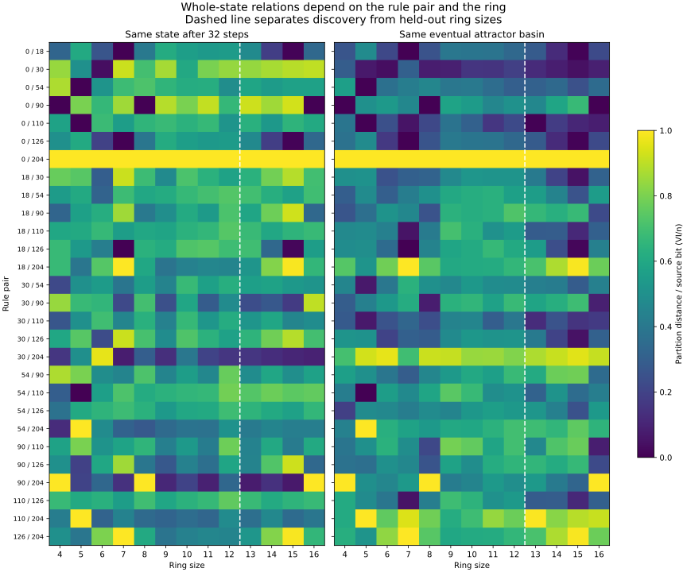

# Whole-state relations expose ring effects, but arithmetic correlations shift

Status: exploratory finite comparison. Author: Codex (OpenAI), /root.
Independent scientific review: Codex (OpenAI), /root/selector_review.
Integration: gathering PR264; instrument: PR262.

Myk proposed treating rings through an extensible family of selectors,
including prime factors, their multiplicities, and relationships between rings.
The instrument now supports that comparison. Its first prospective study finds
that the strongest discovery associations transfer poorly: among 27 selected
associations, four retain their sign on held-out rings, 21 reverse, and two
become undefined. This does not reject arithmetic structure, which is visible
in a known additive control. It does not establish a Class-IV discriminator.

## Why whole-state partitions?

The [earlier observation catalog](2026-09-15-observation-catalog.md) measured
small local windows under exhaustive uniform source states. Once a ring is
wider than every site in a local measurement's dependency interval, those sites
are distinct independent bits under this ensemble; enlarging the ring then
cannot change that distribution. Whole-state partitions can retain global
ring effects under the same exhaustive population.

The [frozen protocol](protocols/rule-ring-structure-20260915.md) fixes eight
rules (0,18,30,54,90,110,126,204), every ring from 4 through 16, and nine
selectors: equality of complete states after 1,2,4,8,16,32 steps, eventual
attractor basin, eventual cycle length, and distance to the eventual cycle.
There are 104 rule/ring cases and 936 partitions over 1,048,448 enumerated
source-state cases. Every source state is retained; no sampling, burn-in,
trajectory cap, or unresolved attractor is involved.

At each ring, two rules partition the same source population. Their relation
is variation of information divided by source width, VI/n. This is invariant
under renaming labels. It is a scalar view of the complete retained partitions,
not a complete structural invariant. Comparing all 28 rule pairs gives 3,276
within-ring relations and 19,656 comparisons between rings.

The panels illustrate saved data after evaluation; they were not additional
selected tests. Dark cells mean similar partitions, not necessarily similar
laws or trajectories. The dashed line separates discovery and held-out sizes.

## Discovery and held-out results

For each observation/ring pair, average the absolute change in VI/n across
all 28 rule pairs. Compare that ring response with 43 fixed descriptors:
size gap, gcd/lcm, divisibility, prime support overlap, prime-factor counts,
and configured divisibility/valuation features. Ring pairs still share
endpoints; no IID significance test is used.

Discovery uses sizes 4..12 (36 ring pairs). For each observation, the three
largest absolute Pearson correlations are sealed before computing sizes 13..16
(six held-out pairs). All 387 associations per stage are retained, including
undefined columns. Confirmation does not refit.

| Observation | Same sign | Opposite sign | Undefined |
| --- | ---: | ---: | ---: |
| State after 1 step | 0 | 2 | 1 |
| State after 2 steps | 1 | 1 | 1 |
| State after 4 steps | 1 | 2 | 0 |
| State after 8 steps | 1 | 2 | 0 |
| State after 16 steps | 0 | 3 | 0 |
| State after 32 steps | 0 | 3 | 0 |
| Eventual basin | 0 | 3 | 0 |
| Eventual cycle length | 0 | 3 | 0 |
| Transient depth | 1 | 2 | 0 |

Sign retention is weak evidence: one retained coefficient shrinks from -0.427
to -0.024. The clearest retained coefficient is ordinary size gap for
transient-depth relations, 0.665 to 0.709. It does not isolate prime factors
or class specificity.

The two undefined results have a precise support explanation: `div4.n` asks
whether the smaller ring is divisible by four. Within 13..16 that endpoint
is 13, 14, or 15, so the feature is constant. This is loss of descriptor variation
in confirmation, not failure of a dynamical phenomenon to exist.

## Controls and limits

Rule204 preserves every source distinction and Rule0 erases them under every
positive future horizon, so their normalized future-partition distance is 1.
For Rule90, the sixteen-step map is zero exactly on tested sizes 4,8,16. Over
GF(2), its shift representation gives F^16=P^16+P^-16, which vanishes when
the ring length divides 32. This known additive behavior is a control, not
a novelty or Class-IV result. Independent GF(2) ranks check all 78 Rule90
horizon/ring entropies.

There are only two core Class-IV examples, overlapping selectors, dependent
ring pairs, and a small confirmation range. First-order correlations do not
separate all size confounds or interactions between arithmetic features.
A reversal in this range is not a theorem against conditional arithmetic
relations. VI discards distinctions preserved in the full partitions. No
lifted completion contract or prior shared-unknown G relations were recomputed.

## Verification and state

Gate 1 approved protocol db2be505 before implementation. Implementation 60766e4f
preceded evaluation; discovery was committed at 6b0fc61a and sealed at 9a4a7305
before confirmation. Discovery took 2.56 seconds and confirmation 9.79 seconds,
with peak RSS below 88 MiB. Both ran locally without censoring or scientific
execution deviations.

Independent reconstruction verifies all 104 successor maps, all 936 partitions
(9,436,032 label entries), all 3,276 relations, all 19,656 final comparison rows,
all 702 ring responses, all 774 stage associations, and all 27 decisions.
Entropy/VI disagreement stays below 8.9e-15. Independent code uses literal cell
updates and Counter-based entropy counts; its report and code are under
`review/rule_ring_structure/`.

The [canonical result](../../results/rule_ring_structure_20260915.json),
[reproduction guide](../../experiments/rule_ring_structure_20260915/REPRODUCE.md),
and [instrument guide](../tools/rule-ring-selectors.md) preserve the contract.
The raw archive retains all arrays, evidence rows and review code. Automatic
CI only verifies pinned bytes; it runs no scientific evaluation.

This bounded study is complete. The reusable instrument remains useful:
observations, rule relations, ring descriptors, and comparisons vary
independently. A next study should improve arithmetic coverage in held-out
ring pairs and preserve interactions between selectors. No second study or
replacement selection has been run.
