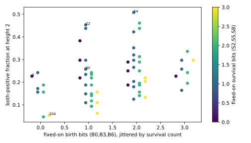

# The fiber phenotype is not additive in the six exposed bits

Is a base rule's fiber phenotype fraction an additive function of the six
bits the height-one quotient exposes, or does the base act as a whole?
Across all 64 reflection-symmetric ECAs, 128 uniformly sampled Life-like
rules each, measured at strip height two under the first census's contract:
the fraction that both persists and spreads is **not additive**. A logistic
model with the six bits as main effects is beaten out of sample by one with
their pairwise interactions (leave-one-fiber-out log-loss 0.527 against
0.534; likelihood-ratio p ≈ 10⁻³³), and the strongest interactions are
between births and survivals (B6·S2, B3·S2 positive; S2·S5, B3·B6 negative).
Spreading is where the non-additivity lives (log-loss 0.633 against 0.673);
for persistence alone the interaction model fits better in sample but
predicts worse out of sample. The first census's ordering replicated at the
top and bottom on fresh samples but not in the middle: fibers 0 and 90
swapped. The eight affine bases are not special.

Evidence: exploratory (finite samples, one strip height, one density, one
contract). Protocol frozen before implementation; runner and analysis
committed before any output was read; evaluation preceded review under
Myk's 2026-09-17 suspension of the cross-model gates. Authored, run and
integrated by Claude/Fable 5.1. Second unit of the
[Class-IV Refinement Program](2026-09-17-class-iv-refinement-program.md).

## Setup

Every reflection-symmetric ECA `r` has a 4096-rule fiber under the
height-one restriction `r = B0 + 18 B3 + 32 B6 + 4 S2 + 72 S5 + 128 S8`
([strip spectrum](2026-09-17-strip-spectrum.md)); the base is the six bits.
128 rules per fiber were drawn without replacement (seed from the protocol
name and base), no exemplars added, and eight rules per fiber were checked
to reproduce the base at height one for 256 steps (all 64 passed). The
contract is the [first census](2026-09-17-fiber-census.md)'s: height 2,
width 521, density 0.5, burn 512, 256 scored transitions, six seeds, 64
sites, disturbance 4 × 8 at horizons 64 and 128; `persist` is `S* > 0`,
`spread` is `alpha_x > 0.5`, `both` is their conjunction. 8,192 rules in
65 minutes over four workers.

The frozen analysis fits, for each outcome, M1 (intercept plus six bits)
and M2 (M1 plus fifteen pairwise products) by IRLS with ridge 10⁻⁶, and
reports deviances, the likelihood-ratio statistic on 15 degrees of freedom,
and leave-one-fiber-out mean log-loss (64 refits each).

## Result

Across the 64 fibers the both-positive fraction ranges from 0.05 (fiber of
76) to 0.51 (fiber of 54), median 0.22, interquartile range 0.16 to 0.29.
Persistence runs 0.20 to 0.82 (median 0.45) and spreading 0.12 to 0.84
(median 0.34).

| outcome | M1 deviance | M2 deviance | LRT (15 df) | p | LOO log-loss M1 | LOO log-loss M2 |
| --- | ---: | ---: | ---: | ---: | ---: | ---: |
| both | 8663 | 8469 | 193.6 | 4 × 10⁻³³ | 0.5339 | **0.5272** |
| spread | 10727 | 9909 | 817.2 | 2 × 10⁻¹⁶⁴ | 0.6733 | **0.6328** |
| persist | 10963 | 10799 | 163.5 | 5 × 10⁻²⁷ | **0.6762** | 0.6823 |

Main effects (M1, log-odds) for both-positive: B3 +0.52, S5 −0.43, S2
−0.15, S8 −0.11, B0 +0.07, B6 +0.06. Fibers with B3 on average 0.28 against
0.18 with it off; with S5 on 0.19 against 0.27. Largest M2 interactions for
both-positive: B6·S2 +1.00, B3·S2 +0.68, S2·S5 −0.51, B3·B6 −0.51,
B0·S8 +0.42. For spreading: B0·S8 +1.12, B6·S2 +1.05, B3·S2 +1.05,
B6·S5 +1.00, B0·B3 −0.95.

Top eight fibers by both-positive: 54 (0.51), 182 (0.46), 22 (0.45),
146 (0.44), 151 (0.44), 147 (0.42), 18 (0.38), 91 (0.35), every one with
B3 on and at most one survival bit. Bottom eight: 76 (0.05), 204 (0.05),
205 (0.06), 232 (0.09), 133 (0.09), 5 (0.11), 236 (0.11), 77 (0.12), every
one with B3 off and two or three survival bits.

Frozen predictions:

- **P1, interactions needed: held** for both-positive (p < 0.01 and M2's
  out-of-sample loss lower). The same holds, more strongly, for spreading.
  For persistence the test is significant in sample but M2 predicts worse
  out of sample, so the persistence axis is additive to within predictive
  accuracy while the spreading axis is not.
- **P2, the first census's ordering replicates: failed** on one of four
  inequalities. Fresh samples give 54 (0.51) > 22 (0.45) > 90 (0.26) >
  0 (0.23) > 204 (0.05): the ends hold, 0 and 90 swap. Their first-census
  values were 0.25 and 0.22, a gap of 0.03 that 128-rule samples do not
  resolve.
- **P3, affine bases not special: held.** The median both-positive fraction
  over {0, 51, 90, 105, 150, 165, 204, 255} is 0.21, inside the other 56
  fibers' interquartile range 0.16 to 0.30. `G ≡ c` at the base says
  nothing about the fiber under this contract.
- **P4, descriptive:** the largest main effect for spreading is B3 as bet;
  for persistence it is B0 (+0.58), not S2 (−0.09). Birth on zero
  neighbours, which seeds activity everywhere, is what buys persistence
  in this contract, and survival-on-two costs it slightly.

## What this does and does not show

The base rule matters as a whole on the spreading axis: the six bits'
effects are not separable, and the interactions have a readable shape
(a birth bit paired with a survival bit raises spreading, two survivals or
two births together lower it). That is a structural fact about the
restriction map's quotient, and it means "the source rule confers a
susceptibility" is not reducible to counting fixed bits. On the
persistence axis it is reducible: main effects suffice out of sample.

Bounds: 128-rule samples cannot order fibers whose fractions differ by a
few hundredths (the 0/90 swap); the both-positive outcome is dominated by
spreading; height two, density 0.5, and one observation contract; no
non-symmetric ECA has a fiber here, so nothing is said about 110.

## Next

Two candidates. An anisotropic restriction family so the non-symmetric
ECAs (110 first) acquire fibers, which would let the discriminator's second
core rule enter the program. Or replace `R*` by the unstandardized
selective-surprisal gap plus within-fiber residual, so the persistence
axis transports across strip heights and the census can be repeated at
height four without the observer change confounding it.

## Files

`experiments/fiber_census_64_20260917/run.py`, `evaluate.py`;
`results/fiber_census_64_20260917/` (`rows.json`, `exactness_control.json`,
`summary.json` with source hashes, `fiber_census_64.svg`).
