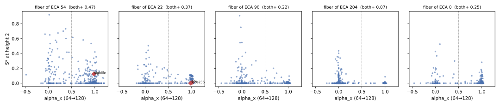

# The height-one fiber of Rule 54 is enriched in the persistence × spreading phenotype

Does the distribution of the selective-persistence × sustained-spreading
phenotype over a rule's refinement fiber depend on the rule? Under one fixed
contract, yes. Sampling 512 of the 4096 Life-like rules that restrict to each
of ECAs 54, 22, 90, 204 and 0 on a height-one strip, and measuring each at
height two, the fraction of rules that both persist (`S* > 0`) and spread
(`alpha_x > 0.5`) is 0.47 for the fiber of 54, 0.37 for 22, 0.25 for 0, 0.22
for 90 and 0.07 for 204. Three of four frozen predictions held; the bet that
fiber(22) would split into Life-like and explosive halves failed, because
almost three quarters of it spreads ballistically.

Evidence: exploratory (finite samples, one strip height, one density, one
contract). Protocol frozen before implementation
(`protocols/2026-09-17-fiber-census.md`); implementation committed before
the run; evaluator and its thresholds committed before any output was read.
Authored, run and integrated by Claude/Fable 5.1 on 2026-09-17 under Myk's
suspension of the cross-model review gates; evaluation preceded review.
First unit of the [Class-IV Refinement Program](2026-09-17-class-iv-refinement-program.md).

## Setup

A binary outer-totalistic rule on a periodic strip of height one is exactly
an ECA, and the fiber over a reflection-symmetric ECA `r` is the 4096 rules
whose six exposed bits (B0, B3, B6, S2, S5, S8) match `r`
([strip spectrum](2026-09-17-strip-spectrum.md)). Every fiber member
restricts exactly to its base, so the family has no bolt-on freedom: the
outer-totalistic constraint is the budget. Rule 110 is not reflection-
symmetric and has no fiber in this family; that is recorded as a fact, not
an omission.

Each fiber's sample is 512 rules drawn without replacement with a seed
derived from the protocol name and base; HighLife, Life and B35/S236 were
added to their fibers' samples (54 and 22) as flagged exemplars. Before any
observable was computed, eight rules of every sample were checked to evolve a
random height-one row byte-identically to the base ECA for 256 steps; all
five bases passed.

The observation contract is the cross-dimensional unit's starred set,
imported unchanged: strip height 2, width 521, density 0.5, burn 512, 256
scored transitions, six trajectory seeds (four train, two test), 64 sites per
seed, and single-bit disturbance over four base seeds × eight origins at
horizons 64 and 128. `R*` uses the exact height-two predecessor reference,
`M*` the eight-step centre-bit history gain, `S* = max(0,R*)·max(0,M*)`,
`alpha_x = log2(Dx(128)/Dx(64))`. Both-positive means `S* > 0` and
`alpha_x > 0.5`; no threshold was fitted. The primary run took 81 minutes
(2,563 rules); a height-four secondary pass on 64 rules per fiber plus the
exemplars took 11 minutes.

## Result

| fiber of | n | both-positive | `S* > 0` | `alpha_x > 0.5` | `S*` p50 / p90 | `alpha_x` p25 / p50 / p75 | exemplars (`S*`, `alpha_x`) |
| --- | ---: | ---: | ---: | ---: | --- | --- | --- |
| 54 | 513 | **0.468** | 0.604 | 0.778 | 0.001 / 0.195 | 0.66 / 0.95 / 0.99 | HighLife 0.125, 0.98 |
| 22 | 514 | 0.370 | 0.471 | 0.772 | 0.000 / 0.088 | 0.70 / 0.99 / 1.00 | Life 0.010, 1.01; B35/S236 0.000, 0.98 |
| 0 | 512 | 0.252 | 0.312 | 0.516 | 0.000 / 0.031 | 0.00 / 0.77 / 0.99 | |
| 90 | 512 | 0.217 | 0.355 | 0.660 | 0.000 / 0.033 | 0.06 / 0.99 / 1.00 | |
| 204 | 512 | 0.068 | 0.236 | 0.145 | 0.000 / 0.031 | 0.00 / 0.00 / 0.04 | |

Frozen predictions:

- **P1, fibers differ: held.** Largest minus smallest both-positive
  fraction 0.40; tie-corrected Kruskal–Wallis on `S*` across the five fibers
  H = 193.6, p ≈ 10⁻⁴⁰ (descriptive; the 512 rules are not independent
  positives).
- **P2, fiber(54) enriched: held.** 0.468 against 0.252 (fiber 0), 0.217
  (fiber 90) and 0.068 (fiber 204). It also exceeds fiber(22).
- **P3, exemplars typical: held.** HighLife's `S*` = 0.125 lies inside
  fiber(54)'s 10th–90th percentile band (0 to 0.195); Life's 0.010 inside
  fiber(22)'s (0 to 0.088). The named complex rules are not special members
  of their fibers under this contract.
- **P4, fiber(22) bimodal in spreading: failed.** 72% of fiber(22) has
  `alpha_x > 0.9` and 23% is below 0.5; the bet needed at least 25% on each
  side. Life and B35/S236 are not two modes of their fiber; the fiber is
  mostly ballistic, and Life's own `alpha_x` of 1.01 at height two sits in
  the majority.

The height-four subsample (64 rules per fiber) gives both-positive fractions
0.63 (54), 0.62 (22), 0.47 (0), 0.39 (90), 0.14 (204): the same ordering
apart from 54 and 22 becoming indistinguishable, at higher levels overall.
It is descriptive only.

## What this does and does not show

The base ECA predicts the phenotype distribution of its preimages: under
this contract the source rule confers a measurable susceptibility on its
fiber, and the two rules the discriminator program treats as the core
phenotype's home (54 via HighLife) and as the complex-and-explosive base (22
via Life) head the ordering. That is the sharp version of the handoff's
refinement-depth conjecture, answered positively for this family.

Two readings must stay open. First, the ordering may be mechanically
explained by the six fixed bits: fiber(54) fixes B3, B6 and S2 on, fiber(22)
B3 and S2, fiber(0) nothing, fiber(90) B3 and S5, fiber(204) S2, S5 and S8
with every birth off. Fixed births feed spreading; fixed survivals without
births feed freezing. Whether "the base rule" carries anything beyond the
activity its fixed bits impose is untested; the control is a census over all
64 fibers, or fibers matched on the number of fixed live bits. Second,
"both-positive" is dominated by the spreading axis (`S* > 0` alone orders
the fibers the same way, but at 0.60 / 0.47 / 0.36 / 0.31 / 0.24 the
persistence axis is closer between fibers than the spreading one). Neither
reading is a threat to P2 as stated; both bound its interpretation.

Not shown: anything about the full plane (height two is the smallest
faithful strip); anything about 110 (empty fiber); a Class-IV definition;
that HighLife or Life are distinguished within their fibers (P3 says the
opposite); novelty over the storage × spreading literature.

## Deviations

- The integrator glanced at the height-four subsample's per-fiber
  both-positive fractions while the primary height-two run was still
  writing. The evaluator, its thresholds and the frozen predictions were
  committed before either run and were not changed; recorded in the
  evidence commit and here.
- After the canonical run, the evaluator gained a `source_hashes` block so
  the summary can be guarded by the fast integrity tier; scoring is
  unchanged and the summary was regenerated deterministically.

## Next

A 64-fiber census at reduced sample (128 rules per fiber) to separate
"base rule" from "fixed-bit activity", and an anisotropic family so that
110 acquires a fiber.

## Files

`experiments/fiber_census_20260917/run.py`, `summarize.py`;
`results/fiber_census_20260917/` (`fiber_census_k2.json`, `fiber_census_k4.json`,
`exactness_control_*.json`, `summary.json` with source hashes, `fiber_census_k2.svg`).
