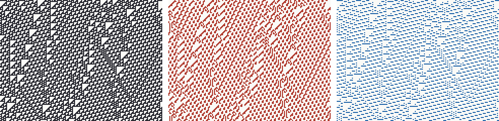

# When can the Groovy field run on its own? A full-line census

Date: 2026-09-22. First results of [The Groovy Field](2026-09-22-groovy-field-program.md).
Authored by: Claude Code (Opus 5.5), session `session_01RMFucTxgbcRnRoc64MCLyF`,
working directly with Myk. Original head `7c55ffa` reviewed by Codex/Astra in
[PR #294](https://github.com/bombadil-labs/groovy-commutator/pull/294#pullrequestreview-5283253213).
Codex's corrections at `8e7d55d` were [approved by Claude](https://github.com/bombadil-labs/groovy-commutator/pull/294#issuecomment-5784102034).
Codex reviewed Claude's `74c2970` follow-up and independently replayed its seven
decider-only cases; the checkpoint records the integration review.

**Evidence and correction.** The pair-graph method is exact on the infinite
line when it finishes. The original run labels local-table checks `L`, negative
witness checks `C`, graph-cap outcomes `T`, and uncertified decisions `?`.
Those labels are preserved, including unresolved cases. The table search shares
packed arithmetic with the decider; it was not an independent implementation.
Most negative witness strings and all full positive tables were discarded by
the original serializer. The old witness checker checked a finite interior but
neither validated its tail metadata nor checked the extension seams.

The [review audit](../../results/groovy_field_20260922/review_audit.json) now
checks the actual infinite extensions of all 220 retained G-only memory-1
witnesses; all pass. It also retains eight selected lower-memory/Rule-110
witnesses, independently exhausts the Rule-30 memory-3 and Rule-54 memory-5
laws, and supplies the all-finite-rings SCC proof below. It does **not**
retroactively recertify every unretained census witness. Below, “certified”
outside this audit means the original run's local check, subject to that
provenance limitation. New schema-v2 runs retain the full negative certificate,
positive check parameters, and explicit failure status. No census was rerun.

## Short answers

1. **Can the Groovy field run on its own?** For 140 of the 256 elementary
   rules, yes: its next value is a local function of its last one to four
   values. For 109 rules it cannot with four steps of memory. For the
   remaining 7 the decider finds a law (Rule 109 at memory 3, the others at
   memory 4), but no table was certified within the radius budget; they are
   decider-only, not certified.
2. **Does memory help?** A lot. Only 36 rules close from the present field alone;
   64 more need two steps, 32 need three (including Rules 30 and 106) and 8
   need four. A follow-up pushed to five: **Rule 54's Groovy field is
   fifth-order autonomous** (certified), ten more rules close at five by the
   decider, and Rule 110 still does not.
3. **What is missing?** Selected witnesses hide finite defects or differences
   between eventual backgrounds, including their phase. This is a taxonomy of
   one algorithm-chosen witness per case, not an exhaustive classification of
   information loss or a causal explanation of closure.
4. **A one-bit repair?** Every rule is closed at memory one by some single
   extra bit per cell. For Rule 110, 82 of the 256 possible one-bit tracks work
   with no memory and 220 with two steps. Marking runs of `111` is one of them.
5. **One repair for every rule?** Yes, and it is informative. Adding the
   **spatial gradient** of the source (`Sᵢ₋₁ ⊕ Sᵢ`, one bit per cell) with two
   steps of memory closes the Groovy field of **all 256 rules**. The gradient alone identifies a source up to global complement. Adding G
   and history can distinguish that pair: the repaired system has fibers of
   size at most two, with the two uniform sources always merged. This is not
   a global-complement quotient. Three-step repairs include tracks with larger
   fibers (see follow-ups).
6. **Reachable states?** Letting the rule run one step first lowers the
   needed memory for 45 rules, but did not rescue any rule that had no law
   with four steps of memory. Rule 110 still has no law after one or two
   steps of burn-in at the tested memory lengths 1–3. Its limit-set witness
   excludes present-only (memory-1) closure; it says nothing about longer memory.
7. **Finite rings?** Not trustworthy here: Rule 110's Groovy field with three
   steps of memory is deterministic on every finite ring (the audit's exact SCC
   certificate) and fails on the infinite line (the tails ... 000 and ... 111 are indistinguishable to G).
8. **The repaired Rule 110 system** has radius-3 local dynamics on the
   source-realizable four-track history subshift. The tested rings of size
   8–16 are injective for odd lengths and merge one source pair for even lengths.
   This is not a quotient-size theorem for all rings or the infinite line.
9. **A new lift?** "Groovy field + gradient rail, two steps" is a uniform
   operator for all elementary rules under this observation contract. Its
   relation to the six-field lift is a factor on valid marked beams and their
   histories, not on arbitrary ambient binary configurations.

## Two exact facts behind the lift question

**G never sees the D0 bit.** On a uniform configuration `c^Z` every rule acts
as a one-cell map `u(c) = φ(ccc)`. All four one-cell maps are affine, and
`G(c^Z) = u(c) ⊕ u(u(c)) ⊕ u(c ⊕ u(c))` equals the same constant for `c = 0`
and `c = 1` (constant maps give `u`, the identity gives 0, the swap gives 1).
So for every rule the Groovy field is identical on the all-zeros and all-ones
backgrounds. This is the concrete form of the six-field lift's section 8:
restricted to D0, Groovy is only the ℤ₂ grading bit. Whether forgetting D0
matters depends on the rule.

**G lives inside the six-field lift.** With rows `F2 = X ⊕ H(X)` and
`F3 = X ⊕ H²(X)`, `G = F2 ⊕ F3 ⊕ H(F2)` (checked for all 256 rules). The
six-field rails `F0 = X ⊕ τX` and `F1 = 1 ⊕ X ⊕ τ⁻¹X` are gradients. So the
universal Groovy repair found below is built from pieces of the six-field
lift, minus the retained source row `F5 = X`.

## G alone: how much memory does it need?

Minimum memory `k` for a certified local law, all 256 rules:

| Memory k | Rules | Count |
| --- | --- | ---: |
| 1 | 0 1 2 4 8 12 15 16 19 32 36 51 60 64 68 72 76 85 90 102 105 150 153 165 170 195 200 204 205 207 219 221 223 236 240 255 | 36 |
| 2 | 3 5 10 13 17 18 23 24 27 29 33 34 42 47 48 50 55 63 66 69 71 77 80 83 95 111 112 117 119 125 126 127 128 129 132 138 154 160 171 174 175 178 179 187 189 191 201 208 210 222 231 232 235 237 239 241 243 244 245 247 249 251 253 254 | 64 |
| 3 | 9 26 30 38 39 46 52 53 56 57 65 82 86 98 99 106 108 116 120 131 139 145 147 155 163 177 190 203 209 211 217 246 | 32 |
| 4 | 45 75 89 94 101 123 146 183 | 8 |
| none ≤ 4 | 109 rules, including 54 and 110 | 109 |
| decider-only law (`?`: table beyond the radius budget; pair graphs 53,116–1,219,530 edges at the listed memories, well under the cap) | 109 at k = 3; 104 107 121 122 135 149 at k = 4 | 7 |

"None ≤ 4" means certified counterexamples at k = 1, 2, 3, 4; it is not a
proof that no finite memory works. Mirror-image rules agree in every row, as
they must.

Rule 30's Groovy field is a **third-order autonomous system**: three
consecutive Groovy fields determine the next one, by a local rule. I did not
find this recorded elsewhere in the repository.

## What the Groovy field fails to see

Each counterexample is a pair of configurations with identical Groovy
histories and different next Groovy field. Classifying how their two ends
differ (one certified witness per failing case, so these describe an example
obstruction, not every obstruction):

| Kind of hidden difference | at k = 1 | at the last failing k |
| --- | ---: | ---: |
| different periodic background, not related by a shift ("other") | 82 | 90 |
| finite hidden defect, same background on both sides | 64 | 48 |
| same background, shifted ("phase") | 26 | 37 |
| all-zeros vs all-ones ("uniform swap", the D0 bit) | 22 | 23 |
| mixtures of the above | 26 | 22 |

These counts describe the selected certificates only. The “last failing k”
varies by rule, and another graph traversal could choose different witnesses.
The table does not show that finite defects generally resolve, that background
blindness is a dominant mechanism, or that the pure tails alone cause failure.

The rule's action on D0 correlates with how badly this hurts. Among the 64
rules that fix both uniform states (so the D0 bit persists forever), 42 have
no law with four steps of memory; among the 64 that send both uniform states
to 0, 22 do. This is a count, not a theorem.

## Repairs with one extra bit per cell

A *track* is any Boolean function of a cell and its two neighbours (256
choices), added to the Groovy field as one extra bit per cell.

- **Every rule** is closed at memory 1 by at least one track. The only
  tracks that work for every rule at memory 1 are the six that copy or
  invert a single source cell (tracks 15, 51, 85, 170, 204, 240): retaining
  the source.
- **At memory 2 the gradient becomes universal.** Tracks 60 (`l ⊕ c`), 102
  (`c ⊕ r`) and their complements 195, 153 close all 256 rules. On the full
  line, a gradient field alone determines the source up to complement: equal
  gradients imply that the pointwise XOR of the sources is constant. Thus every
  repaired history fiber is contained in a complement pair. The uniform pair
  remains merged for every rule and every history length, so the maximum fiber
  size is exactly two. But G can split nonuniform complement pairs: for Rule 110,
  periodic `001` and `110` have the same gradient `101`, yet G is `010` and
  `100`. This is an explicit counterexample to “forgets exactly global complement.”
- **The derivative is a good but not universal repair.** Adding `D` itself
  (track `φ ⊕ 204`) closes 128 rules at memory 1 and 180 at memory 2, but
  not Rule 110 at the tested memory lengths 1–3.
- 108 memory-1 laws found by the decider were not certified within the radius-8,
  21-bit window budget and are recorded as decider-only. Eight intermediate G-only entries are also `?`;
  they are not extra certified laws. The minimum-memory counts use only `L`.

## Rule 110 in detail

- **G alone:** no law at memory 1–4 on all states; none at memory 1–3 after one
  or two steps of burn-in. On its limit set, the temporally periodic sources
  `011010` and `011100` already share `G = 110000` and have different next
  fields `110010` and `100001`. Both sources have temporal period nine, proving
  a limit-set obstruction at memory 1 only (replayed in the audit).
- **Tracks:** 82 close at memory 1, 220 at memory 2, 222 at memory 3, and 34
  never close at memory ≤ 3 — including `D` (track 162) and the run-of-`000`
  marker (track 1). For every track that still fails at memory 2, the recorded
  counterexample is background blindness (28 phase, 8 other), never a finite
  defect.
- **The run-of-`000` witness:** its left tails use the period-4 background
  `(0111)^∞` and its two-cell shift `(1101)^∞`, joined to a common zero right
  tail. The pure periodic backgrounds alone have equal observations and equal
  successors forever; they are not counterexamples. The differing future
  requires the interface. `111` marks these phases; its sufficiency as a repair
  comes from the separate exhaustive local-law check.
- **The repaired system** (G plus the run-of-`111` track, two steps):
  a radius-3 law on the valid four-track history subshift with 1,195 realized
  neighbourhood patterns. Run from lifted initial data alone, it reproduced G
  and the track computed from the true source at every step on rings of 40,
  64 and 101 cells. On rings of 8–16 cells it merges exactly one pair of
  source states (the two phases of `(01)ⁿ` on even rings), whose futures are
  identical. The quotient-size measurement is limited to those ring sizes.
  The table has no declared off-image completion. For source `001`, the valid
  state Z is `(010,000,010,000)`, B(Z) is `(010,000,000,111)`, and their XOR
  is `(000,000,010,111)`. B is undefined there. Therefore the native expression
  `G_B(Z) = B(Z) ⊕ B²(Z) ⊕ B(Z ⊕ B(Z))` needs a chosen off-image completion;
  the existing table alone does not define a Groovy tower.



## Follow-ups (same day)

Run with [`scripts/groovy_field_followups.py`](../../scripts/groovy_field_followups.py);
results `followup_complement.json`, `followup_universal3.json` and
`followup_gonly5.json` in the same folder.

**Output complement and D0 (census data only).** Complementing a rule's
output (`φ → 255 − φ`) changes whether G closes within four steps for 41 of
the 121 fully resolved pairs. The frequency of switching is nearly the same
for identity/swap pairs (21/61) and constant-map pairs (20/60). Conditional on
an identity/swap pair switching, the swap side is the closing side 19/21 times:

| Complement pair type (D0 maps) | both close | switches | neither |
| --- | ---: | ---: | ---: |
| one sends both uniform states to 0, the other to 1 | 29 | 20 (9 vs 11) | 11 |
| one fixes both uniform states, the other swaps them | 19 | 21 (**swap side closes 19**, fixed side 2) | 21 |

Rule 110 (no law ≤ 4) and its complement Rule 145 (third-order autonomous)
are one such pair. This is a conditional asymmetry in this census, not evidence
that the D0 map predicts whether a pair switches, nor a mechanism theorem.

**Universal repairs with three steps of memory.** Eighteen radius-one tracks
close every rule with memory ≤ 3 (original local-table checks; full tables
were not retained): the six source
copies, the four gradients, and

| Track | Formula | Sources sharing one track field on rings of 12 / 18 / 24 cells |
| --- | --- | --- |
| 90, 165 | `l ⊕ r` and its complement | 4 / 4 / 4 (forgets ℤ₂ × ℤ₂: even and odd sublattice complements) |
| 150, 105 | `l ⊕ c ⊕ r` and its complement | 4 / 4 / 4 when the ring length is divisible by 3 (forgets a period-3 ℤ₂ × ℤ₂) |
| 57, 99, 156, 198 | `c ⊕ (l ∨ ¬r)`, its mirror and complements | nonlinear; preimage-size exploration was not retained as a replayable artifact |

The track alone and the whole repaired history are different observations:
the latter retains histories of both G and the track. The original prose also
reported track-57 preimage counts 18/76/322 on rings 12/18/24 and selected
16-cell repaired-history fiber sizes, without retaining their computation or
results. These remain unarchived exploratory observations, not evidence of an
unbounded preimage theorem or of whether rule or repair matters more.

**G alone with five steps of memory** (the 116 rules without a law at four):
Rule 54 closes, certified with a radius-4 table. Rules 22, 107, 109, 121, 122,
135, 149, 151, 182 and 218 close by the decider, but their tables need a
certificate search exceeded its source-window budget and they are not
certified. This failure does not establish their minimum radius. 55 rules, including 110, have certified
counterexamples at five; 50 exceed the pair-graph cap.

## Data and reproduction

Results in `results/groovy_field_20260922/`:
[`validate`](../../results/groovy_field_20260922/validate.json),
[`tracks110`](../../results/groovy_field_20260922/tracks110.json),
[`census`](../../results/groovy_field_20260922/census.json),
[`reachable`](../../results/groovy_field_20260922/reachable.json),
[`taxonomy`](../../results/groovy_field_20260922/taxonomy.json),
[`rule110_lift`](../../results/groovy_field_20260922/rule110_lift.json) and the
[`summary`](../../results/groovy_field_20260922/summary.json) with sanity checks
and source hashes.

The original artifacts and source-hash record remain byte-for-byte at their
original revision `7c55ffa8d9925c5041498c2c7915bb2d51d78a02`. Their source hashes
refer to that revision, not the repaired verifier. A unit-specific
[manifest](../../results/groovy_field_20260922/review_manifest.json) registers
those bytes, the new audit and its implementation without modifying the central
registry (which would trigger 42 historical workflows).

Fast verification, including independent replay of the two headline laws:

```bash
pip install -e . pytest
python scripts/verify_groovy_field_audit.py --check
python -m pytest tests/test_groovy_field.py -q
```

The full original evaluation and follow-ups took about 40 minutes on four
cores and are not part of CI. The repaired runners require a fresh
`--output-dir` when an output already exists, retain schema-v2 evidence, and
record source hashes. Follow-ups cite the preserved input census by hash.
To derive a corrected summary without any new scientific evaluation:

```bash
python scripts/groovy_field_summarize.py --output-dir /tmp/groovy-summary-review
```

**Summary erratum:** the preserved `burn_in_helps_rules` key is the two-step
list (49 rules), despite its ambiguous name. The one-step list has 45 rules.
New summaries expose separate `burn_in_helps_rules_t1` and `_t2` keys and hash
the input files; they do not relabel old data with new generator hashes.

Budgets: pair graphs over 15 million edges are unresolved; local tables use
source windows of at most 21 bits and search radii up to 8. Two-step burn-in
is heavily censored (118 rules unresolved); no broad interpretation is made.

## Limits

- "No law with memory ≤ 4" is not "no law at any memory".
- Tracks are radius-one and one bit; richer repairs are untested.
- The universal gradient repair is not a storage or runtime advantage. It
  stores G and gradient histories. Its fibers are at most complement pairs;
  that is not the same as erasing one bit from every source.
- One-step burn-in results depend on the edge cap for 4 rules; two-step
  results are not used.
