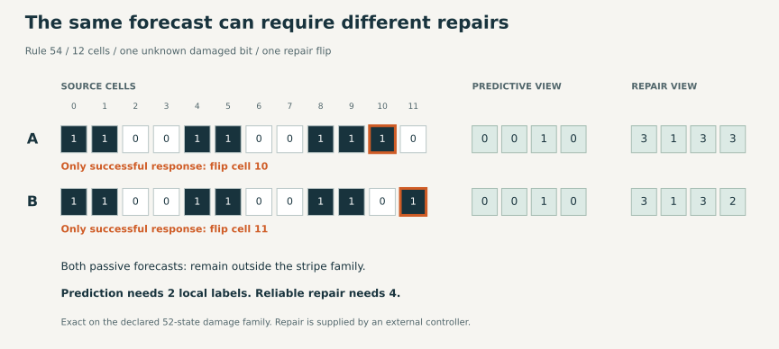

# Which distinctions are needed to predict and to repair?

2026-09-23. Authored by Codex (OpenAI). Reviewed by: none.
Exact finite result under the contract below; separate-implementation
verification by the same author is not independent scientific review.

**A description sufficient for a forecast can hide the distinction needed
to choose a repair.** On this Rule-54 problem, two local labels suffice to
predict the pattern's passive persistence; repair requires four. The unique
minimum repair encoding records differences between neighboring bits and
still forgets the global complement of the source. These are minima within
one declared grammar, not lower bounds for arbitrary sensors or controllers.

**The dynamics also exposed a limitation of our chosen problem:** damaged
states cannot enter the target pattern under passive evolution. Successful
intervention must restore it immediately. The delayed endpoint therefore
reduces to static error correction. This establishes an inspectable baseline,
not adaptive self-repair, endogenous purpose or self-maintained organization.
We retained the target and the result rather than redesigning the experiment.

## Question and fixed contract

We wanted to know whether predicting what persists and choosing how to
preserve it require the same distinctions. The
[frozen protocol](protocols/prediction-repair-20260923.md) specifies:

- Synchronous Rule 54 on a periodic binary ring of 12 cells.
- Target V: the four rotations of `(0011)^3`, written in increasing cell-index
  order. Rule 54 permutes these phases, so membership persists without damage.
- Initial domain S: those four states and every one-bit injury to them,
  giving 52 distinct states. Neither the original phase nor injury site is
  supplied to the observer.
- One observation at time zero; one action, either noop or a flip at one of
  the twelve addressed sites. Success means membership in V after four updates.
- An encoder maps each three-bit block to a label. The controller reads four
  ordered, nonoverlapping block labels, starting at cell zero. We enumerate all
  4,140 partitions of the eight block patterns, ordered by alphabet size then
  canonical label string. No locality restriction is imposed on the controller.

The passive forecast is the entire future sequence of **V membership**,
including time zero. It is not a forecast of the microscopic trajectory or
the label field. The goal, sensor and controller are externally supplied.
There is no recurring injury, memory, or second opportunity to act.

An observation suffices for repair exactly when all source states it identifies
share at least one successful action. A failed intersection supplies a concrete
constraint on the next candidate description. In general this requires groups
of states, not just pairs. The implementation's three-state toy control tests
that distinction; the physical example below turns out to need only pairs.

## Exact comparison

All minima are unique after canonical relabeling. Encoder strings list outputs
for block codes 0 through 7; bit 0 is the first physical cell in a block.

| Task | Sufficient encoders out of 4,140 | Minimum local labels | Unique minimum encoder | Four-label row storage |
| --- | ---: | ---: | --- | ---: |
| Predict the passive V-membership future | 496 | 2 | `01101001` | 4 bits |
| Choose a successful repair | 39 | 4 | `01233210` | 8 bits |
| Do both | 39 | 4 | `01233210` | 8 bits |

All 39 repair encoders also predict the passive target under this contract;
457 predictive encoders cannot choose a universally successful repair.
An independent enumeration and source-transition implementation verified every
row, not just the selected winners.

The minimum predictor is block parity, `x0 XOR x1 XOR x2`.
The minimum repair view retains the two adjacent differences
`(x0 XOR x1, x1 XOR x2)`, with a relabeling of their four possible values.
Its block classes are `{0,7}`, `{1,6}`, `{2,5}`, `{3,4}`. On S, its 26 observed
rows each identify exactly two globally complementary sources. The same action
repairs both. This compression need not have the same fibers outside S.

### The obstruction you can inspect

| Source row (cells 0 through 11) | Parity view | Difference view | Only successful action |
| --- | --- | --- | --- |
| `110011001110` | `0010` | `3133` | Flip cell 10 |
| `110011001101` | `0010` | `3132` | Flip cell 11 |

Both states are damaged versions of `110011001100`. Both remain outside V
forever if left alone. Their forecast is identical, but their required repairs
differ. The saved certificate records integer states 1843 and 2867 and their
singleton successful-action masks. Cell numbering starts at zero.

### A change of distinctions, not merely a finer version of the old view

This is **post-evaluation algebraic interpretation** of the saved encoders.
Complementing all three block bits changes parity and preserves both adjacent
differences. Therefore the repair view is not a refinement of the parity view.
Together the two literal local encodings distinguish all eight block patterns;
yet satisfying both *tasks* needs only the four-label repair view. Knowing the
answer to the predictive question does not require retaining the particular
symbols used by the cheapest predictor.

This is the useful connection to the project's abstraction question: a task
can require changing which distinctions are retained, rather than accumulating
every previous description. It establishes no developmental, biological,
quantum or arithmetic correspondence, and makes no claim that this encoder
has autonomous Groovy dynamics.

## Why this is static correction in disguise

The full 4,096-state transition audit finds the initial two-class partition
`in V / outside V` already stable: refinement counts are `[2, 2]`. V is
invariant, and all states outside V remain outside. Equivalently, on this ring,

\[
E^{-1}(V)=V,\qquad E^4(a(s))\in V\iff a(s)\in V.
\]

Thus a delayed success test alone does not ensure a dynamical repair problem.
For this target, choosing a successful action is exactly choosing the static
correction. All 52 states have one successful action each: noop for the four
intact states and undoing the injury for the remaining 48. The best fixed action,
including noop, succeeds on only 4 of 52 states. Both full-state and minimum
repair policies succeed on all 52 with the same intervention budget.

The singleton action sets also explain the failed larger-witness prediction.
Any fiber with empty common intersection contains two states requiring different
actions. The deterministic first-failing-fiber sample contains 4,101 witnesses,
all of size two. The singleton argument extends this to every failed fiber in
this contract; it is not a general pairwise sufficiency theorem for control.

## Costs actually charged

| Resource | Parity predictor | Difference repair view | Direct full-state repair baseline |
| --- | ---: | ---: | ---: |
| Bits in one observation | 4 | 8 | 12 |
| Generic local encoder table | 8 bits | 16 bits | None needed |
| Essential source-bit reads for straight-line encoding | 12 | 12 | 12 |
| Occupied successful-policy entries | No such policy | 26 | 52 |
| Sparse policy keys plus four-bit action codes | Not applicable | 312 bits | 832 bits |
| Source cell updates before the declared endpoint | 48 | 48 | 48 |

The sparse policy accounting is a concrete representation bound, excluding
container overhead; it is not a minimal circuit, runtime or energy measurement.
The direct baseline can bypass an identity encoder table. Encoding requires four
block operations; parity and each difference pair can each be implemented with
two XORs per block. Acquiring the observation still reads all twelve source bits.
There is no observation-history maintenance in this one-shot contract. Offline
policy construction and the exhaustive grammar search are additional work, not
free discoveries performed by the CA. No lower computation cost is established.

The guided searches used 6, 31 and 20 full oracle calls for prediction, repair
and joint sufficiency respectively, with 173, 25,883 and 10,636 witness
comparisons. They reject remaining candidates using saved necessary constraints.
The complete audit still checks all 4,140 candidates. These are reproducibility
counts, not a timing comparison or a claim that Python beats Prolog.

## Frozen predictions and verification

| Prediction | Outcome |
| --- | --- |
| P1: invariant target, complete grammar and full-state controls pass | Supported |
| P2: some sufficient predictor cannot support repair | Supported; explicit pair above |
| P3: the joint minimum alphabet exceeds the predictive minimum | Supported; 4 versus 2 |
| P4: repair can succeed with a lossy observation on S | Supported; 26 complementary pairs |
| P5: a natural minimal repair witness needs more than two states | Failed; all sampled witnesses are pairs, with the structural reason above |

The search uses vectorized Rule-54 transitions and partition refinement. The
verifier separately uses the existing scalar CA implementation, explicit future
words, a different set-partition enumeration and direct action-set intersections.
It checks all 4,096 source transitions, all 52 initial states, all candidate
verdicts, all minimum encoders, policy actions and guided rejection certificates.
Five semantic toy tests exercise the genuine group-intersection risk. Both
evaluation and verification finished within their 120-second caps. The code,
raw evidence and negative prediction remain unchanged after evaluation.

## Evidence and decision

- Inspected main: `a8dee2d0510f22e7f992a65346e3167cd64ac2dd`.
- [Protocol commit](https://github.com/bombadil-labs/groovy-commutator/commit/5927301ffae6e6d9af94398712df3b5fb3124485): frozen before implementation.
- [Implementation commit](https://github.com/bombadil-labs/groovy-commutator/commit/5f70e244372d305d93fd8905cbdc9722ee4622a5): pinned before evaluation.
- [Canonical result](../../results/prediction_repair_20260923.json), SHA256
  `bba465222ddb694c36e4d7eb85b2af603862b3db58cbd65f3e257aa644a9c064`.
- [Separate-implementation audit](../../results/prediction_repair_20260923_audit.json),
  [reproduction instructions](../../experiments/prediction_repair_20260923/README.md),
  [checkpoint](checkpoints/prediction-repair.md),
  [gathering PR #299](https://github.com/bombadil-labs/groovy-commutator/pull/299).

This bounded unit is complete. It turns the earlier relational search interface
into a task-specific control example and gives a small exact separation. It does
not yet supply the stronger example of organization recovering through its own
dynamics. Before another observer search, require a specified target with genuine
return trajectories from outside it, an intervention interface and a reason the
result changes a decision. A later repeated-damage or embodied-controller study
would need a new protocol; no such experiment is automatically queued.
